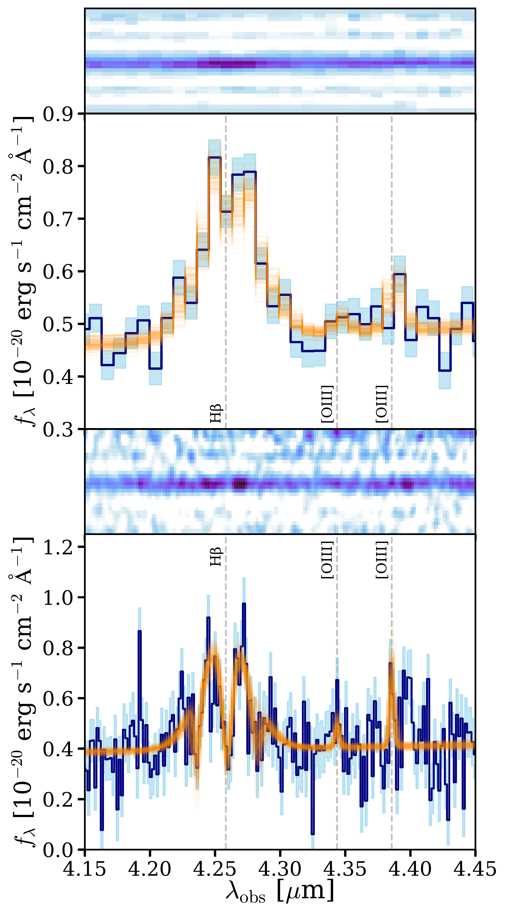
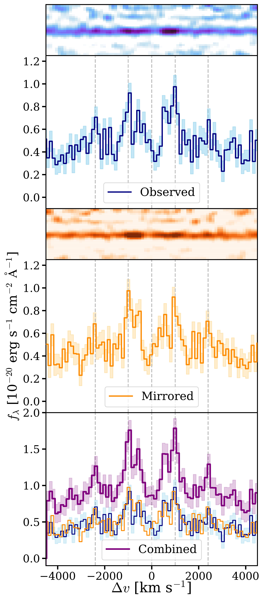

$\newcommand{\ensuremath}{}$
$\newcommand{\xspace}{}$
$\newcommand{\object}[1]{\texttt{#1}}$
$\newcommand{\farcs}{{.}''}$
$\newcommand{\farcm}{{.}'}$
$\newcommand{\arcsec}{''}$
$\newcommand{\arcmin}{'}$
$\newcommand{\ion}[2]{#1#2}$
$\newcommand{\textsc}[1]{\textrm{#1}}$
$\newcommand{\hl}[1]{\textrm{#1}}$
$\newcommand{\footnote}[1]{}$
$\newcommand{\pasa}{PASA}$
$\newcommand{\pasp}{PASP}$
$\newcommand{\thefigure}{Extended Data \arabic{figure}}$
$\newcommand{\thetable}{Extended Data \arabic{table}}$

# A "Black Hole Star" Reveals the Remarkable Gas-Enshrouded Hearts of the Little Red Dots

<mark>Appeared on: 2025-03-24</mark> -  _Submitted. NIRSpec prism spectra featured in this work from JWST program GO-5224 ("Mirage or Miracle", PIs: Oesch & Naidu) are publicly available at this https URL . See De Graaff et al. in today's arXiv posting for a z=3.5 BH*. Comments greatly appreciated and warmly welcomed!_

R. P. Naidu, et al. -- incl., <mark>A. d. Graaff</mark>, <mark>R. Hviding</mark>, <mark>F. Walter</mark>

**Abstract:** The physical processes that led to the formation of billion solar mass black holes within the first 700 million years of cosmic time remain a puzzle Banados18, Yang20Poniuaena, Wang21quasar . Several theoretical scenarios have been proposed to seed and rapidly grow black holes Woods19, Smith19SMBH, Inayoshi20, Volonteri21 , but direct observations of these mechanisms remain elusive. Here we present a source 660 million years after the Big Bang that displays singular properties: among the largest Hydrogen Balmer breaks reported at any redshift, broad multi-peaked H $\beta$ emission, and Balmer line absorption in multiple transitions. We model this source as a  “black hole star" (BH*) where the Balmer break and absorption features are a result of extremely dense, turbulent gas forming a dust-free "atmosphere" around a supermassive black hole Inayoshi24, Ji25BlackThunder . This source may provide evidence of an early black hole embedded in dense gas -- a theoretical configuration proposed to rapidly grow black holes via super-Eddington accretion AlexanderNatarajan14, Begelman08quasistars, Volonteri10, Schleicher13, CoughlinBegelman24 . Radiation from the BH* appears to dominate almost all observed light, leaving limited room for contribution from its host galaxy. We demonstrate that the recently discovered “Little Red Dots" (LRDs) Matthee24, Greene24, Kocevski24, Taylor24, Lin24 with perplexing spectral energy distributions Akins24, Wang24z8, Setton24b, Kokorev24, Labbe24Monster, Labbe25LRDs, Killi24 can be explained as BH*s embedded in relatively brighter host galaxies. This source provides evidence that SMBH masses in the LRDs may be over-estimated by orders of magnitude -- the BH* is effectively dust-free contrary to the steep dust corrections applied while modeling LRDs Greene24, Brooks24, Furtak24, Ji25BlackThunder , and the physics that gives rise to the complex line shapes and luminosities may deviate from assumptions underlying standard scaling relations.

**Figure 1. -** **Comparison against a mock spectrum of a "black hole star" model**. The schematic depicts an SMBH within a $\approx40$ AU "atmosphere" of dense gas -- the continuum is produced in hot regions close to the SMBH whereas absorption, scattering, and further emission occur in the dense gas atmosphere. The data (navy blue) are binned ($3\times$) to emphasize the continuum shape that our fiducial model (pink, with noise as per error spectrum) provides an excellent match to. The model is selected to reproduce the Balmer break strength and Balmer line EWs, while also matching the UV-faintness and MIRI long-wavelength data without having to invoke different mechanisms for lines and continuum. The narrow [OIII] emission and additional UV luminosity plausibly arise from the faint host galaxy, and are not captured by the BH* model (see Fig. 4). The excess flux around H$\infty$ is a \texttt{Cloudy} artifact due to modeling with a finite number of Hydrogen levelsJi25BlackThunder. (**)

**Figure 2. -** **Extended Data Figure 1 $|$ Simultaneous emission line fits to the prism (top) and grating (bottom) spectra.** 100 draws from the posterior are shown in orange. The consistency of features across both modes inspires confidence in their reality. For example, the detailed structure of the H$\beta$ line -- a central absorber, extremely broad wings, and absorption even in the wings -- recurs in both panels. Similarly, the existence of narrow [OIII]5008Å emission would be difficult to discern in either mode by itself, but is recovered in the joint fit. (**)

**Figure 3. -** **Extended Data Figure 2 $|$ The remarkable symmetry of the H$\beta$ line profile points to a symmetric configuration of absorbing gas.** Here we compare the observed line profile (top, blue) to a line profile mirrored around the systemic redshift derived from [OIII](center, orange). In the bottom panel we co-add these spectra. These profiles display peaks ($\pm1000$ km s$^{-1}$, and perhaps also $\pm2400$ km s$^{-1}$) and troughs ($\pm1500$ km s$^{-1}$; see absorber locations in Table 3) at similar velocities. This potential symmetry has important implications. First, it means the recovered systemic redshift from [OIII] is robust. Furthermore, these features are highly unlikely to be the result of random absorption systems or inflows/outflows that are fortuitously aligned at the same positive and negative velocities. Instead, this alignment suggests the presence of a symmetric absorbing structure (e.g., shells of gas). (**)

