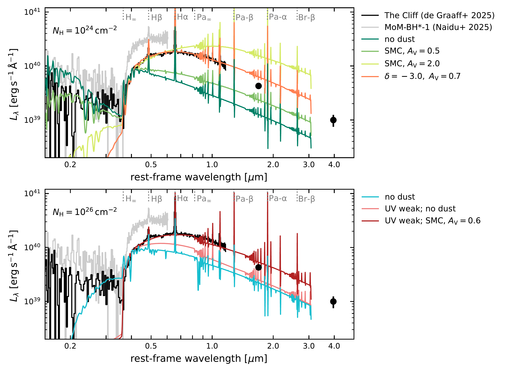
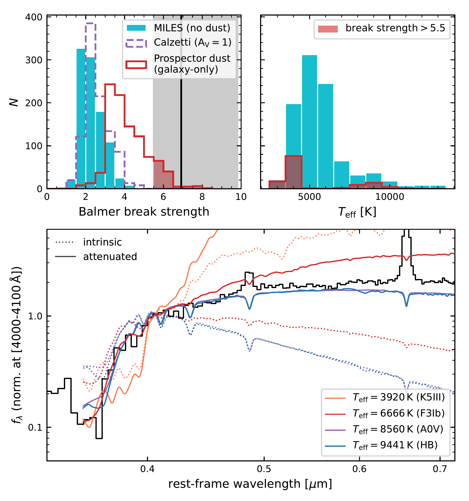
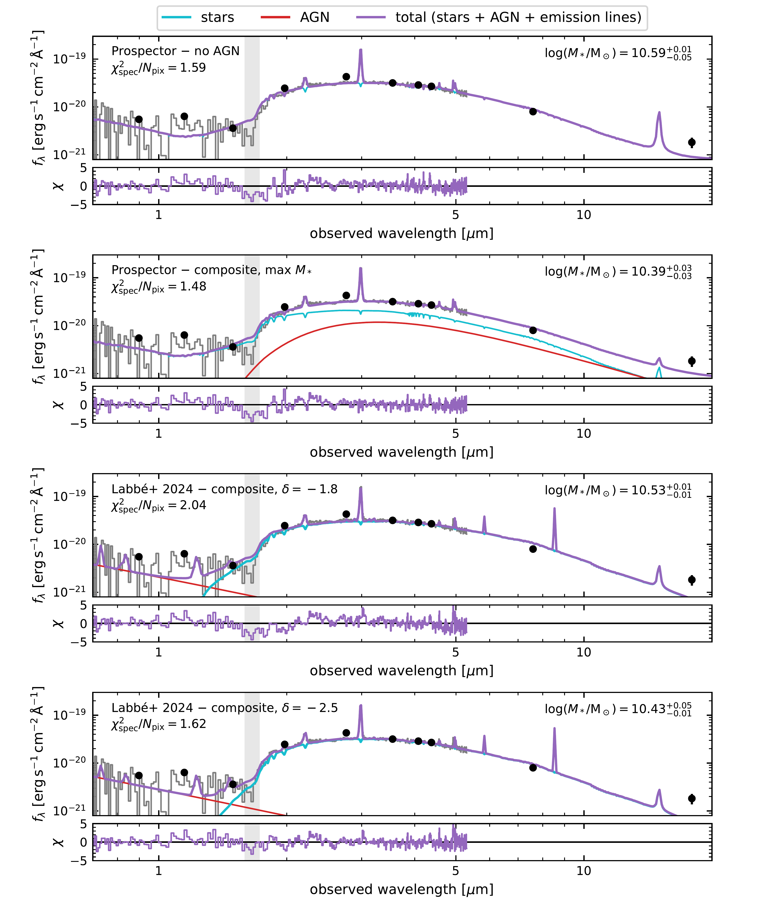

$\newcommand{\ensuremath}{}$
$\newcommand{\xspace}{}$
$\newcommand{\object}[1]{\texttt{#1}}$
$\newcommand{\farcs}{{.}''}$
$\newcommand{\farcm}{{.}'}$
$\newcommand{\arcsec}{''}$
$\newcommand{\arcmin}{'}$
$\newcommand{\ion}[2]{#1#2}$
$\newcommand{\textsc}[1]{\textrm{#1}}$
$\newcommand{\hl}[1]{\textrm{#1}}$
$\newcommand{\footnote}[1]{}$
$\newcommand{\micron}{\rm \mu m}$
$\newcommand{\ergs}{\rm erg s^{-1}}$
$\newcommand{\Oiii}{[O {\sc iii}]\xspace}$
$\newcommand{\Hei}{He {\sc i}\xspace}$
$\newcommand{\Oi}{O {\sc i}\xspace}$
$\newcommand{\Nii}{[N {\sc ii}]\xspace}$
$\newcommand{\Hb}{{\rm H}\beta\xspace}$
$\newcommand$
$\newcommand{\Msun}{\rm M_\odot}$
$\newcommand{\kpc}{ \rm kpc}$
$\newcommand{\kms}{ \rm km s^{-1}}$
$\newcommand{\re}{r_{\rm e,maj}}$
$\newcommand{\rec}{r_{\rm e}}$
$\newcommand{\fdm}{f_{\rm DM}}$
$\newcommand{\fbar}{f_{\rm baryon}}$
$\newcommand{\Mgas}{M_{\rm gas}}$
$\newcommand{\Mdm}{M_{\rm DM}}$
$\newcommand{\Mbar}{M_{\rm baryon}}$
$\newcommand{\Mdyn}{M_{\rm dyn}}$
$\newcommand{\Mbh}{M_{\rm BH}}$
$\newcommand{\reff}{r_{\rm e}}$
$\newcommand{\Ha}{H\alpha\xspace}$
$\newcommand{\Pad}{Pa-\delta\xspace}$
$\newcommand{\Pag}{Pa-\gamma\xspace}$
$\newcommand{\AG}[1]{{\bf \color{purple}{#1} }}$
$\newcommand{\ruby}{\textit{The Cliff}\xspace}$
$\newcommand{\zspec}{z_{\rm spec}}$
$\newcommand{\zphot}{z_{\rm phot}}$
$\newcommand{\pix}{\rm pix}$
$\newcommand{\prospector}{\texttt{Prospector}\xspace}$
$\newcommand{\pysersic}{\texttt{pysersic}\xspace}$
$\newcommand{\Av}{A_{\rm V}}$
$\newcommand{\cloudy}{\texttt{Cloudy}\xspace}$
$\newcommand{\mombh}{MoM-BH*-1\xspace}$

# A remarkable Ruby: Absorption in dense gas, rather than evolved stars, drives the extreme Balmer break of a Little Red Dot at $z=3.5$

<mark>Appeared on: 2025-03-24</mark> -  _19 pages, 9 figures; submitted to A&A. See Naidu et al. for a z=8 Balmer Cliff!_

<mark>A. d. Graaff</mark>, et al. -- incl., <mark>H.-W. Rix</mark>

**Abstract:** $\noindent$ The origin of the rest-optical emission of compact, red, high-redshift sources known as `little red dots' (LRDs) poses a major puzzle. If interpreted as starlight, it would imply that LRDs would constitute the densest stellar systems in the Universe. However, alternative models suggest active galactic nuclei (AGN) may instead power the rest-optical continuum.Here, we present JWST/NIRSpec, NIRCam and MIRI observations from the RUBIES and PRIMER programs of $\ruby$ : a bright LRD at $z=3.55$ with an exceptional Balmer break, twice as strong as that of any high-redshift source previously observed. The spectra also reveal broad Hydrogen ( $\Ha$ $\rm FWHM\sim1500 \kms$ ) and $\Hei$ emission, but no significant metal lines. We demonstrate that massive evolved stellar populations cannot explain the observed spectrum, even when considering unusually steep and strong dust attenuation, or reasonable variations in the initial mass function.Moreover, the formally best-fit stellar mass and compact size ( $M_*\sim10^{10.5} \Msun, r_{\rm e}\sim40 $ pc) would imply densities at which near-monthly stellar collisions might lead to significant X-ray emission.We argue that the Balmer break, emission lines, and $\Ha$ absorption line are instead most plausibly explained by a ` $*black hole star*$ ' (BH*) scenario, in which dense gas surrounds a powerful ionising source. In contrast to recently proposed BH* models of dust-reddened AGN, we show that spectral fits in the rest UV to near-infrared favour an intrinsically redder continuum over strong dust reddening. This may point to a super-Eddington accreting massive black hole or, possibly, the presence of (super)massive stars in a nuclear star cluster. $\ruby$ is the clearest evidence to date that at least some LRDs are not ultra-dense, massive galaxies, and are instead powered by a central ionising source embedded in dense, absorbing gas.

**Figure 9. -** The NIRSpec/PRISM spectra of $\ruby$ and $\mombh$($\zspec=7.76$; Naidu et al. 2025) are remarkably similar in shape, and only differ by a factor $\sim2$ in luminosity. Top: A BH* star model of a blue incident AGN spectrum ($\alpha_X=-1.5$, $\alpha_{\rm UV}=-0.5$) with high column density of $N_{\rm H}=10^{24} $cm$^{-2}$(rescaled to the rest $[4000,4100] Å$ flux of $\ruby$ and convolved to PRISM resolution) yields an intrinsically strong Balmer break (dark green) that matches the spectrum better than any of the stellar spectra explored (Figure $\re$f{fig:miles}). Steep dust curves are required to match the shape of the spectrum blueward of $\sim4200 Å$(green), and high optical depths are needed to be able to match the curvature of the rest-optical spectrum (light green, orange). However, such strongly dust-reddened AGN models result in a severe discrepancy in the rest near-IR. Bottom: Increased absorption from dense gas ($N_{\rm H}=10^{26} $cm$^{-2}$) results in extra reddening of the spectra without the need for dust (blue line), but the Balmer break of this model does not match the spectrum. A UV-weak incident AGN spectrum ($\alpha_X=-0.5$, $\alpha_{\rm UV}=-0.1$) can produce a strong Balmer break as well as a redder rest near-IR, although small mismatches in the IR remain even after modest dust attenuation (red lines). This suggests a redder intrinsic AGN spectrum (as predicted by some super-Eddington accretion disc models), or additional component in the SED such as (super)massive stars, is needed to explain $\ruby$.  (*fig:BHstar*)

**Figure 8. -** Top left: Balmer break strength (from rest-frame $[3620,3720] Å$ and $[4000,4100] Å$ ranges) distribution for the standard MILES stellar library (blue), and after applying a Calzetti dust law (with $\Av=1$; dashed purple), and the steep attenuation law from the $\prospector$ galaxy-only model (solid red). The black vertical line and shaded region show the measured break strength and $1\sigma$ uncertainty of $\ruby$. Top right: Effective temperatures of all MILES stars (blue) and the stars that, after applying the steep dust law, fall within $1\sigma$ of $\ruby$(red). Bottom: A representative sample of MILES spectra with strong Balmer breaks, convolved to the PRISM resolution at $z=3.5$ and normalised at $[4000,4100] Å$. Dotted and solid lines show the stellar spectra without dust and with steep dust attenuation, respectively. In comparison to the spectrum of $\ruby$, K giants, main-sequence A stars and horizontal branch stars fall short at $<3645 Å$ and $>5000 Å$. Only massive supergiants, with steep dust attenuation, can match the strength and shape of the Balmer break (albeit with a mismatch at $>5000 Å$), and suggests that an extraordinary, top-heavy IMF would be required to explain the rest-frame optical emission of $\ruby$.  (*fig:miles*)

**Figure 6. -** Best-fit SED models and residuals (with respect to the PRISM spectrum) for four model variations, constructed as different mixtures of (dust-reddened) stellar population and power-law AGN model components. These AGN models do not consider the possible reddening by absorbing dense gas, which we explore in Section $\re$f{sec:cloudy}. The region around the Balmer limit is highlighted, where the mismatch between models and data is strongest. From top to bottom: the fiducial `galaxy-only' model from $\prospector$; a galaxy + AGN model that maximises the stellar contribution, fit with $\prospector$(the `maximal $M_*$' model of  ([Wang and Leja 2024]()) ); the galaxy + AGN model following [Labbe, Greene and Matthee (2024)](), but fitting only Hydrogen emission lines instead of a forest of metal lines; the galaxy + AGN model of [Labbe, Greene and Matthee (2024)](), but with an even steeper dust law (see Section $\re$f{sec:dust}). All four models favour a massive post-starburst solution, with a very steep dust attenuation law and high optical depth. However, even with such extreme dust, none of these models can produce the strong Balmer break and shape of the rest-frame optical SED, as is evident from the systematic (and significant) features in the residuals blue- and redward of the Balmer break.  (*fig:seds*)

