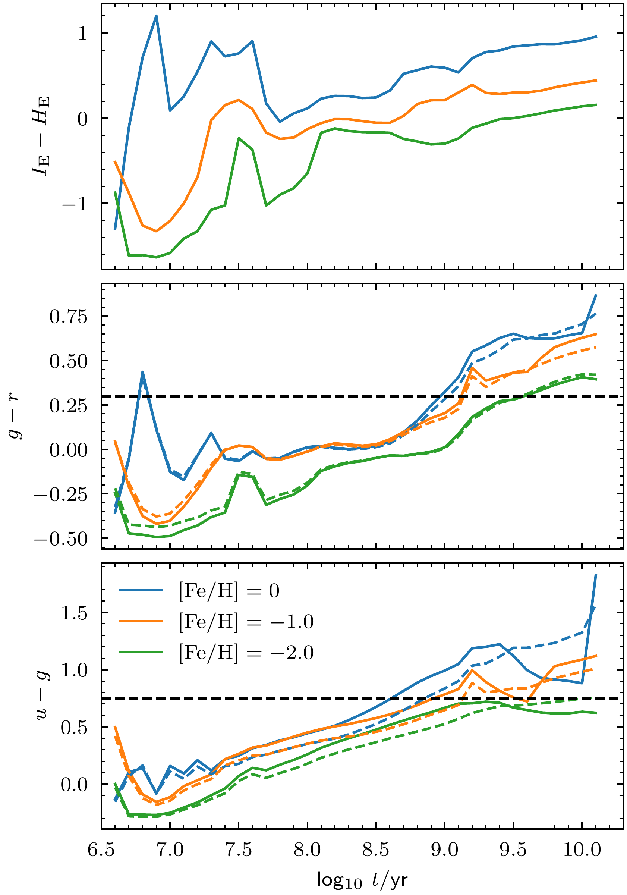
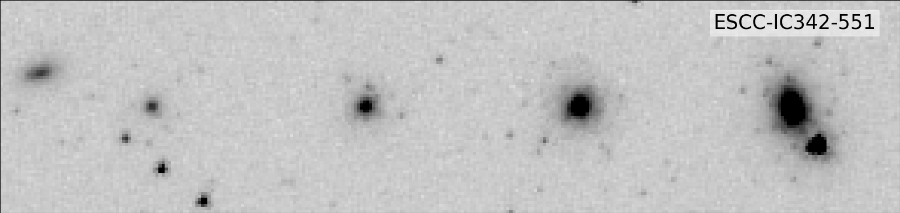

$\newcommand{\ensuremath}{}$
$\newcommand{\xspace}{}$
$\newcommand{\object}[1]{\texttt{#1}}$
$\newcommand{\farcs}{{.}''}$
$\newcommand{\farcm}{{.}'}$
$\newcommand{\arcsec}{''}$
$\newcommand{\arcmin}{'}$
$\newcommand{\ion}[2]{#1#2}$
$\newcommand{\textsc}[1]{\textrm{#1}}$
$\newcommand{\hl}[1]{\textrm{#1}}$
$\newcommand{\footnote}[1]{}$
$\newcommand{\orcid}[1]$

# $\Euclid$: Star clusters in IC 342, NGC 2403, and Holmberg II$\thanks{This paper is published on behalf of the Euclid Consortium.}$

<mark>Appeared on: 2025-03-24</mark> -  _Submitted to A&A following internal review_

S. S. Larsen, et al. -- incl., <mark>K. Jahnke</mark>

**Abstract:** We examine the star cluster populations in the three nearby (3.20--3.45 Mpc) galaxies IC 342,  NGC 2403, and Holmberg II, observed as part of the $\Euclid$ Early Release Observations programme.Our main focus in this paper is on old globular clusters (GCs), for which the wide field-of-view and excellent image quality of $\Euclid$ offer substantial advantages over previous work. For IC 342, in particular, this is the first study of stellar clusters other than its nuclear cluster.After selection based on size and magnitude criteria, followed by visual inspection, we identify 111 old ( $\gtrsim1$ Gyr) GC candidates in IC 342, 50 in NGC 2403 (of which 15 were previously known), and 7 in Holmberg II.In addition, a number of younger and/or intermediate-age candidates are identified. The colour distributions of GC candidates in the two larger galaxies show hints of bimodality with peaks at $(\IE-\HE)_0 = 0.36$ and 0.79 (IC 342) and $(\IE-\HE)_0 = 0.36$ and 0.80 (NGC 2403), corresponding to metallicities of $\mathrm{[Fe/H]}\approx-1.5$ and $\mathrm{[Fe/H]}\approx-0.5$ , similar to those found for the metal-poor and metal-rich GC subpopulations in the Milky Way.The luminosity functions of our GC candidates exhibit an excess of relatively faint objects, relative to a canonical, approximately Gaussian GC luminosity function (GCLF). Although some contamination from background galaxies may be present in our samples, we argue that the excess may be partly real, particularly in IC 342 where the excess objects may be similar to those previously identified in galaxies such as M101 and NGC 6946. The specific frequency of classical old GCs in IC 342, as determined based on the brighter half of the GCLF, appears to be unusually low with $S_N\approx0.2$ --0.3.The combined luminosity function of young and intermediate-age clusters in all three galaxies is consistent with a power-law distribution, $\mathrm{d}N/\mathrm{d}L \propto L^{-2.3\pm0.1}$ . The total numbers of young clusters brighter than $M(\IE)=-8$ in NGC 2403 and Holmberg II are comparable with those found in their Local Group counterparts, that is, M33 and the Small Magellanic Cloud, respectively.

**Figure 8. -** PARSEC simple stellar population model colours versus age. Top: \Euclid$\IE-\HE$. Middle:  MegaCam $g-r$. Bottom: MegaCam $u-g$. For the MegaCam filters, dashed and solid lines indicate models for the old and new MegaCam filters, respectively. The horizontal dashed lines indicate the colour criteria for selection of old GC candidates. (*fig:SSPcol_age*)

**Figure 3. -** Top and centre panels: as Fig. \ref{fig:simGCsN2403}, but for IC 342. Bottom panel: simulated clusters with ages of 20 Myr. (*fig:simGCsI342*)

**Figure 27. -** \Euclid VIS image of IC 342 with class 1--4 cluster candidates marked.  Old GC candidates are shown with red circles, intermediate-age candidates  in blue, and ambiguous candidates as open black circles. The dashed black circle indicates a radius of 10 kpc and the white/magenta dashed lines indicate the HST/ACS F435W+F606W coverage from programmes 10579 and 16002. North is up and east to the left.  (*fig:ic342cc_yc_gc*)

