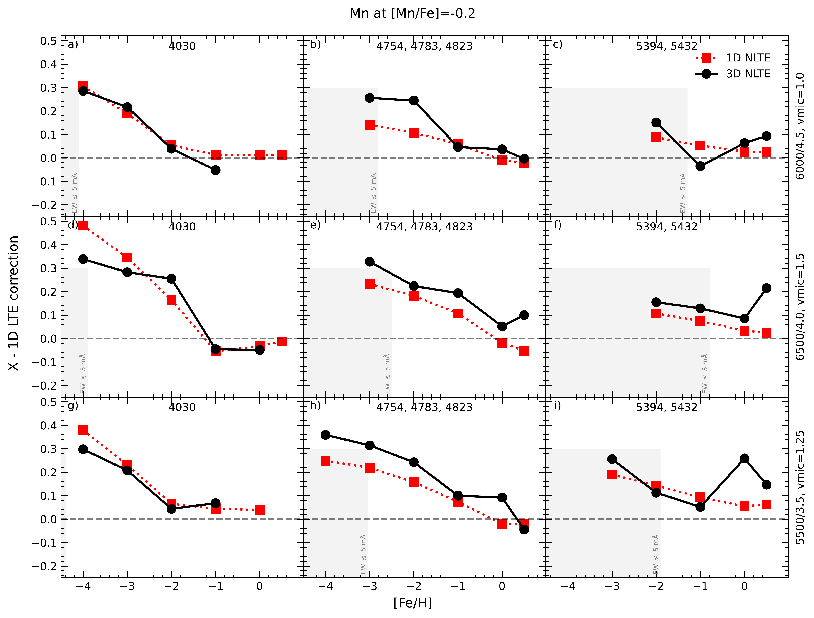
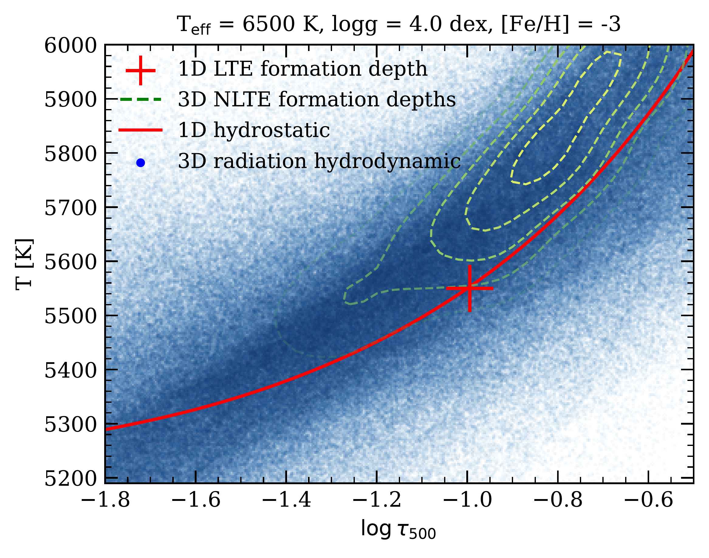
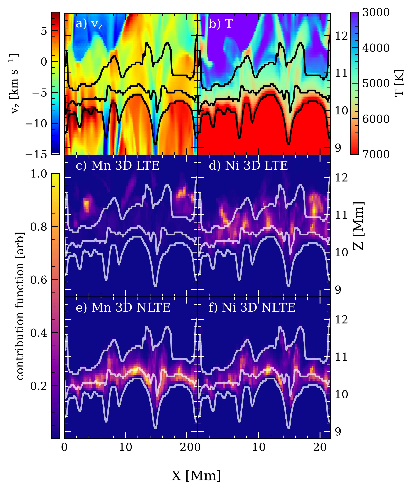

$\newcommand{\ensuremath}{}$
$\newcommand{\xspace}{}$
$\newcommand{\object}[1]{\texttt{#1}}$
$\newcommand{\farcs}{{.}''}$
$\newcommand{\farcm}{{.}'}$
$\newcommand{\arcsec}{''}$
$\newcommand{\arcmin}{'}$
$\newcommand{\ion}[2]{#1#2}$
$\newcommand{\textsc}[1]{\textrm{#1}}$
$\newcommand{\hl}[1]{\textrm{#1}}$
$\newcommand{\footnote}[1]{}$
$\newcommand{\ns}[1]{{\color{red} #1}}$
$\newcommand{\mb}[1]{{\color{brown}{\bf Maria:} #1}}$
$\newcommand{\teff}{T_{\rm eff}}$
$\newcommand{\logg}{\log g}$
$\newcommand{\vmic}{\xi_{\rm t}}$
$\newcommand{\vmac}{V_{\rm mac}}$
$\newcommand{\EW}{W_{\lambda}}$
$\newcommand{\mA}{{\rm mÅ}}$
$\newcommand{\Elow}{E_{\rm low}}$
$\newcommand{\Eup}{E_{\rm up}}$
$\newcommand{\SH}{S\!_{\rm H}}$
$\newcommand{\Eu}[5]{\mbox{\rm #1 ^{\rm #2}{\rm #3}^{{\rm #4}}_{\rm #5}}}$
$\newcommand{\Y}[5]{\mbox{\rm #1 ^{\rm #2}{\rm #3}^{{\rm #4}}_{\rm #5}}}$
$\newcommand{\Sr}[5]{\mbox{\rm #1 ^{\rm #2}{\rm #3}^{{\rm #4}}_{\rm #5}}}$
$\newcommand{\Ba}[5]{\mbox{\rm #1 ^{\rm #2}{\rm #3}^{{\rm #4}}_{\rm #5}}}$
$\newcommand{\Mn}[5]{\mbox{\rm #1 ^{\rm #2}{\rm #3}^{{\rm #4}}_{\rm #5}}}$
$\newcommand{\Ni}[5]{\mbox{{\rm #1} ^#2{\rm #3}^{{\rm #4}}_{\rm #5}}}$
$\newcommand{\CH}[5]{\mbox{\rm #1 ^{\rm #2}{\rm #3}^{{\rm #4}}_{\rm #5}}}$
$\newcommand{\Co}[5]{\mbox{\rm #1 ^{\rm #2}{\rm #3}^{{\rm #4}}_{\rm #5}}}$
$\newcommand{\Fe}[5]{\mbox{#1 ^#2{\rm #3}^{{\rm #4}}_ }}$
$\newcommand{\footnoterule}$
$\newcommand{\footnoterule}$
$\newcommand{\footnoterule}$
$\newcommand{\thebibliography}{\DeclareRobustCommand{\VAN}[3]{##3}\VANthebibliography}$

# Observational constraints on the origin of the elements. IX. 3D NLTE abundances of metals in the context of Galactic Chemical Evolution Models and 4MOST

<mark>Appeared on: 2025-03-24</mark> -  _13 pages + 16 pages appendix, 10 figures + 17 figures appendix, accepted to MNRAS_

<mark>N. Storm</mark>, et al. -- incl., <mark>M. Bergemann</mark>, <mark>P. Eitner</mark>, <mark>R. Hoppe</mark>

**Abstract:** $\noindent$ Historically, various methods have been employed to understand the origin of the elements, including observations of elemental abundances which have been compared to Galactic Chemical Evolution (GCE) models. It is also well known that 1D Local Thermodynamic Equilibrium (LTE) measurements fail to accurately capture elemental abundances. Non-LTE (NLTE) effects may play a significant role, and neglecting them leads to erroneous implications in galaxy modelling. In this paper, we calculate 3D NLTE abundances of seven key iron-peak and neutron-capture elements (Mn, Co, Ni, Sr, Y, Ba, Eu) based on carefully assembled 1D LTE literature measurements, and investigate their impact within the context of the OMEGA+ GCE model. Our findings reveal that 3D NLTE abundances are significantly higher for iron-peak elements at [ Fe/H ]  $< -3$ , with (for the first time ever) [ Ni/Fe ] and (confirming previous studies) [ Co/Fe ] on average reaching 0.6-0.8 dex, and [ Mn/Fe ] reaching $-0.1$ dex, which current 1D core-collapse supernova (CCSN) models cannot explain. We also observe a slightly higher production of neutron-capture elements at low metallicities, with 3D NLTE abundances of Eu being higher by +0.2 dex at [ Fe/H ]  $= -3$ . 3D effects are most significant for iron-peak elements in the very metal-poor regime, with average differences between 3D NLTE and 1D NLTE ${reaching}$ up to 0.15 dex. Thus, ignoring 3D NLTE effects introduces significant biases, so including ${them}$ should be considered whenever possible.

**Figure 16. -** Average Mn corrections for 1D LTE abundances at [Mn/Fe] = -0.2. Corrections are plotted for 1D NLTE and 3D NLTE respectively in red squares and black dots for three line groups in each column. Each row represents a different atmosphere, top to bottom: $\teff=6000$ K, $\logg=4.5$ dex, $\vmic = 1.00$ km s$^{-1}$(main-sequence); $\teff=6500$ K, $\logg=4.0$ dex, $\vmic = 1.50$ km s$^{-1}$(turn-off); $\teff=5500$ K, $\logg=3.5$ dex, $\vmic = 1.25$ km s$^{-1}$(subgiant). $\vmic$ only refers to the value used in 1D models. A vertical shaded area represents a rough indication where a line becomes too weak to be measured reliably (EW $\leq$5mÅ). (*fig:mn_corrections*)

**Figure 8. -** {Zoomed-in temperature structure of the 1D MARCS (red line) and the 3D RHD \texttt{Stagger} model atmosphere (blue distribution) for $\teff = 6500$ K, $\logg = 4.0$ dex, and [Fe/H] $= -3$. The red cross indicates the formation height of the Ni I line at 5476 Å as a function of $\log \tau_{500}$ in 1D LTE; similarly, the formation heights in 3D NLTE are indicated by green contours. Here the formation height is defined as the location where the line core's contribution function contributes the most.} (*fig:1d_vs_3d_temperature*)

**Figure 4. -** {2D slices in the x-z plane of the 3D \texttt{Stagger} model atmosphere with parameters $\teff = 6500$ K, $\logg = 4.0$ dex, and [Fe/H] = -3. Top left: vertical velocity v$_{\rm z}$ with black contours denoting $\log \tau_{500}$ values of $-3, -1, 1$, from top to bottom (contours are preserved throughout other panels). Top right: temperature structure. Middle panels: 3D LTE of the contribution function (defined in the text) in arbitrary units for Mn line at 4030.76 Å with [Mn/Fe] = 0.0 (left) and Ni line 5476.90 Å with [Ni/Fe] = 0.5 (right). Bottom panels: same as middle panels but for the 3D NLTE case.} (*fig:cont_func_3d_both*)

