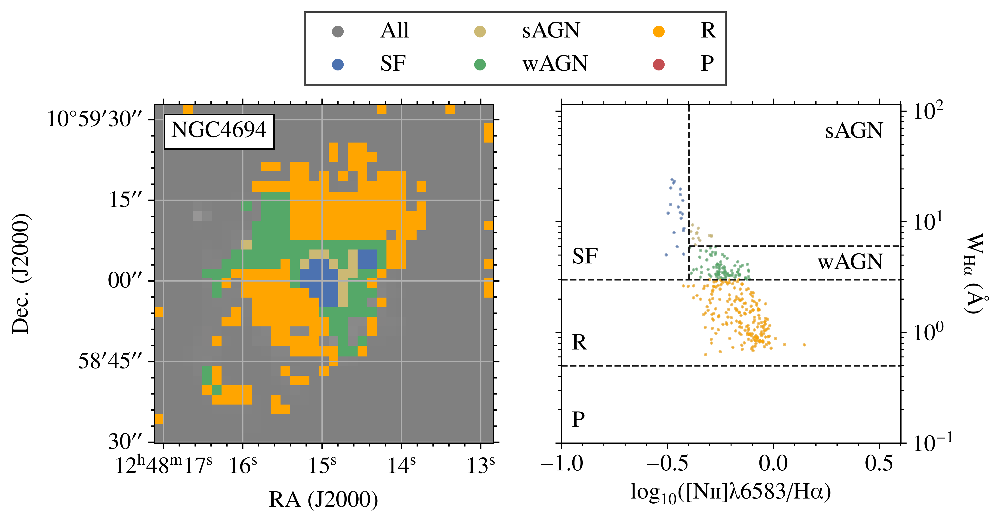
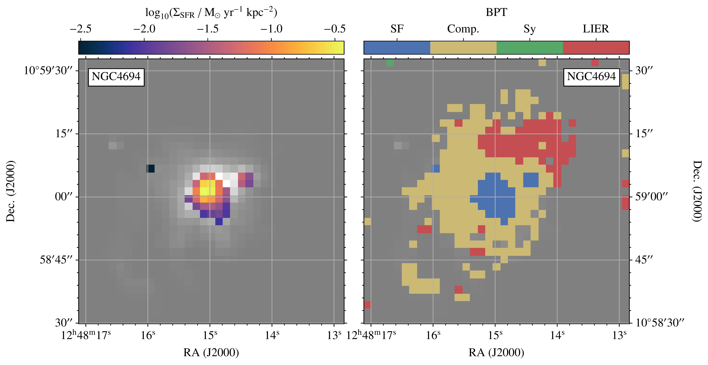

$\newcommand{\ensuremath}{}$
$\newcommand{\xspace}{}$
$\newcommand{\object}[1]{\texttt{#1}}$
$\newcommand{\farcs}{{.}''}$
$\newcommand{\farcm}{{.}'}$
$\newcommand{\arcsec}{''}$
$\newcommand{\arcmin}{'}$
$\newcommand{\ion}[2]{#1#2}$
$\newcommand{\textsc}[1]{\textrm{#1}}$
$\newcommand{\hl}[1]{\textrm{#1}}$
$\newcommand{\footnote}[1]{}$
$\newcommand{\sigsfr}{\Sigma_{\rm SFR}}$
$\newcommand{\siggas}{\Sigma_{\rm gas}}$
$\newcommand{\ha}{{\rm H}\alpha}$
$\newcommand{\hb}{{\rm H}\beta}$
$\newcommand{\aco}{\alpha_\mathrm{CO}}$
$\newcommand{\ewha}{W_\mathrm{H\alpha}}$
$\newcommand{\thebibliography}{\DeclareRobustCommand{\VAN}[3]{##3}\VANthebibliography}$

# The resolved star-formation efficiency of early-type galaxies

<mark>Appeared on: 2025-03-25</mark> -  _13 pages, 42 Figures (27 in Appendices). Accepted for publication in MNRAS_

T. G. Williams, et al. -- incl., <mark>E. Schinnerer</mark>

**Abstract:** Understanding how and why star formation varies between galaxies is fundamental to our comprehension of galaxy evolution. In particular, the star-formation efficiency (SFE; star-formation rate or SFR per unit cold gas mass) has been shown to vary substantially both across and within galaxies. Early-type galaxies (ETGs) constitute an extreme case, as about a quarter have detectable molecular gas reservoirs but little to no detectable star formation. In this work, we present a spatially-resolved view of the SFE in ten ETGs, combining state-of-the-art Atacama Large Millimeter/submillimeter Array (ALMA) and Multi Unit Spectroscopic Explorer (MUSE) observations. Optical spectroscopic line diagnostics are used to identify the ionized emission regions dominated by star-formation, and reject regions where the ionization arises primarily from other sources. We identify very few regions where the ionization is consistent with pure star formation. Using $\ha$ as our SFR tracer, we find that previous integrated measurements of the star-formation rate based on UV and 22 $\micron$ emission are systematically higher than the SFR measured from $\ha$ . However, for the small number of regions where ionization is primarily associated with star formation, the SFEs are around 0.4 dex higher than those measured in star-forming galaxies at a similar spatial resolution (with depletion times ranging from $10^8$ to $10^{10}$ yr). Whilst the SFE of ETGs is overall low, we find that the SFEs of individual regions within ETGs can be similar to, or higher than, similar sized regions within star-forming galaxies.

**Figure 6. -** BPT diagram of individual spaxels within the galaxy NGC 4694. _ Left_: [O{\sc iii}] -- [N{\sc ii}] diagnostic. _ Right:_[O{\sc iii}] -- [S{\sc ii}] diagnostic. The demarcation from [ and Kauffmann (2003)](https://ui.adsabs.harvard.edu/abs/2003MNRAS.346.1055K) is shown as a solid black line, and those from [Kewley, et. al (2006)](https://ui.adsabs.harvard.edu/abs/2006MNRAS.372..961K) as black dashed and dot-dashed lines. Data points are coloured by their positions in the BPT diagram, and are grey if they do not meet our signal-to-noise thresholds. The error-bars are typically on the order of 0.01 for these ratios as the lines are strongly detected, so these uncertainties are negligible. (*fig:ngc4694_bpt*)

**Figure 12. -** WHAN diagnostics of individual spaxels within the galaxy NGC 4694. _ Left_: Map of the WHAN classes overlaid on an $\ha$ map of the galaxy. _ Right_: WHAN classes defined using the $\ewha$ -- ([N{\sc ii}]/$\ha$ plane. We use the classes of [ and Mateus (2011)](https://ui.adsabs.harvard.edu/abs/2011MNRAS.413.1687C): star-forming (SF), strong AGN (sAGN), weak AGN (wAGN), retired (R) and passive (P). Here, we have dropped the `galaxy' nomenclature from the retired and passive galaxies ued in [ and Mateus (2011)](https://ui.adsabs.harvard.edu/abs/2011MNRAS.413.1687C), to highlight that our observations are resolved. (*fig:ngc4694_whan*)

**Figure 8. -** SFR (left) and BPT (right) maps of the galaxy NGC 4694. The pixels here correspond to a 150 pc-size region, and pixels are only coloured if they pass our S/N cuts, and the SFR maps are calculated only for spaxels that fall in the SF region of the BPT diagram. The greyscale shows $\ha$ emission in both cases. In the left panel, for the small number of spaxels classified as star-forming, we show the SFR surface densities in colour. The right panel shows spaxels coloured by their BPT classification, with the same colours as in Figure \ref{fig:ngc4694_bpt}. For this galaxy, the majority of the spaxels are defined as having their ionization dominated by processes other than star-formation. (*fig:ngc4694_sfr_map*)

