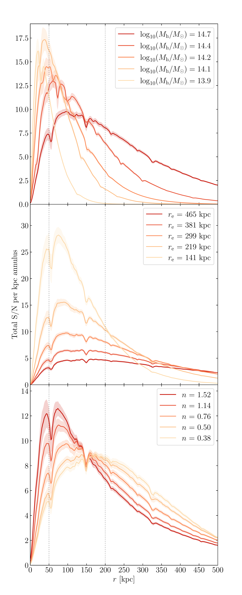

$\newcommand{\ensuremath}{}$
$\newcommand{\xspace}{}$
$\newcommand{\object}[1]{\texttt{#1}}$
$\newcommand{\farcs}{{.}''}$
$\newcommand{\farcm}{{.}'}$
$\newcommand{\arcsec}{''}$
$\newcommand{\arcmin}{'}$
$\newcommand{\ion}[2]{#1#2}$
$\newcommand{\textsc}[1]{\textrm{#1}}$
$\newcommand{\hl}[1]{\textrm{#1}}$
$\newcommand{\footnote}[1]{}$
$\newcommand{\Msun}{M_\sun}$
$\newcommand{\Mhalo}{M_\mathrm{h}}$
$\newcommand{\logMhalo}{\logten(\Mhalo/\Msun)}$
$\newcommand{\Mstar}{M_*}$
$\newcommand{\logMstar}{\logten(\Mstar/\Msun)}$
$\newcommand{\fICL}{f_\textrm{ICL}}$
$\newcommand{\Rmax}{R_\textrm{max}}$
$\newcommand{\SN}{\textrm{S/N}}$
$\newcommand{\ICLap}{(BCG+ICL)_{{50}-{200}}}$
$\newcommand{\nina}[1]{{\color{orange}\textsf{#1}}}$
$\newcommand{\eceb}[1]{{#1}}$
$\newcommand{\referee}[1]{#1}$
$\newcommand{\orcid}[1]{\orcidlink{#1}}$

# $\Euclid$ preparation: LXX. Forecasting detection limits for intracluster light in the Euclid Wide Survey

<mark>Appeared on: 2025-03-25</mark> -  _21 pages, 13 figures, 2 tables. Accepted for publication in A&A_

E. Collaboration, et al. -- incl., <mark>K. Jahnke</mark>

**Abstract:** The intracluster light (ICL) permeating galaxy clusters is a tracer of the cluster's assembly history, and potentially a tracer of their dark matter structure.In this work we explore the capability of the Euclid Wide Survey to detect ICL using $\eceb{\HE-band}$ mock images. We simulate clusters across a range of redshifts (0.3--1.8) and halo masses ( $10^{13.9}$ -- $10^{15.0} \Msun$ ), using an observationally motivated model of the ICL. We identify a 50--200 kpc circular annulus around the brightest cluster galaxy (BCG) in which the signal-to-noise ratio (S/N) of the ICL is maximised and use the S/N within this aperture as our figure of merit for ICL detection. We compare three state-of-the-art methods for ICL detection, and find that a method that performs simple aperture photometry after high-surface brightness source masking is able to detect ICL with minimal bias for clusters more massive than $10^{14.2} \Msun$ .The S/N of the ICL detection is primarily limited by the redshift of the cluster, driven by cosmological dimming, rather than the mass of the cluster. Assuming the ICL in each cluster contains 15 \% of the stellar light, we forecast that $\Euclid$ will be able to measure the presence of ICL in $\eceb{up to}$ $\sim80$ 000 clusters of $>10^{14.2} \Msun$ between $z=0.3$ and 1.5 with a $\SN>3$ . Half of these clusters will reside below $z=0.75$ and the majority of those below $z=0.6$ will be detected with a $\SN>20$ . A few thousand clusters at $1.3<z<1.5$ will have ICL detectable with a S/N greater than 3.The surface brightness profile of the ICL model is strongly dependent on both the mass of the cluster and the redshift at which it is observed so the outer ICL is best observed in the most massive clusters of $>10^{14.7} \Msun$ . $\Euclid$ will detect the ICL at more than 500 kpc distance from the BCG, up to $z=0.7$ , in several hundred of these massive clusters over its large survey volume.

**Figure 8. -** _Left_: \HE-band S/N of the ICL + BCG measured within a 50--200 kpc annulus, interpolated across halo mass and redshift space, using `smoothed' ICL parameters calculated as described in Sect. \ref{sec:fitting_sn} assuming a fixed ICL fraction of $15\%$. Coloured circles indicate the S/N values from the individual model clusters for comparison. Contours indicate the lines corresponding to a $\SN= 3, 10$ and 20 as labelled. Dashed contours indicate the threshold halo mass above which the total number of clusters in a redshift bin of $\Delta z=0.1$ is expected to be 10, 100, and 1000, across the footprint of the EWS, calculated as described in Sect. \ref{sec:haloestimates}. By the same estimates, the grey shaded region to the upper-right indicates the parameter space in which we expect to find no clusters according to the halo mass function.
_Right_: \HE-band S/N of the BCG+ICL measured within a 50--200 kpc annulus, interpolated across ICL fraction and redshift space, for a cluster with $\Mhalo=10^{14.7} $\Msun$$. $\fICL$ is defined as the total flux of the ICL across its entire radial extent, divided by the combined total fluxes of the ICL, BCG and cluster galaxies. Circles indicate the locations at which the ICL S/N has been measured to produce the interpolated map. (*fig:mhalo_z*)

**Figure 11. -** Ratio of the $\ICLap$  uncertainty $\referee${($\sigma_\mathrm{measured}$)} of each fitting method to the $\ICLap$  noise ($\referee${$\sigma_\mathrm{in}$, equivalent to the noise component in our S/N measurements)} of the input model, for varying $\fICL$ at a fixed halo mass of $\Mhalo=10^{14.7} $\Msun$$. Points are coloured by redshift. The horizontal lines show the mean value at each redshift, coloured by the corresponding redshift. (*fig:iclfits_comparison_sigma_ficl*)

**Figure 1. -** S/N per kpc annulus versus radius for clusters of varying halo mass (_top_), ICL effective radius (_middle_) and ICL Sérsic index (_bottom_), measured on the isolated ICL component (not including BCG) within 2 kpc annuli. The lines and shaded regions respectively show the median value and standard deviation of the S/N across nine instances of the same cluster simulated in different regions of the image. $\referee${The vertical dotted lines indicate the 50--200 kpc region we selected for the annulus}.
     (*fig:sn-curve-multi*)

