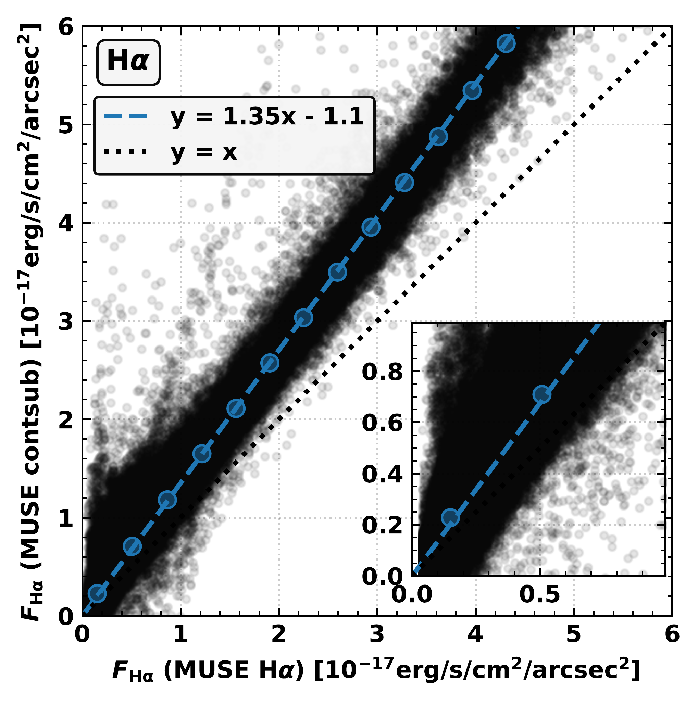

$\newcommand{\ensuremath}{}$
$\newcommand{\xspace}{}$
$\newcommand{\object}[1]{\texttt{#1}}$
$\newcommand{\farcs}{{.}''}$
$\newcommand{\farcm}{{.}'}$
$\newcommand{\arcsec}{''}$
$\newcommand{\arcmin}{'}$
$\newcommand{\ion}[2]{#1#2}$
$\newcommand{\textsc}[1]{\textrm{#1}}$
$\newcommand{\hl}[1]{\textrm{#1}}$
$\newcommand{\footnote}[1]{}$
$\newcommand{\xx}[1]{\textcolor{black}{ #1}}$
$\newcommand{\HII}{\ion{H}{II}}$
$\newcommand{\Ha}{H{\alpha}}$
$\newcommand{\ngal}{38}$
$\newcommand{\ngalphangs}{74}$
$\newcommand{\sfr}{M_{\odot} yr^{-1}}$
$\newcommand{\lea}{{\>\rlap{\raise2pt\hbox{<}}\lower3pt\hbox{\sim} \>}}$
$\newcommand{\gea}{{\>\rlap{\raise2pt\hbox{>}}\lower3pt\hbox{\sim} \>}}$
$\newcommand{\GEMINI}{\affiliation{Gemini Observatory/NSF’s NOIRLab, 950 N. Cherry Avenue, Tucson, AZ, 85719, USA$
$}}$
$\newcommand{\ASCL}{\affiliation{Astrophysics Source Code Librar$
$y, Michigan Technological University, 1400 Townsend Drive, Houghton, MI 49931}}$
$\newcommand{\OSU}{\affiliation{Department of Astronomy, The Ohio State University, 140 West 18th Avenue, Columbus, Ohio 43210, USA}}$
$\newcommand{\Alberta}{\affiliation{Department of Physics, University of Alberta, Edmonton, AB T6G 2E1, Canada}}$
$\newcommand{\ANU}{\affiliation{Research School of Astronomy and Astrophysics, Australian National University, Canberra, ACT 2611, Australia}}$
$\newcommand{\IPARCOS}{\affiliation{Instituto de Física de Partículas y del Cosmos, Universidad Complutense de Madrid, E-28040 Madrid, Spain}}$
$\newcommand{\IPAC}{\affiliation{Caltech-IPAC, 1200 E. California Blvd. Pasadena, CA 91125, USA}}$
$\newcommand{\Carnegie}{\affiliation{Observatories of the Carnegie Institution for Science, 813 Santa Barbara Street, Pasadena, CA 91101, USA}}$
$\newcommand{ÇAPP}{\affiliation{Center for Cosmology and Astroparticle Physics, 191 West Woodruff Avenue, Columbus, OH 43210, USA}}$
$\newcommand{\CfA}{\affiliation{Harvard-Smithsonian Center for Astrophysics, 60 Garden Street, Cambridge, MA 02138, USA}}$
$\newcommand{\CITEVA}{\affiliation{Centro de Astronomía (CITEVA), Universidad de Antofagasta, Avenida Angamos 601, Antofagasta, Chile}}$
$\newcommand{\CNRS}{\affiliation{CNRS, IRAP, 9 Av. du Colonel Roche, BP 44346, F-31028 Toulouse cedex 4, France}}$
$\newcommand{\ESO}{\affiliation{European Southern Observatory, Karl-Schwarzschild Stra{\ss}e 2, D-85748 Garching bei München, Germany}}$
$\newcommand{\Heidelberg}{\affiliation{Astronomisches Rechen-Institut, Zentrum für Astronomie der Universität Heidelberg, Mönchhofstra\ss e 12-14, D-69120 Heidelberg, Germany}}$
$\newcommand{\ICRAR}{\affiliation{International Centre for Radio Astronomy Research, University of Western Australia, 35 Stirling Highway, Crawley, WA 6009, Australia}}$
$\newcommand{\IRAM}{\affiliation{Institut de Radioastronomie Millimétrique (IRAM), 300 Rue de la Piscine, F-38406 Saint Martin d'Hères, France}}$
$\newcommand{\IRAP}{\affiliation{CNRS, IRAP, 9 Av. du Colonel Roche, BP 44346, F-31028 Toulouse cedex 4, France}}$
$\newcommand{\UPS}{\affiliation{Université de Toulouse, UPS-OMP, IRAP, F-31028 Toulouse cedex 4, France}}$
$\newcommand{\ITA}{\affiliation{Universität Heidelberg, Zentrum für Astronomie, Institut für Theoretische Astrophysik, Albert-Ueberle-Str 2, D-69120 Heidelberg, Germany}}$
$\newcommand{\IWR}{\affiliation{Universität Heidelberg, Interdisziplinäres Zentrum für Wissenschaftliches Rechnen, Im Neuenheimer Feld 205, D-69120 Heidelberg, Germany}}$
$\newcommand{\JHU}{\affiliation{Department of Physics and Astronomy, The Johns Hopkins University, Baltimore, MD 21218, USA}}$
$\newcommand{\Leiden}{\affiliation{Leiden Observatory, Leiden University, P.O. Box 9513, 2300 RA Leiden, The Netherlands}}$
$\newcommand{\Maryland}{\affiliation{Department of Astronomy, University of Maryland, College Park, MD 20742, USA}}$
$\newcommand{\MPE}{\affiliation{Max-Planck-Institut für extraterrestrische Physik, Giessenbachstra{\ss}e 1, D-85748 Garching, Germany}}$
$\newcommand{\MPIA}{\affiliation{Max-Planck-Institut für Astronomie, Königstuhl 17, D-69117, Heidelberg, Germany}}$
$\newcommand{\Nagoya}{\affiliation{Department of Physics, Nagoya University, Furo-cho, Chikusa-ku, Nagoya, Aichi 464-8602, Japan}}$
$\newcommand{\NRAO}{\affiliation{National Radio Astronomy Observatory, 520 Edgemont Road, Charlottesville, VA 22903-2475, USA}}$
$\newcommand{\OAN}{\affiliation{Observatorio Astronómico Nacional (IGN), C/Alfonso XII, 3, E-28014 Madrid, Spain}}$
$\newcommand{\OCAD}{\affiliation{OCAD University, Toronto, Ontario, M5T 1W1, Canada}}$
$\newcommand{\ObsParis}{\affiliation{Sorbonne Université, Observatoire de Paris, Université PSL, CNRS, LERMA, F-75014, Paris, France}}$
$\newcommand{\Ox}{\affiliation{Sub-department of Astrophysics, Department of Physics, University of Oxford, Keble Road, Oxford OX1 3RH, UK}}$
$\newcommand{\Princeton}{\affiliation{Department of Astrophysical Sciences, Princeton University, Princeton, NJ 08544 USA}}$
$\newcommand{\UToledo}{\affiliation{Ritter Astrophysical Research Center, University of Toledo, Toledo, OH, 43606}}$
$\newcommand{\Toulouse}{\affiliation{Université de Toulouse, UPS-OMP, IRAP, F-31028 Toulouse cedex 4, France}}$
$\newcommand{\UBonn}{\affiliation{Argelander-Institut für Astronomie, Universität Bonn, Auf dem Hügel 71, 53121 Bonn, Germany}}$
$\newcommand{\UChile}{\affiliation{Departamento de Astronomía, Universidad de Chile, Camino del Observatorio 1515, Las Condes, Santiago, Chile}}$
$\newcommand{\UCM}{\affiliation{Departamento de Física de la Tierra y Astrofísica, Universidad Complutense de Madrid, E-28040 Madrid, Spain}}$
$\newcommand{\UCSD}{\affiliation{Center for Astrophysics and Space Sciences, Department of Physics,  University of California,\ San Diego, 9500 Gilman Drive, La Jolla, CA 92093, USA}}$
$\newcommand{\ULyon}{\affiliation{Univ Lyon, Univ Lyon 1, ENS de Lyon, CNRS, Centre de Recherche Astrophysique de Lyon UMR5574,\ F-69230 Saint-Genis-Laval, France}}$
$\newcommand{\UMass}{\affiliation{University of Massachusetts—Amherst, 710 N. Pleasant Street, Amherst, MA 01003, USA}}$
$\newcommand{\UniCA}{\affiliation{Université Côte d'Azur, Observatoire de la Côte d'Azur, CNRS, Laboratoire Lagrange, 06000, Nice, France}}$
$\newcommand{\UWyoming}{\affiliation{Department of Physics and Astronomy, University of Wyoming, Laramie, WY 82071, USA}}$
$\newcommand{\LAM}{\affiliation{$
$Aix Marseille Univ, CNRS, CNES, LAM (Laboratoire d’Astrophysique de Marseille),  F-13388 Marseille,$
$France}}$
$\newcommand{\UHawaii}{\affiliation{Institute for Astronomy, University of Hawaii, 2680 Woodlawn Drive, Honolulu, HI 96822, USA}}$
$\newcommand{\UGent}{\affiliation{Sterrenkundig Observatorium, Universiteit Gent, Krijgslaan 281 S9, B-9000 Gent, Belgium}}$
$\newcommand{\IPARC}{\affiliation{Instituto de Física de Partículas y del Cosmos IPARCOS, Facultad de Ciencias Físicas, Universidad Complutense de Madrid, E-28040, Spain}}$
$\newcommand{\STScI}{\affiliation{Space Telescope Science Institute, 3700 San Martin Drive, Baltimore, MD 21218, USA}}$
$\newcommand{\McMaster}{\affiliation{Department of Physics and Astronomy, McMaster University, Hamilton, ON L8S 4M1, Canada}}$
$\newcommand{\INAF}{\affiliation{INAF -- Osservatorio Astrofisico di Arcetri, Largo E. Fermi 5, I-50157, Firenze, Italy}}$
$\newcommand{\Sydney}{\affiliation{Sydney Institute for Astronomy, School of Physics A28, The University of Sydney, NSW 2006, Australia}}$
$\newcommand{\UA}{\affiliation{Centro de Astronomía (CITEVA), Universidad de Antofagasta, Avenida Angamos 601, Antofagasta, Chile}}$
$\newcommand{\LERMA}{\affiliation{Observatoire de Paris, PSL Research University, CNRS, Sorbonne Universités, 75014 Paris}}$
$\newcommand{\SAIMSU}{\affiliation{Sternberg Astronomical Institute, Lomonosov Moscow State University, Universitetsky pr. 13, 119234 Moscow, Russia}}$
$\newcommand{\Rad}{\affiliation{Elizabeth S. and Richard M. Cashin Fellow at the Radcliffe Institute for Advanced Studies at Harvard University, 10 Garden Street, Cambridge, MA 02138, U.S.A.}}$
$\newcommand\kms{{\rm km s^{-1}}}$
$\newcommand\Kkms{{\rm K km s^{-1}}}$
$\newcommand\msun{{\mathrm{M}\_\odot}}$
$\newcommand\lsun{{\mathrm{L}\_\odot}}$
$\newcommand\micron{\hbox{\mum}}$
$\newcommand\solyr{{\rm M\_\odot yr^{-1}}}$
$\newcommand\sol{{\rm M\_\odot}}$
$\newcommand\dyncm{{\rm dyn cm^{-2}}}$
$\newcommand\ergs{{\rm  erg s^{-1}}}$
$\newcommand\cmsq{{\rm cm^{-2}}}$
$\newcommand\cmcb{{\rm cm^{-3}}}$
$\newcommand\gcmsq{{\rm g cm^{-2}}}$
$\newcommand\gcmcb{{\rm g cm^{-3}}}$
$\newcommand\Kcmcb{{\rm K cm^{-3}}}$
$\newcommand\ntdp{{\rm N\_2D^+}}$
$\newcommand\fluxdensityunitpix{{\rm erg s^{-1} cm^{-2} Å^{-1} pix^{-1}}}$
$\newcommand\fluxunitpix{{\rm erg s^{-1} cm^{-2} pix^{-1}}}$
$\newcommand\fluxdensityunit{{\rm erg s^{-1} cm^{-2} Å^{-1}}}$
$\newcommand\fluxunit{{\rm erg s^{-1} cm^{-2}}}$

# The PHANGS-HST-H$\alpha$ Survey: \ Warm Ionized Gas Physics at High Angular resolution in Nearby GalaxieS with the Hubble Space Telescope

<mark>Appeared on: 2025-03-25</mark> -  _published in the Astronomical Journal_

R. Chandar, et al. -- incl., <mark>K. Kreckel</mark>, <mark>E. Schinnerer</mark>

**Abstract:** The PHANGS project is assembling a comprehensive, multi-wavelength dataset of nearby ( $\sim$ 5-20 Mpc), massive star-forming galaxies to enable multi-phase, multi-scale investigations into the processes that drive star formation and galaxy evolution. To date, large survey programs have provided molecular gas (CO) cubes with ALMA, optical IFU spectroscopy with VLT/MUSE, high-resolution NUV--optical imaging in five broad-band filters with HST, and infrared imaging in NIRCAM $+$ MIRI filters with JWST.  Here, we present PHANGS-HST-H $\alpha$ , which has obtained high-resolution ( $\sim$ 2 -- 10 pc), narrow-band imaging in the F658N or F657N filters with the HST/WFC3 camera of the warm ionized gas in the first 19 nearby galaxies observed in common by all four of the PHANGS large programs. We summarize our data reduction process, with a detailed discussion of the production of flux-calibrated, Milky Way extinction corrected, continuum-subtracted H $\alpha$ maps. PHANGS-MUSE IFU spectroscopy data are used to background subtract the HST-H $\alpha$ maps, and to determine the [ NII ] correction factors for each galaxy. We describe our public data products $\footnote{The data released as part of this work includes the reduced drizzled narrow-band images and the flux-calibrated, continuum-subtracted H$\alpha$ maps for each galaxy.  These images are available for download via MAST at \url{https://archive.stsci.edu/hlsp/phangs.html}, as well as at the Canadian Astronomy Data Centre as part of the PHANGS archive at \url{https://www.canfar.net/storage/vault/list/phangs/RELEASES}.}$ and highlight a few key science cases enabled by the PHANGS-HST-H $\alpha$ observations.

**Figure 1. -** **Results of the [N II] $\lambda$6548Å and [N II] $\lambda$6583Å line correction routine (\S \ref{subsec_contsub2**).} H$\alpha$ fluxes from the continuum subtracted MUSE synthetic filter maps as a function of the H$\alpha$ flux densities measured from the MUSE spectroscopic data. The blue circles represent 20 binned data points (equally spaced), and the dashed blue line shows the best linear fit to these points ($y = ax + b$), where $y$ represents the HST image data points and $x$ represents the MUSE data points (see Table \ref{tab_bgcorr_niicorr}). The dotted line shows the 1-to-1 line. (*fig_scatteranchor*)

**Figure 6. -** ** Left:** Galaxies from the SDSS sample with $z \lesssim 0.1$ form the backdrop of the left panel, where the galaxy star-forming sequence is the prominent upper feature. Coverage of the SFR--M$_*$ plane by galaxies in the parent PHANGS sample ($N=74$; open circles) is shown.
        Red crosses show that the 19 galaxies observed as part of the HST-H$\alpha$ project tend to have higher SFRs.
        ** Right:** The star formation and molecular gas surface brightness  ([Sun, Leroy and Rosolowsky 2022]())  for the parent PHANGS sample (open circles) and the PHANGS-HST-H$\alpha$ subsample studied here (red crosses).  Outlier NGC 3239 is noted.
     (*fig:sample*)

**Figure 9. -** **Example MUSE spectra compared with HST filter transmission curves (ACS/WFC and WFC3/UVIS).**
    Example spectra from NGC 628 (top panel) and NGC 2835 (bottom panel) are shown as solid black lines, overlaid with the F555W (blue), F658N (orange), and F814W (green) filter transmission curves for ACS/WFC (top panel) and WFC3/UVIS  (bottom panel). The left panel displays the full wavelength range of the MUSE observations, with dashed vertical lines marking the coverage limits. In the right panel, we focus on the $\Ha$ line within the F658N filter bandpass, which includes contributions from the [NII]$\lambda6548$ and [NII]$\lambda6583$ emission lines. (*fig_filters_spec*)

