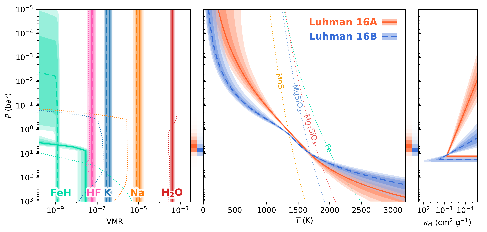
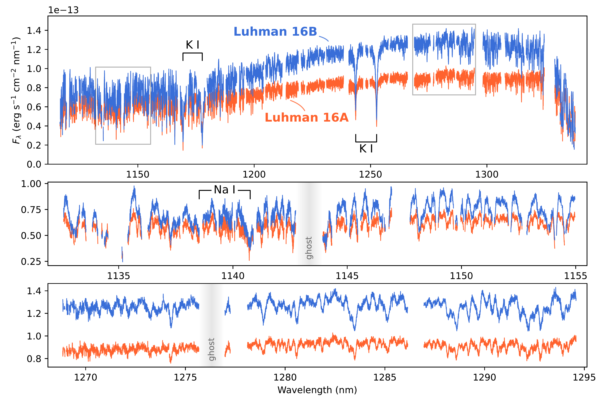

$\newcommand{\ensuremath}{}$
$\newcommand{\xspace}{}$
$\newcommand{\object}[1]{\texttt{#1}}$
$\newcommand{\farcs}{{.}''}$
$\newcommand{\farcm}{{.}'}$
$\newcommand{\arcsec}{''}$
$\newcommand{\arcmin}{'}$
$\newcommand{\ion}[2]{#1#2}$
$\newcommand{\textsc}[1]{\textrm{#1}}$
$\newcommand{\hl}[1]{\textrm{#1}}$
$\newcommand{\footnote}[1]{}$
$\newcommand{\arraystretch}{1.4}$

# The ESO SupJup Survey VII: Clouds and line asymmetries in CRIRES$^+$ J-band spectra of the Luhman 16 binary

<mark>Appeared on: 2025-03-28</mark> -  _Accepted for publication in A&A_

S. d. Regt, et al. -- incl., <mark>P. Mollière</mark>

**Abstract:** Brown dwarfs at the L-T transition likely experience an inhomogeneous clearing of the clouds in their atmospheres. The resulting surface of thin and thick cloudy patches has been put forward to explain the observed variability, J-band brightening, and re-emergence of FeH absorption. We study the closest brown dwarf binary, Luhman 16A and B, in an effort to constrain their chemical and cloud compositions. As this binary consists of an L7.5 and T0.5 component, we gain insight into the atmospheric properties at the L-T transition. As part of the ESO SupJup Survey, we observed Luhman 16AB at high spectral resolution in the J-band ( $1.1$ -- $1.4 \mathrm{\mu m}$ ) using CRIRES $^+$ . To analyse the spectra, we employ an atmospheric retrieval framework, coupling the radiative transfer code \texttt{petitRADTRANS} with the \texttt{MultiNest} sampling algorithm. For both objects, we report detections of $H_2$ O, K, Na, FeH, and, for the first time in the J-band, hydrogen-fluoride (HF). The K doublet at $1250 \mathrm{nm}$ shows asymmetric absorption in the blue line wings, which are reproduced via pressure- and temperature-dependent shifts of the line cores. We find evidence for clouds in both spectra and we place constraints on an FeH-depletion in the Luhman 16A photosphere. The inferred over-abundance of FeH for Luhman 16B opposes its predicted rainout into iron clouds. A two-column model, which emulates the patchy surface expected at the L-T transition, is weakly preferred ( $\sim$ $1.8\sigma$ ) for component B but disfavoured for A ( $\sim$ $5.5\sigma$ ). The results suggest a uniform surface on Luhman 16A, which is in good agreement with the reduced variability observed for this L-type component. While the presented evidence is not sufficient to draw conclusions about any inhomogeneity on Luhman 16B, future observations covering a broader wavelength range could help to test the cloud-clearing hypothesis.

**Figure 7. -** Retrieved vertical profiles of Luhman 16A (solid) and Luhman 16B (dashed). _Left panel_: chemical abundances and the $68$, $95$ and $99.7\%$ confidence envelopes of each species, for both brown dwarfs. The dotted lines show the chemical-equilibrium abundances computed with \texttt{FastChem} ([Kitzmann, Stock and Patzer 2024]()) . With the exception of FeH, the modelled abundances are constant with altitude and thus do not show the drop-offs exhibited by the equilibrium profiles.
    _Middle panel_: inferred temperature profiles and the condensation curves (dotted) of four cloud species  ([Visscher, Lodders and Fegley 2006](), [Visscher, Lodders and Fegley 2010]()) . _Right panel_: grey-cloud opacities retrieved as a function of altitude. The orange and blue shading in the panel gaps indicate the Luhman 16AB photospheres as obtained with the integrated emission contribution functions. (*fig:vertical_profiles*)

**Figure 1. -** Variation with temperature of the broadening ($\gamma_W/n_p$, solid) and shift ($d/n_p$, dashed) rates of the $\mathrm{4p^2P_{3/2}-5s}$(green) and $\mathrm{4p^2P_{1/2}-5s}$(purple) lines, perturbed by $H_2$ and He. The van der Waals (vdW) broadening, computed with Eq. \ref{eq:width_Kurucz}, is shown in black for comparison. (*fig:core_power_law*)

**Figure 3. -** CRIRES$^+$ J-band spectra of the Luhman 16 binary. _Top panel_: nine spectral orders covered in the J1226 wavelength setting. The two reddest order-detector pairs are omitted, as described in Sect. \ref{sect:obs_and_red}. _Lower panels_: zoom-ins showing the similar absorption features between the brown dwarfs. (*fig:spectrum*)

