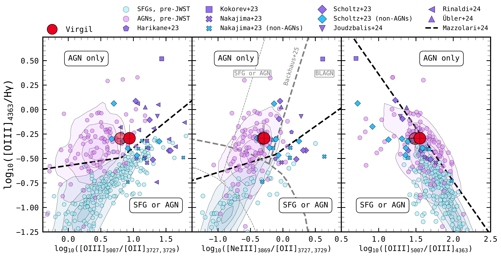

$\newcommand{\ensuremath}{}$
$\newcommand{\xspace}{}$
$\newcommand{\object}[1]{\texttt{#1}}$
$\newcommand{\farcs}{{.}''}$
$\newcommand{\farcm}{{.}'}$
$\newcommand{\arcsec}{''}$
$\newcommand{\arcmin}{'}$
$\newcommand{\ion}[2]{#1#2}$
$\newcommand{\textsc}[1]{\textrm{#1}}$
$\newcommand{\hl}[1]{\textrm{#1}}$
$\newcommand{\footnote}[1]{}$
$\newcommand{\gsim}{{\;\raise0.3ex\hbox{>\kern-0.75em\raise-1.1ex\hbox{\sim}}\;}}$
$\newcommand{\arraystretch}{1.5}$

# $\bf$ Deciphering the Nature of $_ Virgil_$: An Obscured AGN Lurking Within an Apparently Normal Lyman-$\alpha$ Emitter During Cosmic Reionization

<mark>Appeared on: 2025-04-03</mark> -  _39 pages, 3 tables, 14 figures. Submitted to ApJ_

P. Rinaldi, et al. -- incl., <mark>F. Walter</mark>

**Abstract:** We present a comprehensive analysis of the MIRI Extremely Red Object _Virgil_ , a Lyman- $\alpha$ emitter at $z_{spec} = 6.6379 \pm0.0035$ with the photometric properties of a Little Red Dot. Leveraging new JWST/MIRI imaging from the MIDIS and PAHSPECS programs, we confirm _Virgil_ 's extraordinary nature among galaxies in JADES/GOODS-South, exhibiting a strikingly red NIRCam-to-MIRI color (F444W $-$ F1500W = $2.84\pm0.04$ mag). Deep NIRSpec/PRISM spectroscopy from the OASIS program offers key insights into the host galaxy, revealing properties of an average star-forming galaxy during Cosmic Reionization, such as a subsolar metallicity, low-to-moderate dust content, and a relatively high ionization parameter and electron temperature. By estimating the star formation rate of _Virgil_ from UV and H $\alpha$ , we find evidence that the galaxy is either entering or fading out of a bursty episode. Although line-ratio diagnostics employed at high- $z$ would classify _Virgil_ as an Active Galactic Nucleus (AGN), this classification becomes ambiguous once redshift evolution is considered. Nonetheless, _Virgil_ occupies the same parameter space as recently confirmed AGNs at similar redshifts. The new deep MIRI data at 15 $\mu$ m reinforce the AGN nature of _Virgil_ , as inferred from multiple spectral energy distribution (SED) fitting codes. _Virgil_ 's rising infrared SED and UV excess resemble those of Dust-Obscured Galaxies (DOGs) studied with $_ Spitzer_$ at Cosmic Noon, particularly blue-excess HotDOGs. Our results highlight the need for a multi-wavelength approach incorporating MIRI to uncover such extreme sources at $z\gtrsim6$ and to shed light on the interplay between galaxy evolution and early black hole growth during Cosmic Reionization.

**Figure 11. -** The best-fit results for _ Virgil_ are shown, with photometric data indicated by black squares and $3\sigma$ upper limits by black inverted triangles. The reduced chi-squared values are also reported and computed consistently across the different SED fitting codes to account for their varying treatments of upper limits. The red arrow highlights the IR excess relative to the typical SFG template, which both NIRCam and NIRSpec data would bias the SED fitting toward. In contrast, the blue arrow indicates the UV excess compared to the average LRD template proposed by akins_cosmos-web_2024.
    For comparison, we include the LRD model from akins_cosmos-web_2024 and _ Virgil_'s SED, excluding the MIRI bands, as derived from {\sc bagpipes}. Additionally, we show the average BL GP SED (green circles) from lin_discovery_2024, considering only sources with $M_{\bullet}$ similar to the estimated value for _ Virgil_. Finally, we compare it with the Blue-excess HotDOG (HSC J1202; red circles) from noboriguchi_extreme_2022. RUBIES-BLAGN-1 model from wang_rubies_2024 is shown in blue. The vertical dashed red line marks the transition between the NIRCam and MIRI domains. All models are normalized to F444W in the _ Virgil_'s reference system.
 (*fig:sed_fitting*)

**Figure 9. -** ** Left Panel:** O32 vs. O3Hg. ** Middle Panel:** Ne3O2 vs. O3Hg. ** Right Panel:** O33 vs. O3Hg. _ Virgil_ is shown as a red filled circle, with higher opacity representing the case without dust correction and lower opacity indicating the dust-corrected one. The dashed black lines indicate the separation criteria proposed by mazzolari_new_2024 to distinguish AGNs from SFGs. The contour areas correspond to the SDSS sample in the local Universe ( (abazajian_seventh_2009) ) for comparison. Filled circles represent pre-JWST literature data for SFGs and AGNs  (mostly at low redshift;  (seyfert_nuclear_1943,  izotov_chemical_2006,  berg_direct_2012,   amorin_extreme_2015,  perna_x-raysdss_2017,  yang_blueberry_2017,  yang_ly_2017,  izotov_j08114730_2018,  dors_chemical_2020,  armah_chemical_2021,   pustilnik_xmp_2021) ). For comparison with recent JWST-based studies, we include results from harikane_jwstnirspec_2023,  nakajima_jwst_2023,  scholtz_jades_2023,  ubler_ga-nifs_2024,  juodzbalis_dormant_2024,  rinaldi_not_2024(with some of them having both SFGs and AGNs). In particular, the sample from rinaldi_not_2024 consists of photometrically selected LRDs in GOODS-S, some exhibiting clear broadening in the Balmer lines. The gray dashed line in the middle panel represents the separation criterion at $z\gtrsim4$ recently proposed by backhaus_emission-line_2025 to distinguish BLAGNs from non-BLAGNs.
 (*fig:virgil_line_ratios_oiii_hg*)

**Figure 4. -** ** Left panel:** 2D MSA/PRISM spectrum produced by {\sc MSAEXP}. We optimally scaled the trace to highlight all of the significant line detections. We show the data in azure, while the uncertainty is highlighted in gray. Assuming the best-fit {\sc MSAEXP}$z_{spec} = 6.6379\pm0.0035$, we show the positions of the emission lines as dashed vertical lines. ** Right panel:** JWST/NIRCam RGB image (2.5$\arcsec$$\times$2.5$\arcsec$) along with the slit positions showed in white. We highlight _ Virgil_ and the foreground LAE at $z\approx4.77$ already studied in matthee_deciphering_2022 with VLT/MUSE data. (*fig:virgil_spectrum*)

