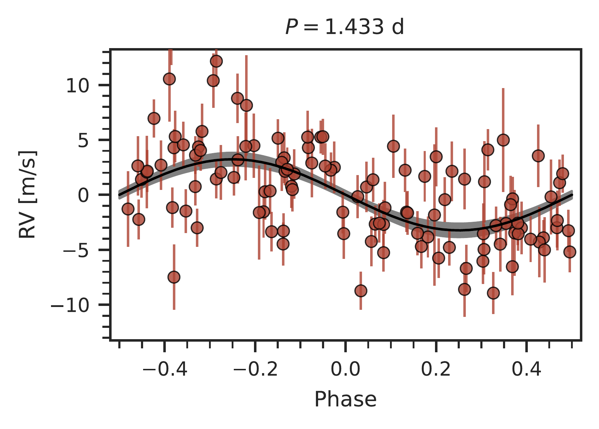
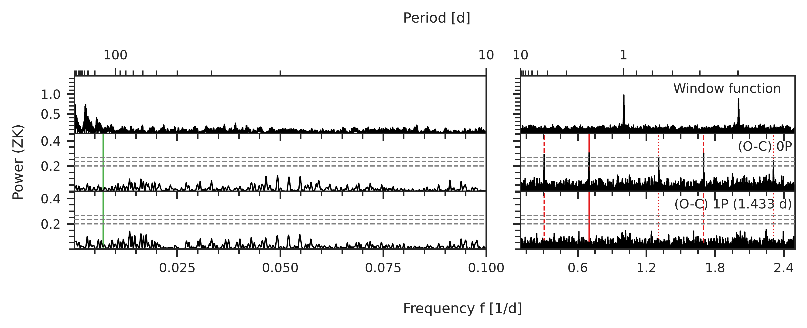

$\newcommand{\ensuremath}{}$
$\newcommand{\xspace}{}$
$\newcommand{\object}[1]{\texttt{#1}}$
$\newcommand{\farcs}{{.}''}$
$\newcommand{\farcm}{{.}'}$
$\newcommand{\arcsec}{''}$
$\newcommand{\arcmin}{'}$
$\newcommand{\ion}[2]{#1#2}$
$\newcommand{\textsc}[1]{\textrm{#1}}$
$\newcommand{\hl}[1]{\textrm{#1}}$
$\newcommand{\footnote}[1]{}$
$\newcommand{\AS}[3]{#1^{+#2}_{-#3}}$
$\newcommand{\Commref}[1]{\textcolor{red}{\textbf{#1}}}$
$\newcommand{\TODO}[1]{\textcolor{magenta}{\textsc{todo:} \textit{#1}}}$
$\newcommand{\StarJOne}{G~261--6}$
$\newcommand{\PlanetJOne}{G~261--6 b}$
$\newcommand{\MassJOne}{\SI{1.37\pm0.23}{M_\oplus}}$
$\newcommand{\PeriodJOne}{\SI{5.4536\pm0.0032}{\day}}$
$\newcommand{\ProtJOne}{\SI{114}{\day}}$
$\newcommand{\PeriodCandJone}{\SI{1.83}{\day}}$
$\newcommand{\StarJTwo}{G~192--15}$
$\newcommand{\MassJTwoc}{\SI{14.3}{M_\oplus}}$
$\newcommand{\MassJTwob}{\SI{1.03\pm0.18}{M_\oplus}}$
$\newcommand{\StarJZero}{G~268--110}$
$\newcommand{\PlanetJZero}{G~268--110 b}$
$\newcommand{\MassJZero}{\SI{1.52\pm0.25}{M_\oplus}}$
$\newcommand{\PeriodJZero}{\SI{1.43263\pm0.000076}{\day}}$
$\newcommand{\TeqJZero}{\SI{534\pm12}{\day}}$
$\newcommand{\ProtJZero}{\SI{143}{\day}}$
$\newcommand{\RomanNumeralCaps}[1]$
$\newcommand{\inst}[1]{\unskip^{\instrefs{#1}}}$
$\newcommand{\autoref}$
$\newcommand{\scsep}{\newcommand\scsep{,}}$
$\newcommand{\equationautorefname}{Eq.}$
$\newcommand{\figureautorefname}{Fig.}$
$\newcommand{\sectionautorefname}{Sect.}$
$\newcommand{\subsectionautorefname}{Sect.}$
$\newcommand{\subsubsectionautorefname}{Sect.}$
$\newcommand\scsep{,}$

# The CARMENES search for exoplanets around M dwarfs: Occurrence rates of Earth-like planets around very low-mass stars

<mark>Appeared on: 2025-04-07</mark> -  _Number of pages: 25; number of figures: 23 (12 in main + 11 in appendix). Accepted in A&A; DOI (pending): https://doi.org/10.1051/0004-6361/202453381 (Volume 696, Article number A101)_

A. Kaminski, et al. -- incl., <mark>R. Burn</mark>, <mark>T. Henning</mark>, <mark>M. Kürster</mark>

**Abstract:**            Aims: Previous estimates of planet occurrence rates in the CARMENES survey indicated increased numbers of planets on short orbits for M dwarfs with masses below 0.34\,M$_\odot$. Here we focused on the lowest-mass stars in the survey, comprising 15 inactive targets with masses under 0.16\,M$_\odot$. Methods: To correct for detection biases, we determined detection sensitivity maps for individual targets and the entire sample. Using Monte Carlo simulations, we estimated planet occurrence rates for orbital periods of 1\,d to 100\,d and minimum masses from 0.5\,M$_\oplus$ to 10\,M$_\oplus$. Results: The radial velocity (RV) data from CARMENES reveal four new planets around three stars in our sample, namely G~268--110\,b, G~261--6\,b, and G~192--15\,b and c. All three b planets have minimum masses of 1.03--1.52\,M$_\oplus$ and orbital periods of 1.43--5.45\,d, while G~192--15\,c is a 14.3\,M$_\oplus$ planet on a wide, eccentric orbit with $P \approx 1218$\,d and $e \approx 0.68$. Our occurrence rates suggest considerable dependencies with respect to stellar masses. For planets below 3\,M$_\oplus$ we found rates consistent with one planet per star across all investigated periods, but the rates decrease almost by an order of magnitude for larger planet masses up to 10\,M$_\oplus$. Compared to previous studies, low-mass stars tend to harbor more planets with $P <10$\,d. We also demonstrate that synthetic planet populations based on the standard core accretion scenario predict slightly more massive planets on wider orbits than observed. Conclusions: Our findings confirm that planet occurrence rates vary with stellar masses even among M dwarfs, as we found more planets with lower masses and on shorter orbits in our subsample of very low-mass stars compared to more massive M dwarfs. Therefore, we emphasize the need for additional differentiation in future studies.         

**Figure 3. -** CARMENES detection sensitivity map, averaged over the individual maps of the 15 stellar targets of this study.
    The light blue markers indicate the 11 planets included for this occurrence rate analysis, and the color map illustrates the detection probabilities of the respective period-mass grid points. The solid lines represent the masses associated to the RV semi-amplitude values equal to the RVs' root mean square averaged over the time series (blue), the mean RV uncertainties (magenta), and the median of the RV uncertainties. (*fig:planet_occurrence*)

**Figure 1. -** Phased RV plot for $\PlanetJZero$  based on the best fit model (1P$_\text{(1.43 d-circ)}$). The black line depicts the model based on the parameters listed in $\autoref${tab:planetparams}. The shaded area illustrates the 1$\sigma$ confidence interval. (*fig:phasefolded_J01048-181*)

**Figure 6. -** Window function (upper panel) and GLS periodograms of the CARMENES RVs for $\StarJZero$  before ('0P', middle) and after subtracting the one-planet model ('1P', bottom).
    The two panels on the left and right represent the same GLS periodograms but plot different regions to better represent the occurring signals. The period of the 1.43-day planet is highlighted by a red solid line. Its first-order aliases at \SI{3.28}{\day} and \SI{0.59}{\day} are marked by red dashed lines, and the second-order aliases at \SI{0.76}{\day} and \SI{0.43}{\day} by red dotted lines. The rotation period of \SI{143}{\day} determined by \cite{Newton2018} is indicated by a solid green line. (*fig:gls_rv_J01048-181*)

