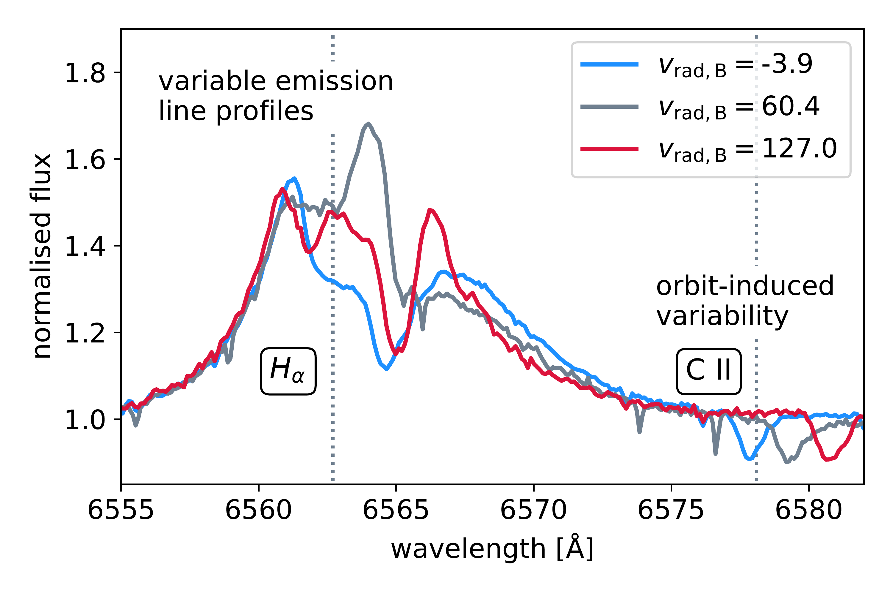

$\newcommand{\ensuremath}{}$
$\newcommand{\xspace}{}$
$\newcommand{\object}[1]{\texttt{#1}}$
$\newcommand{\farcs}{{.}''}$
$\newcommand{\farcm}{{.}'}$
$\newcommand{\arcsec}{''}$
$\newcommand{\arcmin}{'}$
$\newcommand{\ion}[2]{#1#2}$
$\newcommand{\textsc}[1]{\textrm{#1}}$
$\newcommand{\hl}[1]{\textrm{#1}}$
$\newcommand{\footnote}[1]{}$
$\newcommand{\aj}{Astronomical Journal}$
$\newcommand{\apj}{Astrophysical Journal}$
$\newcommand{\aap}{Astronomy \& Astrophysics}$
$\newcommand{\jcap}{Journal of Cosmology and Astroparticle Physics}$
$\newcommand{\aapr}{The Astronomy and Astrophysics Review}$
$\newcommand{\mnras}{Monthly Notices of the Royal Astronomical Society}$
$\newcommand{\araa}{Annual Review of Astronomy and Astrophysics}$
$\newcommand{\Msun}{\mathrm{M}_\odot}$

# HIP 15429: a newborn Be star on an eccentric binary orbit

<mark>Appeared on: 2025-04-10</mark> -  _submitted to Astronomy & Astrophysics_

<mark>J. Müller-Horn</mark>, et al. -- incl., <mark>K. El-Badry</mark>, <mark>H.-W. Rix</mark>, <mark>R. Seeburger</mark>, <mark>J. Villasenor</mark>

**Abstract:** Interaction in close binary systems is common in massive stars. The mass donor is stripped of its hydrogen envelope and evolves to become a hot helium star, whereas the accretor gains mass and angular momentum, spinning up in the process. However, the small number of well-constrained post-interaction binary systems currently limits detailed comparisons with binary evolution models.    We identified a new post-interaction binary, HIP 15429, consisting of a stripped star and a recently formed, rapidly rotating Be star companion ( $v_\mathrm{rot} \sin i \approx 270 $ km/s) sharing many similarities with recently identified bloated stripped stars.    From orbital fitting of multi-epoch radial velocities we find a 221-day period. We also find an eccentricity of $e=0.52$ , which is unexpectedly high as tides are expected to have circularised the orbit efficiently during the presumed recent mass transfer. The formation of a circumbinary disk during the mass transfer phase or the presence of an unseen tertiary companion might explain the orbit's high eccentricity.    We determined physical parameters for both stars by fitting the spectra of the disentangled binary components and multi-band photometry. The stripped nature of the donor star is affirmed by its high luminosity at a low inferred mass ( $\lesssim 1 \mathrm{M}_\odot$ ) and imprints of CNO-processed material in the surface abundances. The donor's relatively large radius and cool temperature ( $T_{\rm eff} = 13.5 \pm 0.5 $ kK) suggest that it has only recently ceased mass transfer.    Evolutionary models assuming a 5-6 $ \mathrm{M}_\odot$ progenitor can reproduce these parameters and imply that the binary is currently evolving towards a stage where the donor becomes a subdwarf orbiting a Be star.    The remarkably high eccentricity of HIP 15429 challenges standard tidal evolution models, suggesting either inefficient tidal dissipation or external influences, such as a tertiary companion or circumbinary disk. This underscores the need to identify and characterise more post-mass transfer binaries to benchmark and refine theoretical models of binary evolution.

**Figure 22. -** Spectral constraints on the stellar parameters of the narrow-lined stripped star. The panels show the disentangled spectrum (black) compared to PoWR models with the best-fit parameters ($T_\mathrm{eff} = 13.5,\text{kK}$, $\log g = 2.25$). The models differ in composition: one assumes solar hydrogen, helium and metal abundances \citep{Asplund+2021}, while our fiducial model (blue) is He- and N-enriched, characteristic of a stripped star. The narrow H-Balmer absorption lines support a low surface gravity, while the stripped-star model provides a better fit to the He and N absorption features. Metal lines not present in the model spectra (e.g., Si II 4153, 4163 Å) were not included in the atomic line lists. (*fig:stripped_star_models*)

**Figure 1. -** _Top:_{Balmer emission lines at quadrature.} Two TRES spectra taken close to quadrature (red and blue lines) and one spectrum close to the system's barycentric velocity (grey line). The grey dotted lines indicate the rest-frame wavelengths of the Balmer H$_\alpha$ and carbon C II 6572 lines. Orbital motion of the narrow-lined star is apparent from wavelength shifts in the C II lines, whereas the H$_\alpha$ line shows variable emission line profiles.\ _Bottom:_{Short-term variability of emission line profiles.} Three TRES spectra observed at $t = \mathrm{MJD}   60235$, $t + 5 $d and $t+ 9 $d, that is, spanning $<5\%$ of the orbital period. Solid grey, red and blue lines show the variable H$_\alpha$ emission line profiles. The rest-frame wavelength of H$_\alpha$ is shown as in the top panel. Narrow lines at 6574, 6577 Å   originate from variable telluric absorption. (*fig:spectral_variability*)

**Figure 25. -** {Period-eccentricity diagram for known post-mass transfer binaries.} Recently discovered bloated stripped star binaries with O/Be companions \citep{Shenar+2020,ElBadry_Quataert2021,Villasenor+2023,Ramachandran+2024,Pauli+2022} are indicated with red diamond markers. These include the parameter values for HIP 15429 determined in this work (Müller-Horn et al. 2025). Be + subdwarf binaries with known orbital parameters are shown with light blue triangles \citep{Mourard+2015,Chojnowski+2018,Peters+2008,Peters+2013,Klement+2022,Klement+2024,Wang+2023}. We plot the short-period subdwarf binaries compiled by \cite{Edelmann+2005} and \cite{Kupfer+2015} and long-period ($>500 $d orbits) subdwarf binaries discovered by \cite{Deca+2012,Barlow+2013,Vos+2012,Vos+2013,Vos+2017} with dark blue triangles. Likely post-common envelope binaries with white dwarf or main sequence stars analysed by \cite{Yamaguchi+2024} are shown with yellow stars. (*fig:period_eccentricity_comparison*)

