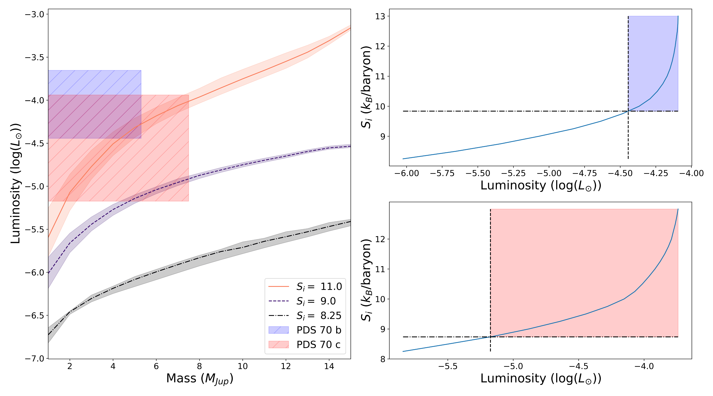
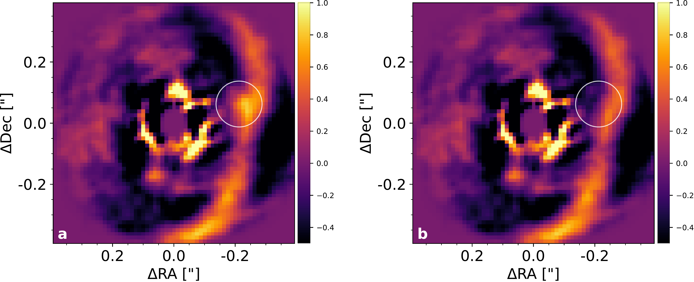

$\newcommand{\ensuremath}{}$
$\newcommand{\xspace}{}$
$\newcommand{\object}[1]{\texttt{#1}}$
$\newcommand{\farcs}{{.}''}$
$\newcommand{\farcm}{{.}'}$
$\newcommand{\arcsec}{''}$
$\newcommand{\arcmin}{'}$
$\newcommand{\ion}[2]{#1#2}$
$\newcommand{\textsc}[1]{\textrm{#1}}$
$\newcommand{\hl}[1]{\textrm{#1}}$
$\newcommand{\footnote}[1]{}$
$\newcommand{\Mp}{\ensuremath{M_{\mathrm{p}}}\xspace}$
$\newcommand{\Sunits}{\ensuremath{k_{\mathrm{B}}/\mathrm{baryon}}\xspace}$
$\newcommand{\mum}{\ensuremath{\upmu}m\xspace}$
$\newcommand{\mas}{\ensuremath{\upmu}as\xspace}$
$\newcommand{\arraystretch}{1.4}$
$\newcommand{\arraystretch}{1.1}$

# Differentiating Formation Models with New Dynamical Masses for the PDS 70 Protoplanets

<mark>Appeared on: 2025-04-16</mark> - 

<mark>D. Trevascus</mark>, et al. -- incl., <mark>E. Matthews</mark>, <mark>I. Hammond</mark>, <mark>W. Brandner</mark>, <mark>R. Burn</mark>, <mark>G. Chauvin</mark>, <mark>L. Kreidberg</mark>, <mark>J. Sauter</mark>

**Abstract:** Hot- and cold-start planet formation models predict differing luminosities for the young, bright planets that direct imaging surveys are most sensitive to. However, precise mass estimates are required to distinguish between these models observationally. The presence of two directly imaged planets, PDS 70 _b_ and _c_ , in the PDS 70 protoplanetary disk provides us a unique opportunity for dynamical mass measurements, since the masses for these planets are currently poorly constrained. Fitting orbital parameters to new astrometry of these planets, taken with VLTI/GRAVITY in the $K$ band, we find $2\sigma$ dynamical upper mass limits of 4.9 $M_{\rm Jup}$ for _b_ and 13.6 $M_{\rm Jup}$ for _c_ . Adding astrometry from the newly proposed planet candidate PDS 70 _d_ into our model, we determine $2\sigma$ dynamical upper mass limits of 5.3 $M_{\rm Jup}$ , 7.5 $M_{\rm Jup}$ and 2.2 $M_{\rm Jup}$ for _b_ , _c_ , and the candidate _d_ respectively. However, $N$ -body analysis of the orbits fit in this case suggest that the inclusion of $d$ makes the system unstable. Using the upper mass limits for _b_ and _c_ we rule out the coldest-start formation models for both planets, calculating minimum post-formation entropies ( $S_i$ ) of 9.5 $\Sunits$ and 8.4 $\Sunits$ respectively. This places PDS 70 _b_ and _c_ on the growing list of directly-imaged planets inconsistent with cold-start formation.

**Figure 7. -** Same as Figure \ref{fig:evo_comp_3body}, but with upper mass limits taken from the three-planet orbital parameter fit. (*fig:evo_comp_3body*)

**Figure 6. -** Comparison of the upper mass limits for PDS 70 _b_ and PDS 70 _c_ from the two-planet orbital parameter fit to cold-, warm-, and hot-start evolutionary models from \citet{Spiegel_2012}. The mass-luminosity curves for the different models, taken at the PDS 70 system age of 5.4 Myr are shown in the left panel, with their corresponding post-formation entropies given in the legend. The ribbon around each curve corresponds to the uncertainty in age of PDS 70. The blue and red boxes in the left panel show the possible masses and luminosities for _b_ and _c_ respectively, with luminosities taken from \citet{Wang_2020}. The upper right panel shows the luminosity-$S_i$ curve at the upper mass limit for _b_. The blue shaded area in this panel, bounded by the dashed and dashed-dotted lines shows the possible range of $S_i$ for _b_ from this orbital parameter fit. The lower right panel is the same as upper right panel, but for _c_. (*fig:evo_comp_2body*)

**Figure 1. -** Final image obtained from our new reduction of the 2014-05-10 SINFONI data, before (a) and after (b) subtracting the estimated contribution of planet _c_ as explained in Sec. \ref{sec:SINFONI}. (*fig:c_in_SINFONI*)

