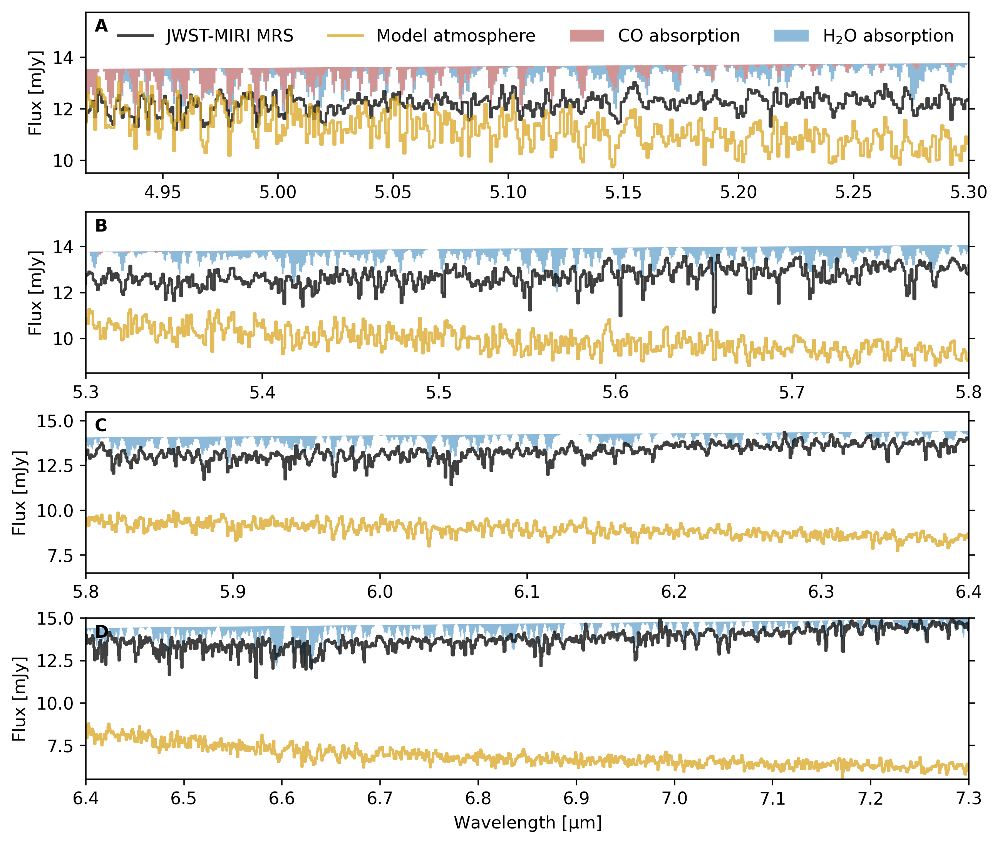

$\newcommand{\ensuremath}{}$
$\newcommand{\xspace}{}$
$\newcommand{\object}[1]{\texttt{#1}}$
$\newcommand{\farcs}{{.}''}$
$\newcommand{\farcm}{{.}'}$
$\newcommand{\arcsec}{''}$
$\newcommand{\arcmin}{'}$
$\newcommand{\ion}[2]{#1#2}$
$\newcommand{\textsc}[1]{\textrm{#1}}$
$\newcommand{\hl}[1]{\textrm{#1}}$
$\newcommand{\footnote}[1]{}$
$\newcommand{\vdag}{(v)^\dagger}$
$\newcommand$
$\newcommand$
$\newcommand{\angstrom}{\text{\normalfontÅ}}$
$\newcommand{\change}[1]{#1}$
$\newcommand{\arraystretch}{1.1}$
$\newcommand{\arraystretch}{1.1}$

# MINDS. Anatomy of a water-rich, inclined, brown dwarf disk: lack of abundant hydrocarbons

<mark>Appeared on: 2025-04-16</mark> -  _30 pages, 18 figures, resubmitted the first revision to ApJ_

<mark>G. Perotti</mark>, et al. -- incl., <mark>T. Henning</mark>, <mark>K. Schwarz</mark>, <mark>R. v. Boekel</mark>

**Abstract:** $\change{2MASS J04381486+2611399 (or J0438) is one of the few young brown dwarfs (BD) with a highly inclined ($i\!\sim\!70^\circ$) disk. Here we report results from JWST-MIRI MRS, HST-ACS and ALMA Band 7 observations. Despite its late spectral type (M7.25), the spectrum of J0438 resembles those of inner disks around earlier-type stars (K1–M5, T Tauri stars), with a volatile reservoir lacking hydrocarbons (except for acetylene, $C_2$$H_2$) and dominated by water. Other identified species are $H_2$, $CO_2$, HCN, [Ar$^{+}$], and [Ne$^{+}$]. The dominance of water over hydrocarbons is driven by multiple factors such as disk dynamics, young disk age, low accretion rate and possible inner disk clearing. J0438 appears highly dynamic, showing a seesaw-like variability and extended emission in $H_2     S$(1), $S$(3), $S$(5), [Ne$^{+}$] and CO ($J=3-2$). Interestingly, the CO  emission reaches up to 400 au from the brown dwarf, suggesting ongoing infalling/outflowing activity impacting the disk chemistry. These observations underscore the combined power of JWST, HST and ALMA in characterizing the chemical diversity and dynamics of brown dwarf disks.}$

**Figure 4. -** **Absorption bands from the photosphere of the brown dwarf**. Comparison between the JWST-MIRI MRS spectrum of J0438 (black) and the PHOENIX model atmosphere spectrum (gold; \citealt{Husser2013}) described in Section \ref{app:stellar_contamination}. For illustration purposes, slab models highlighting the absorption bands of $H_2$O (light blue) and CO (light red) are also shown. (*fig:BD_absorption*)

**Figure 12. -** **JWST-MIRI MRS spectrum of the young J0438 disk (black).** The spectrum is dominated by amorphous silicate absorption and emission bands typical of a highly inclined disk configuration. A very weak $CO_2$ ice absorption feature is tentatively detected (see Appendix \ref{app:cont_sub}, Fig. \ref{fig:co2_ice}) along with inner disk gas reservoir (Table \ref{tab:fluxes}) composed by molecular hydrogen ($H_2$), water ($H_2$O), carbon dioxide ($CO_2$), hydrogen cyanide (HCN), acetylene ($C_2$$H_2$) and the singly ionized cations of argon and neon ([Ar$^{+}$], [Ne$^{+}]$; for zoom-ins see Appendices \ref{app:stellar_contamination} and \ref{app:variability}). The comparison between the JWST-MIRI and the _Spitzer_-IRS low- (SL, LL) and high- (SH) resolution spectra reveal continuum and line variability (grey and teal). The _Spitzer_-IRS spectra were taken from CASSIS \citep{Lebouteiller2011,Lebouteiller2015} and \citet{Pascucci2013}. (*fig:full_spectra*)

**Figure 3. -** **Near- and mid-IR spectra of the young brown dwarf J0438.** Near-infrared IRTF (light blue; \citealt{Luhman2007}), _Spitzer_-IRAC photometry (blue points), _Spitzer_-IRS SL, LL (grey; PID: 40302; PI: J. R. Houck), _Spitzer_-IRS SH (teal; \citealt{Pascucci2013}) and JWST-MIRI MRS (dark blue; this work). The inset shows a zoom-in of the IRTF data. The prominent $H_2$O, CO and amorphous silicate absorption bands are labelled. (*fig:nir_mir*)

