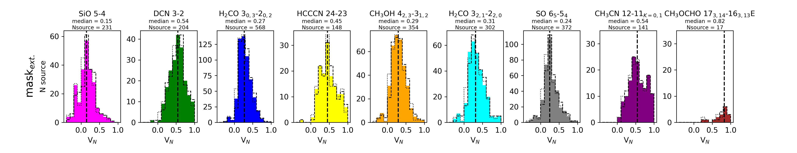
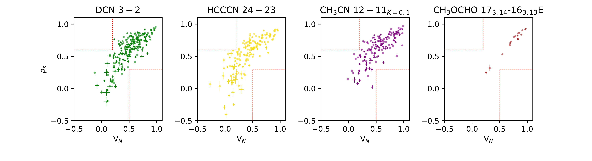
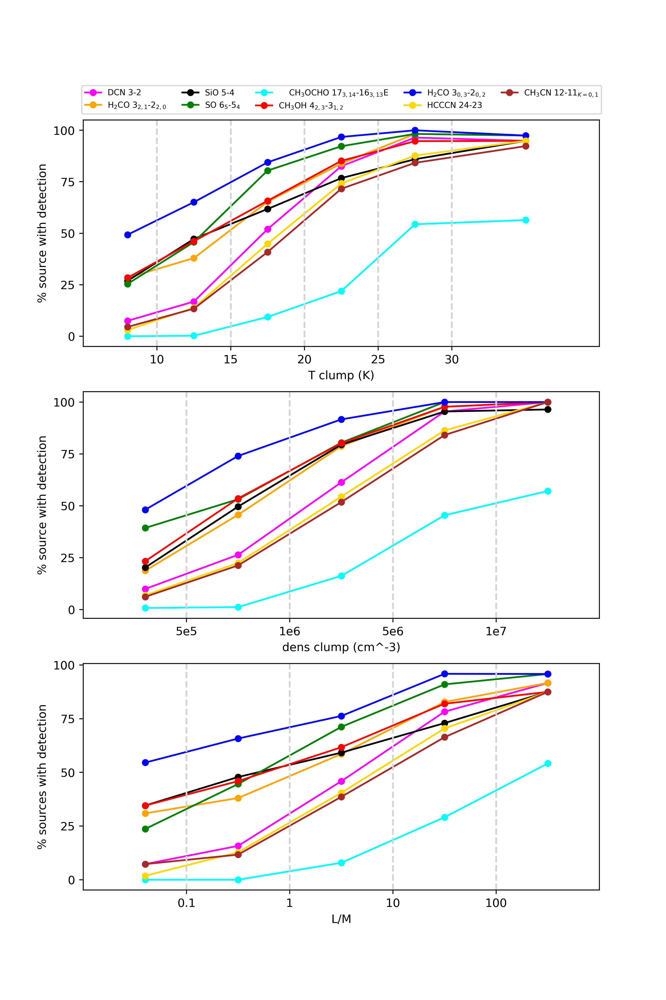

$\newcommand{\ensuremath}{}$
$\newcommand{\xspace}{}$
$\newcommand{\object}[1]{\texttt{#1}}$
$\newcommand{\farcs}{{.}''}$
$\newcommand{\farcm}{{.}'}$
$\newcommand{\arcsec}{''}$
$\newcommand{\arcmin}{'}$
$\newcommand{\ion}[2]{#1#2}$
$\newcommand{\textsc}[1]{\textrm{#1}}$
$\newcommand{\hl}[1]{\textrm{#1}}$
$\newcommand{\footnote}[1]{}$

# ALMAGAL IV. Morphological comparison of molecular and thermal dust emission using the histogram of oriented gradients (HOG) method

<mark>Appeared on: 2025-04-18</mark> -  _Accepted for publication in A&A; 29 pages, 20 figures_

C. Mininni, et al. -- incl., <mark>H. Beuther</mark>, <mark>M. Wells</mark>

**Abstract:** The study of molecular line emission is crucial to unveil the kinematics and the physical conditions of gas in star-forming regions. We utilize data from the ALMAGAL survey which provides an unprecedentedly large statistical sample of high-mass star-forming clumps that helps to remove bias and reduce noise (e.g. due to source peculiarities, selection or environmental effects) to determine how well individual molecular species trace continuum emission. Our aim is to quantify the reliability of using individual molecular transitions to derive physical properties of the bulk of the $H_2$ gas, looking at morphological correlations in their overall integrated molecular line emission with the cold dust. For this study we selected transitions  of $H_2$ CO, $CH_3$ OH, DCN, $HC_3$ N, $CH_3$ CN, $CH_3$ OCHO, SO, and SiO  and compared them with the 1.38 mm dust continuum emission at different spatial scales in the ALMAGAL sample. We included two transitions of $H_2$ CO to understand the validity of the results depending on the excitation condition of the selected transition of a molecular specie. The ALMAGAL project observed more than 1000 candidate high-mass star-forming clumps in ALMA Band 6 at a spatial resolution down to 1000 au. A total of 1013 targets have been analyzed in the present paper, covering all evolutionary stages of the high-mass star-formation process and different conditions of clump fragmentation. We used, for the first time on a large statistical sample, the method of the histogram of oriented gradients (HOG) implemented in the tool \texttt{astroHOG} to compare the morphology of integrated line emission with maps of the 1.38 mm dust continuum emission. For each clump, we defined two masks: one that covers the extended more diffuse continuum emission and a smaller one that contains only the compact sources. We select these two masks to study if and how the correlation among the selected molecules changes with the spatial scale of the emission, from extended more diffuse gas in the clumps to denser gas in compact fragments (cores). Moreover, we calculated the Spearman's correlation coefficient, and compared it with our astroHOG results. Among the molecular species analyzed in this paper, only $H_2$ CO, $CH_3$ OH, and SO show emission on spatial scales comparable with the diffuse 1.38 mm dust continuum emission. However, from the HOG method, the median correlation of the emission of each of these species with the continuum is only $\sim$ 24-29 \% . In comparison with the dusty dense fragments these molecular species still have low values of correlation, on average below 45 \% . The low level of morphological correlation suggests that these molecular lines likely trace on average the clump medium or outer layers around dense fragments (in some cases possibly due to optical depth effects) or are also at this scale tracing inner parts of outflows. On the other hand DCN, $HC_3$ N, $CH_3$ CN, and $CH_3$ OCHO show a good correlation with the dense dust fragments, above 60 \% . The worst correlation is seen with SiO, both with the extended continuum emission and with compact sources. Moreover, unlike other outflow tracers, SiO in a large fraction of the sources does not cover well the area of the extended continuum emission. This and the results of the astroHOG analysis reveal that SiO and SO do not trace the same gas, contrary to what was previously thought. From the comparison of the results of the HOG method and the Spearman's correlation coefficient, the HOG method gives much more reliable results than the intensity-based coefficient in estimating the level of similarity of the emission morphology.

**Figure 12. -** 
    Morphological correlation between the continuum emission and the line emission (moment-0) for the indicated transition, as quantified by $V_{\rm{N}}$ parameter from the \texttt{astroHOG} method.
    Values of $V_{\rm{N}}$$\approx$ 0 and $V_{\rm{N}}$$\approx$ 1  correspond to no correlation and perfect correlation in the distribution of the two emissions, respectively.
    The upper panels correspond to the correlation on the intersection of the moment-0 line emission mask and the mask$_{\rm{ext.}}$.
    The lower panels correspond to a mask selecting only the compact sources where the line is detected, starting from mask$_{\mathrm{com.}}$.
    The dotted and dashed histograms represent how the distribution would change if all the values were replaced by V$_{\mathrm{N}}- $error (the error on the value of $V_{\mathrm{N}}$ is derived using an MC method, see Sect. 4.3) and $V_{\mathrm{N}}+ $error, respectively.  (*fig:resultsastroHOG*)

**Figure 13. -** Comparison between Spearman's correlation coefficient and the $V_{N}$ parameter from the HOG method in the comparison between the continuum and the indicated species using mask$_{\rm{ext.}}$. The two boxes delimited by red dotted-dashed lines are the regions in the plot where the two estimators give the more contrasting results.  (*fig:spearman1*)

**Figure 2. -** Increase of the detection statistic of the molecular transitions analyzed, divided in bins of temperature of the clump (upper panel) and evolutionary stage of the clump L/M (lower panel). (*fig:grid_prop*)

