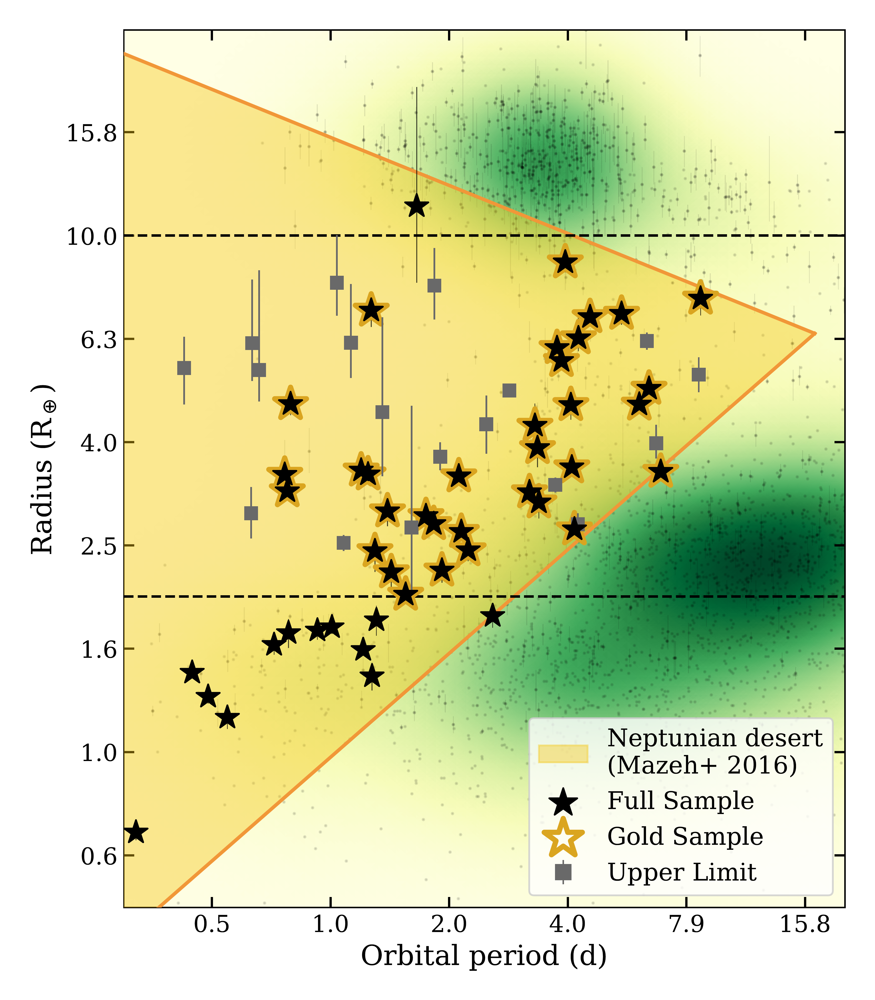
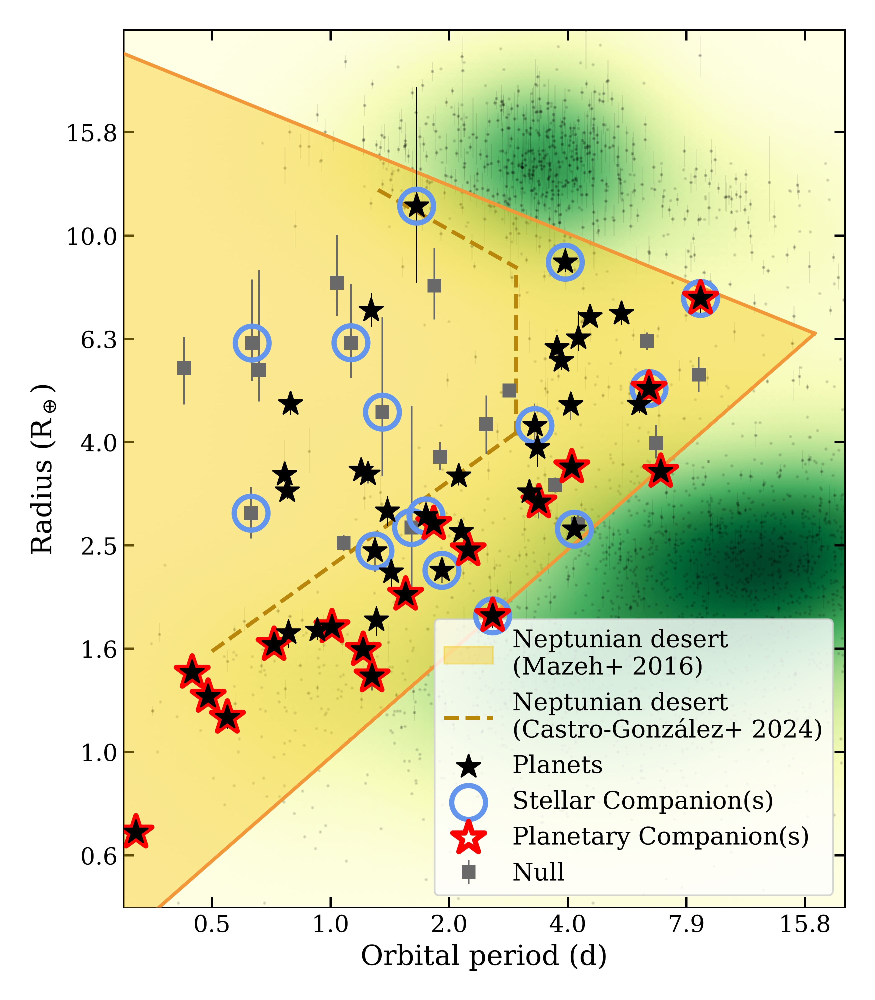
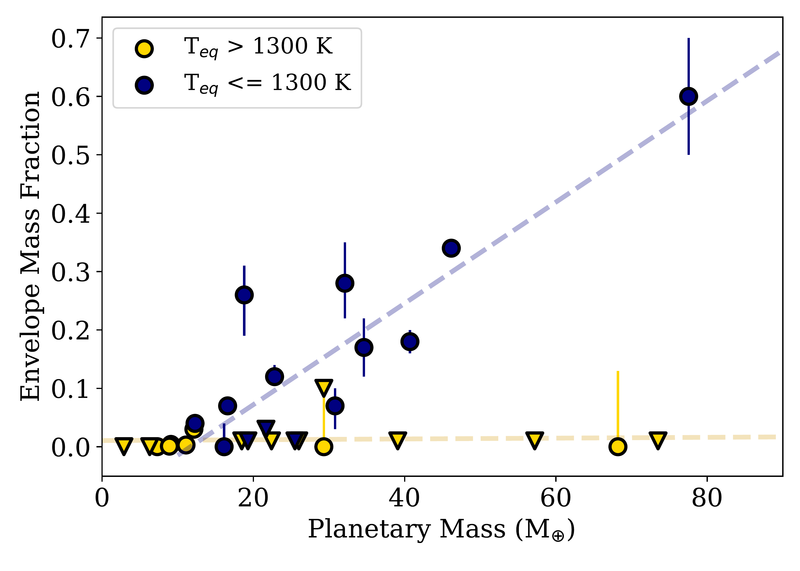

$\newcommand{\ensuremath}{}$
$\newcommand{\xspace}{}$
$\newcommand{\object}[1]{\texttt{#1}}$
$\newcommand{\farcs}{{.}''}$
$\newcommand{\farcm}{{.}'}$
$\newcommand{\arcsec}{''}$
$\newcommand{\arcmin}{'}$
$\newcommand{\ion}[2]{#1#2}$
$\newcommand{\textsc}[1]{\textrm{#1}}$
$\newcommand{\hl}[1]{\textrm{#1}}$
$\newcommand{\footnote}[1]{}$
$\newcommand{\Msun}{M_{\odot}}$
$\newcommand{\lsun}{L_{\odot}}$
$\newcommand{\Rsun}{R_{\odot}}$
$\newcommand{\Rearth}{R_{\oplus}}$
$\newcommand{\solar}{{\odot}}$
$\newcommand{\kep}{\it Kepler}$
$\newcommand{\tess}{\it TESS}$
$\newcommand{\ktwo}{\sl K2}$
$\newcommand{\swift}{\it Swift}$
$\newcommand{\Porb}{P_{\rm orb}}$
$\newcommand{\nuorb}{\nu_{\rm orb}}$
$\newcommand{\eplus}{\epsilon_+}$
$\newcommand{\eminus}{\epsilon_-}$
$\newcommand{\cd}{{\rm c d^{-1}}}$
$\newcommand{\MdotL}{\dot M_{\rm L1}}$
$\newcommand{\Mdot}{\dot M}$
$\newcommand{\Mdotsolar}{\dot{M_{\odot}} yr^{-1}}$
$\newcommand{\Ldisk}{L_{\rm disk}}$
$\newcommand{\src}{KIC 9202990}$
$\newcommand{\ergscm}{erg s^{-1} cm^{-2}}$
$\newcommand{\rchi}{\chi^{2}_{\nu}}$
$\newcommand{\chisq}{\chi^{2}}$
$\newcommand{\pcmsq}{cm^{-2}}$
$\newcommand$
$\newcommand{\rpl}{\mbox{R\textsubscript{p}}}$
$\newcommand{\rstar}{\mbox{R\textsubscript{*}}}$
$\newcommand{\thebibliography}{\DeclareRobustCommand{\VAN}[3]{##3}\VANthebibliography}$

# Exploring the Neptunian Desert: Insights from a Homogeneous Planetary Sample

<mark>Appeared on: 2025-04-24</mark> -  _Accepted and published in MNRAS. 18 pages, 9 figures, 5 tables_

L. Doyle, et al. -- incl., <mark>L. Acuña</mark>

**Abstract:** In this paper, we present a homogeneous analysis of close-in Neptune planets. To do this, we compile a sample of TESS-observed planets using a ranking criterion which takes into account the planet's period, radius, and the visual magnitude of its host star. We use archival and new HARPS data to ensure every target in this sample has precise radial velocities. This yields a total of 64 targets, 46 of which are confirmed planets and 18 of which show no significant radial velocity signal. We explore the mass-radius distribution, planetary density, stellar host metallicity, and stellar and planetary companions of our targets. We find 26 \% of our sample are in multi-planet systems, which are typically seen for planets located near the lower edge of the Neptunian desert. We define a `gold' subset of our sample consisting of 33 confirmed planets with planetary radii between 2 $R_{\oplus}$ and 10 $R_{\oplus}$ . With these targets, we calculate envelope mass fractions (EMF) using the GAS gianT modeL for Interiors (GASTLI). We find a clear split in EMF between planets with equilibrium temperatures below and above 1300 K, equivalent to an orbital period of $\sim$ 3.5 days. Below this period, EMFs are consistent with zero, while above they typically range from 20 $\%$ to 40 $\%$ , scaling linearly with the planetary mass. The orbital period separating these two populations coincides with the transition between the Neptunian desert and the recently identified Neptunian ridge, further suggesting that different formation and/or evolution mechanisms are at play for Neptune planets across different close-in orbital regions.

**Figure 1. -** Our full sample of all 64 targets within the period-radius space (black stars). The Neptunian desert boundaries are from mazeh2016dearth plotted as solid lines, with the enclosed desert area shaded in yellow. The dashed black lines represent the boundaries at 2 $\Rearth$ and 10 $\Rearth$ used to define the Neptune `gold' sample (black stars highlighted in gold). Known planets were sourced from the NASA exoplanet archive (\url{exoplanetarchive.ipac.caltech.edu}) accessed on 28 January 2025 and are plotted as grey dots in the background. The population density of known planets is shaded in green, where darker green denotes more planets discovered in that region of parameter space.  (*fig:nep_desert_all*)

**Figure 3. -** Our full sample of all 64 targets within the period-radius space. Targets identified as hosting a stellar companion (i.e. Stellar Companion(s)) are plotted with a light blue circle. Those which are members of a multiple planet system (i.e. Planetary Companion(s)) are plotted with a red highlight. Some targets meet both criteria. The Neptunian desert boundaries from mazeh2016dearth are plotted as solid lines, with the enclosed Neptunian desert area shaded in yellow. The updated Neptunian desert boundaries from castro2024mapping are plotted as a golden dashed line. All known planets were sourced from the NASA exoplanet archive (\url{https://www.exoplanetarchive.ipac.caltech.edu}) accessed on 28 January 2025 and are plotted as grey dots in the background. The population density of known planets is shaded in green, where darker green denotes more planets discovered in that region of parameter space.  (*fig:companions*)

**Figure 6. -** _ Top:_ We show the distribution of Envelope Mass Fractions (EMF) against planetary orbital period for 29 of our `gold' sample of Neptunian desert planets. For reference, Saturn's EMF = 0.75-0.83 at M = 95.16 $M_{\oplus}$, while Neptune's EMF = 0.15-0.35 at M = 17.15 $M_{\oplus}$, depending on whether their measured atmospheric metallicities are used or a solar envelope is assumed \citep[see][for a detailed comparison with Solar System planets]{acuna2024gastli}. A dashed black line is shown at 3.5 and 5.7 days which represents the Neptune ridge defined in castro2024mapping. _ Bottom:_ The distribution of EMF against planetary mass for 29 of our `gold' sample of Neptunian desert planets. For each temperature range a linear trend in EMF has been fitted and shown as a dashed line. In both, the sample has been split according to the planetary equilibrium temperature with T$_{\rm{eq}}$ > 1300 K in yellow and T$_{\rm{eq}} \leq$ 1300 K in blue. Triangle markers represent planets where only an upper limit on the EMF was derived. (*fig:EMF*)

