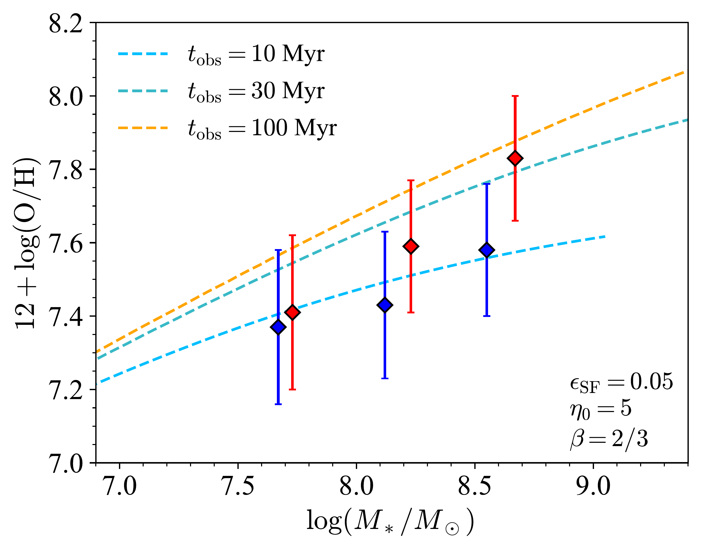

$\newcommand{\ensuremath}{}$
$\newcommand{\xspace}{}$
$\newcommand{\object}[1]{\texttt{#1}}$
$\newcommand{\farcs}{{.}''}$
$\newcommand{\farcm}{{.}'}$
$\newcommand{\arcsec}{''}$
$\newcommand{\arcmin}{'}$
$\newcommand{\ion}[2]{#1#2}$
$\newcommand{\textsc}[1]{\textrm{#1}}$
$\newcommand{\hl}[1]{\textrm{#1}}$
$\newcommand{\footnote}[1]{}$
$\newcommand{\vdag}{(v)^\dagger}$
$\newcommand$
$\newcommand$
$\newcommand{\km}{{\rm km}}$
$\newcommand{\iruv}{L_{\rm IR}/L_{\rm UV}}$
$\newcommand{\irx}{{\it IRX}}$
$\newcommand{\irxb}{{\it IRX}--\beta}$
$\newcommand{\iras}{{\it IRAS}}$
$\newcommand{\galex}{{\it GALEX}}$
$\newcommand{\kpc}{{\rm kpc}}$
$\newcommand{\mpc}{{\rm Mpc}}$
$\newcommand{\Mpc}{{\rm Mpc}}$
$\newcommand{\msun}{{M_\odot}}$
$\newcommand{\sfr}{{\rm M_\odot yr^{-1}}}$
$\newcommand{\lsun}{{\rm L_\odot}}$
$\newcommand{\hubunits}{{\rm km s^{-1} Mpc^{-1}}}$
$\newcommand{\cm}{{\rm cm}}$
$\newcommand{\Gyr}{{\rm Gyr}}$
$\newcommand{\Hboiii}{{\rm H\beta+O[III]}}$
$\newcommand{\siiv}{{\rm Si{\sc IV}}}$
$\newcommand{\heii}{{\rm He{\sc ii}}}$
$\newcommand{\nii}{{\rm[N{\sc ii}]}}$
$\newcommand{\sii}{{\rm[S{\sc ii}]}}$
$\newcommand{\nv}{{\rm N{\sc V}}}$
$\newcommand{\mgii}{{\rm Mg{\sc ii}}}$
$\newcommand{\OII}{[\textrm{O}~\textsc{ii}]\xspace}$
$\newcommand{\OIII}{[\textrm{O}~\textsc{iii}]\xspace}$
$\newcommand{\Ha}{\textrm{H}\ensuremath{\alpha}\xspace}$
$\newcommand{\Hb}{\textrm{H}\ensuremath{\beta}}$
$\newcommand{\Hg}{\textrm{H}\ensuremath{\gamma}\xspace}$
$\newcommand{\Hd}{\textrm{H}\ensuremath{\delta}\xspace}$
$\newcommand{\neiii}{{\rm Ne{\sc III}}}$
$\newcommand{\ciii}{{\rm C{\sc III}]}}$
$\newcommand{\civ}{{\rm C{\sc IV}}}$
$\newcommand{\cii}{{\rm[C{\sc II}]}}$
$\newcommand{\el}[1]{\ensuremath{\textrm{EL}_{#1}}}$
$\newcommand{\arraystretch}{1.3}$
$\newcommand{\arraystretch}{1.35}$
$\newcommand{\arraystretch}{1.2}$

# Insights on Metal Enrichment and Environmental Effect at $z\approx5-7$ with JWST ASPIRE/EIGER and Chemical Evolution Model

<mark>Appeared on: 2025-04-29</mark> -  _19 pages, 9 figures. Comments are welcome_

Z. Li, et al. -- incl., <mark>F. Walter</mark>

**Abstract:** We present the mass-metallicity relation (MZR) for a parent sample of 604 galaxies at $z=5.34-6.94$ with $\OIII$ doublets detected, using the deep JWST/NIRCam wide field slitless spectroscopic (WFSS) observations in 26 quasar fields. The sample incorporates the full observations of 25 quasar fields from JWST Cycle 1 GO program ASPIRE and the quasar SDSS J0100+2802 from JWST EIGER program.    We identify 204 galaxies residing in overdense structures using friends-of-friends (FoF) algorithm. We estimate the electron temperature of $2.0^{+0.3}_{-0.4}\times10^4$ K from the $\Hg$ and $\OIII_{4363}$ lines in the stacked spectrum, indicating a metal-poor sample with median gas phase metallicity 12+ $\log(\mathrm{O/H})=7.64^{+0.23}_{-0.11}$ .    With the most up-to-date strong line calibration based on NIRSpec observations, we find that the MZR shows a metal enhancement of $\sim0.2$ dex at high mass end in overdense environments. However, compared to the local Fundamental Metallicity Relation (FMR), our galaxy sample at $z>5$ shows a metal deficiency of $\sim0.2$ dex relative to FMR predictions. We explain the observed trend of FMR with a simple analytical model, and we favor dilution from intense gas accretion over outflow to explain the metallicity properties at $z>5$ .    Those high redshift galaxies are likely in a rapid gas accretion phase when their metal and gas contents are in a non-equilibrium state. According to model predictions, the protocluster members are closer to the gas equilibrium state than field galaxies and thus have higher metallicity and closer to the local FMR.    Our results suggest that the accelerated star formation during protocluster assembly likely plays a key role in shaping the observed MZR and FMR, indicating a potentially earlier onset of metal enrichment in overdense environments at $z\approx5-7$ .

**Figure 11. -** The predicted $Z-\text{SFR}$ relations for different model configurations. The first panel: Model 1, Incorporating inflow but no outflow, with $\epsilon_\text{SF}$ as the varying parameter. The second panel: Model 2, Incorporating outflow but no inflow, with $\epsilon_\text{SF}$ as the varying parameter. The third panel: Model 3, Incorporating both inflow and outflow, with $\eta$ as the varying parameter. The fourth panel: Model 4, Incorporating both inflow and outflow, with $\beta$ as the varying parameter. In all panels, the lines are color-coded by stellar mass, while different line styles indicate variations in model parameters. (*fig:FMR_predictions*)

**Figure 5. -** Top: The predicted MZR for galaxies with different $t_\text{obs}$. The dashed lines are MZRs color-coded by $t_\text{obs}$. This model assumes $\epsilon_\text{SF}=0.05$, $\eta_0=5$, and an energy-driven wind $\beta=2/3$. The diamond points are our observations the same as in Fig. \ref{fig:mzr}. Bottom: The predicted SFR$-$Z relation for galaxies is shown for different stellar masses and $t_\text{obs}$. The dashed lines, color-coded by $t_\text{obs}$, connect galaxies with the same observational time, while the solid black lines link galaxies of equal stellar mass. Different stellar masses are represented by different symbols. The red and blue diamond points are our observations in cluster and field environments. The asymmetric errors on SFR are due to uncertainties in dust correction.  (*fig:MZR_predictions*)

**Figure 10. -** The mass-metallicity relation for galaxies in protoclusters (red) and blank fields (blue), which are based on R3 calibration from \citetalias{Chakraborty_24}. The \citetalias{Sanders_24} calibration provides similar results, which are listed in Table. \ref{tab:mzr_info} for comparison.
    The results from other works in literature are shown with different colors, which are also listed in Table. \ref{tab:mzr_info} for reference. Higher redshift ($z>3$) measurements in literature are shown in solid lines, and lower redshift ($z\sim2-3$) measurements are shown in dashed lines.
     (*fig:mzr*)

