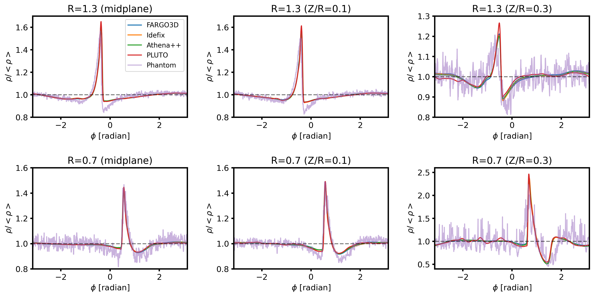

$\newcommand{\ensuremath}{}$
$\newcommand{\xspace}{}$
$\newcommand{\object}[1]{\texttt{#1}}$
$\newcommand{\farcs}{{.}''}$
$\newcommand{\farcm}{{.}'}$
$\newcommand{\arcsec}{''}$
$\newcommand{\arcmin}{'}$
$\newcommand{\ion}[2]{#1#2}$
$\newcommand{\textsc}[1]{\textrm{#1}}$
$\newcommand{\hl}[1]{\textrm{#1}}$
$\newcommand{\footnote}[1]{}$
$\newcommand{\vdag}{(v)^\dagger}$
$\newcommand$
$\newcommand$
$\newcommand{\fargo}{\texttt{FARGO3D}}$
$\newcommand{\inewcommandix}{\texttt{Inewcommandix}}$
$\newcommand{\athena}{\texttt{Athena++}}$
$\newcommand{\pluto}{\texttt{PLUTO}}$
$\newcommand{\Phantom}{\texttt{Phantom}}$
$\newcommand{\mcfost}{\texttt{mcfost}}$
$\newcommand{\radmc}{\texttt{RADMC-3D}}$
$\newcommand{\discminer}{\texttt{DISCMINER}}$

# exoALMA VII: Benchmarking Hydrodynamics and Radiative Transfer Codes

<mark>Appeared on: 2025-04-29</mark> -  _16 pages, 13 figures, Accepted for publication in The Astrophysical Journal Letters_

J. Bae, et al. -- incl., <mark>M. Flock</mark>, <mark>M. Benisty</mark>, <mark>I. Hammond</mark>, <mark>A. Winter</mark>

**Abstract:** Forward modeling is often used to interpret substructures observed in protoplanetary disks. To ensure the robustness and consistency of the current forward modeling approach from the community, we conducted a systematic comparison of various hydrodynamics and radiative transfer codes. Using four grid-based hydrodynamics codes ( $\fargo$ , $\idefix$ , $\athena$ , $\pluto$ ) and a smoothed particle hydrodynamics code ( $\Phantom$ ), we simulated a protoplanetary disk with an embedded giant planet. We then used two radiative transfer codes ( $\mcfost$ , $\radmc$ ) to calculate disk temperatures and create synthetic $^{12}$ CO cubes. Finally, we retrieved the location of the planet from the synthetic cubes using $\discminer$ . We found strong consistency between the hydrodynamics codes, particularly in the density and velocity perturbations associated with planet-driven spirals. We also found a good agreement between the two radiative transfer codes: the disk temperature in $\mcfost$ and $\radmc$ models agrees within $\lesssim 3 \%$ everywhere in the domain. In synthetic $^{12}$ CO channel maps, this results in brightness temperature differences within $\pm1.5$ K in all our models. This good agreement ensures consistent retrieval of planet's radial/azimuthal location with only a few \% of scatter, with velocity perturbations varying $\lesssim 20 \%$ among the models. Notably, while the planet-opened gap is shallower in the $\Phantom$ simulation, we found that this does not impact the planet location retrieval. In summary, our results demonstrate that any combination of the tested hydrodynamics and radiative transfer codes can be used to reliably model and interpret planet-driven kinematic perturbations.

**Figure 1. -** Perturbed density (normalized by the initial density), $\delta\rho/\rho_{\rm init}$ at (top panels) $Z/R=0.3$(3 scale heights above the midplane at $R=1$), (middle panels) $Z/R=0.1$(1 scale height above the midplane at $R=1$), and (bottom panels) midplane. From left to right, results with \texttt{FARGO3D}, \texttt{Idefix}, \texttt{Athena++}, \texttt{PLUTO}, and \texttt{Phantom}. At high altitudes, $\Phantom$ results appear noisy because of the small number of SPH particles in the low-density regions. (*fig:dens2d*)

**Figure 10. -** Azimuthal distribution of the density at (top panels) $R=1.3$ and (bottom panels) $R=0.7$. From left to right, each panel shows the density at the midplane, at $Z/R=0.1$, and $Z/R=0.3$, respectively. The scatter seen in the $\Phantom$ simulation is due to the finite number of particles used in the simulation, and is expected. (*fig:dens1d*)

**Figure 4. -** Same as Figure \ref{fig:dens2d}, but for the meridional velocity $v_\theta$. (*fig:vtheta2d*)

