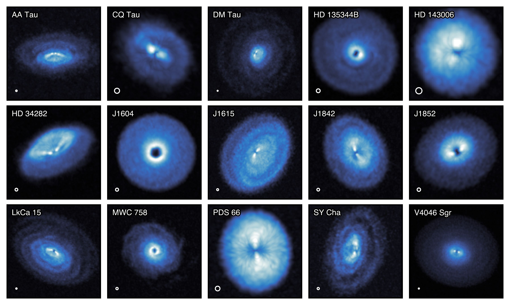
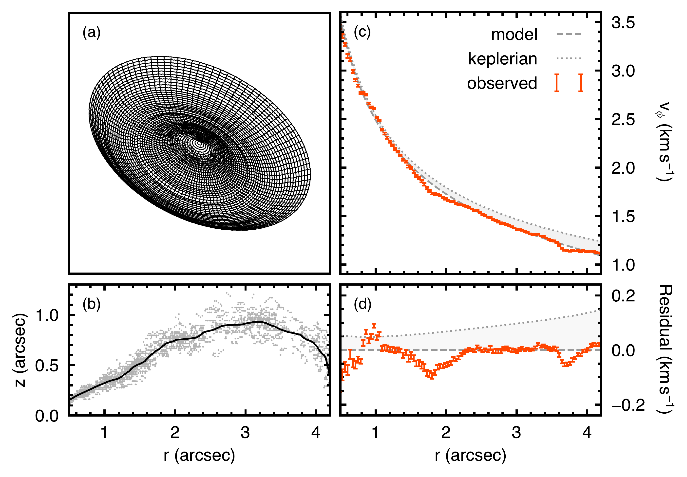
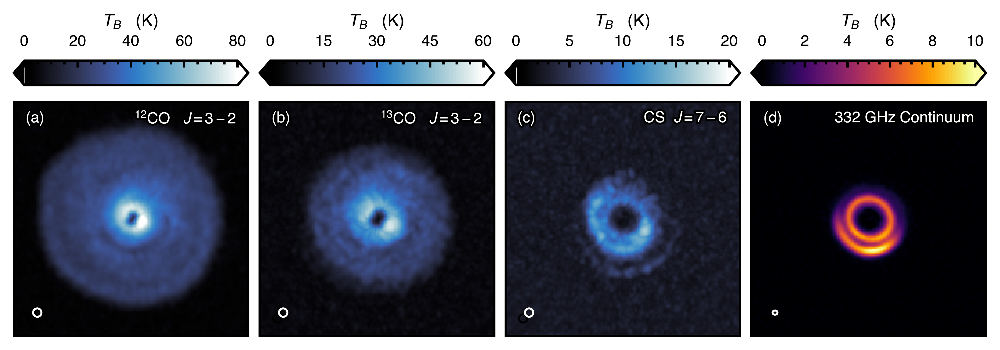

$\newcommand{\ensuremath}{}$
$\newcommand{\xspace}{}$
$\newcommand{\object}[1]{\texttt{#1}}$
$\newcommand{\farcs}{{.}''}$
$\newcommand{\farcm}{{.}'}$
$\newcommand{\arcsec}{''}$
$\newcommand{\arcmin}{'}$
$\newcommand{\ion}[2]{#1#2}$
$\newcommand{\textsc}[1]{\textrm{#1}}$
$\newcommand{\hl}[1]{\textrm{#1}}$
$\newcommand{\footnote}[1]{}$

# exoALMA I. Science Goals, Project Design and Data Products

<mark>Appeared on: 2025-04-29</mark> -  _This paper is part of the exoALMA Focus Issue of The Astrophysical Journal Letters_

R. Teague, et al. -- incl., <mark>M. Benisty</mark>, <mark>D. Fasano</mark>, <mark>M. Flock</mark>, <mark>I. Hammond</mark>

**Abstract:** Planet formation is a hugely dynamic process requiring the transport, concentration and assimilation of gas and dust to form the first planetesimals and cores. With access to extremely high spatial and spectral resolution observations at unprecedented sensitivities, it is now possible to probe the planet forming environment in detail. To this end, the exoALMA Large Program targeted fifteen large protoplanetary disks ranging between ${\sim}1\arcsec$ and ${\sim}7\arcsec$ in radius, and mapped the gas and dust distributions. $^{12}$ CO J=3-2, $^{13}$ CO J=3-2 and CS J=7-6 molecular emission was imaged at high angular ( ${\sim} 0\farcs15$ ) and spectral ( ${\sim} 100 {\rm m s^{-1}}$ ) resolution, achieving a surface brightness temperature sensitivity of ${\sim}1.5$ K over a single channel, while the 330 GHz continuum emission was imaged at 90 mas resolution and achieved a point source sensitivity of ${\sim} 40 \mu{\rm Jy beam^{-1}}$ . These observations constitute some of the deepest observations of protoplanetary disks to date. Extensive substructure was found in all but one disk, traced by both dust continuum and molecular line emission. In addition, the molecular emission allowed for the velocity structure of the disks to be mapped with excellent precision (uncertainties on the order of $10 {\rm m s^{-1}}$ ), revealing a variety of kinematic perturbations across all sources. From this sample it is clear that, when observed in detail, all disks appear to exhibit physical and dynamical substructure indicative of on-going dynamical processing due to young, embedded planets, large-scale, (magneto-)hydrodynamical instabilities or winds.

**Figure 1. -** A summary of the exoALMA sample with all sources showing evidence of gas substructures. All images show the $^{12}$CO (3-2) peak intensity obtained with \texttt{bettermoments} ([Teague and Foreman-Mackey 2018]())  using a quadratic fit to the data and masked with the CLEAN masks. Each source has a variable field of view and the open circle in the lower left of each image denotes the $0$\farcs$15$ synthesized beam for reference. The color maps is individually scaled for each source to emphasize the emission morphology rather than for a quantitative comparison (which can be found in  ([Galloway-Sprietsma, Bae and Izquierdo 2024]()) ). (*fig:CO_gallery_main*)

**Figure 6. -** The high angular and spectral resolution of the exoALMA data enable a detailed exploration of the 3D physical and dynamical structure of protoplanetary disks. Panel (a) shows the projection of the inferred emission surface of the $^{12}$CO emission from the disk around LkCa 15 shown in panel (b). As described in [Galloway-Sprietsma, Bae and Izquierdo (2024)](), the gray points are individual measurements while the black line shows a moving average with a window of $0$\farcs$15$. This deprojection allows for a precise $v_{\phi}$ profile to be extracted, as shown by the orange points in panel (c), which reveals a significant departure from purely Keplerian rotation, as shown by the dotted gray line  ([Stadler, Benisty and Winter 2024]()) . The global profile can be well recovered with a model, shown by the gray line, that includes a radial pressure gradient and the inclusion of the self-gravity of the disk  ([Longarini, et. al 2024]()) . The localized variations, most readily discernible in the residuals shown in panel (d), can be associated with localized pressure variations within the disk  ([Stadler, Benisty and Winter 2024]()) . (*fig:LkCa15_velocity*)

**Figure 3. -** Example of the peak intensities derived from the `fiducial set' of images for HD 135344B. All panels share a $4$\arcsec$\! \times 4$\arcsec$$ field of view centered on the star. The spatial resolution of molecular emission images is $0$\farcs$15$ and the channel spacing is 100 ${\rm m s^{-1}}$ for both $^{12}$CO and $^{13}$CO and 200 ${\rm m s^{-1}}$ for CS. The continuum image has a synthesized beam of $90 {\rm mas} \times 76 {\rm mas}$ with a position angle of $85\fdg0$. (*fig:HD13344_gallery*)

