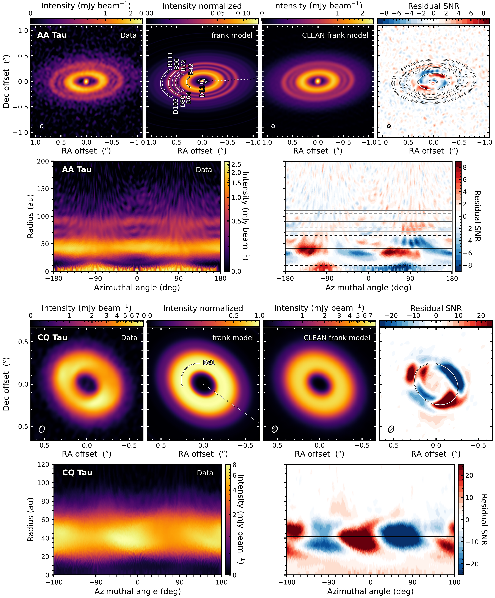

$\newcommand{\ensuremath}{}$
$\newcommand{\xspace}{}$
$\newcommand{\object}[1]{\texttt{#1}}$
$\newcommand{\farcs}{{.}''}$
$\newcommand{\farcm}{{.}'}$
$\newcommand{\arcsec}{''}$
$\newcommand{\arcmin}{'}$
$\newcommand{\ion}[2]{#1#2}$
$\newcommand{\textsc}[1]{\textrm{#1}}$
$\newcommand{\hl}[1]{\textrm{#1}}$
$\newcommand{\footnote}[1]{}$
$\newcommand{\vdag}{(v)^\dagger}$
$\newcommand$
$\newcommand$
$\newcommand{\comment}[1]{\textit{\textcolor{red}{#1}}}$
$\newcommand{\refexoalma}[1]{\textbf{\textcolor{blue}{#1}}}$
$\newcommand{\revision}[1]{\textcolor{red}{#1}}$
$\newcommand{\galario}{\texttt{galario}\xspace}$
$\newcommand{\frank}{\texttt{frank}\xspace}$
$\newcommand{\discminer}{\texttt{discminer}\xspace}$

# exoALMA IV: Substructures, Asymmetries, and the Faint Outer Disk in Continuum Emission

<mark>Appeared on: 2025-04-29</mark> -  _This paper is part of the exoALMA Focus Issue of The Astrophysical Journal Letters_

P. Curone, et al. -- incl., <mark>M. Benisty</mark>, <mark>D. Fasano</mark>, <mark>M. Flock</mark>

**Abstract:** The exoALMA Large Program targeted a sample of 15 disks to study gas dynamics within these systems, and these observations simultaneously produced continuum data at 0.9 mm (331.6 GHz) with exceptional surface brightness sensitivity at high angular resolution. To provide a robust characterization of the observed substructures, we performed a visibility space analysis of the continuum emission from the exoALMA data, characterizing axisymmetric substructures and nonaxisymmetric residuals obtained by subtracting an axisymmetric model from the observed data. We defined a nonaxisymmetry index and found that the most asymmetric disks predominantly show an inner cavity and consistently present higher values of mass accretion rate and near-infrared excess. This suggests a connection between outer disk dust substructures and inner disk properties. The depth of the data allowed us to describe the azimuthally averaged continuum emission in the outer disk, revealing that larger disks (both in dust and gas) in our sample tend to be gradually tapered compared to the sharper outer edge of more compact sources. Additionally, the data quality revealed peculiar features in various sources, such as shadows, inner disk offsets, tentative external substructures, and a possible dust cavity wall.

**Figure 17. -** Comparison of data, $\frank$ model, CLEAN-imaged $\frank$ model, residuals, and polar plots for each disk (here showing AA Tau and CQ Tau and continued in Appendix \ref{sect:Appendix_Galleries}). (Top to bottom, left to right) First panel: fiducial continuum image of the observed data obtained with robust -0.5, with the synthesized beam’s FWHM shown as an ellipse in the lower left corner. The asinh function was applied to the color scale to visually enhance the fainter emission. Second panel: image of the frank model swept over $2\pi$ and reprojected, with normalized intensity and an asinh stretch. Each gap is marked by a dashed arc labeled “D" with its distance from the star in au, while solid arcs labeled “B"indicate the rings. The dotted line corresponds with the PA measured on gas data with $\discminer$ ([Izquierdo, Stadler and Bae 2025]())  and defines the $\phi=0$ angle of the polar plots, increasing counterclockwise (note possible PA differences with the one measured from $\galario$ and used in $\frank$, see Appendix \ref{sect:comparing_gas_dust_geom_param}). Third panel: $\frank$ model sampled at the same $uv$-points of the observation and imaged with CLEAN as the observed data. The color scale is the same as the data panel. Fourth panel: residuals obtained subtracting the \texttt{frank model} from the data. The residual visibilities were calculated at the same $uv$-points of the ALMA observations and imaged with CLEAN as the observed data. The color scale shows the residuals in units of the observed noise ($\sigma_\mathrm{rms}$). Rings and gaps are marked with solid and dashed ellipses, respectively. Fifth panel: polar plot of the data continuum image. Sixth panel: polar plot of the nonaxisymmetric residuals. The locations of rings and gaps are marked by solid and dashed horizontal lines, respectively. (*fig:gallery_single_sources_maintext*)

**Figure 2. -** Same as Fig. \ref{fig:gallery_single_sources_maintext} but for DM Tau and HD 135344B. (*fig:gallery_single_sources_appendix1*)

**Figure 3. -** Same as Fig. \ref{fig:gallery_single_sources_maintext} but for HD 143006 and HD 34282. (*fig:gallery_single_sources_appendix2*)

