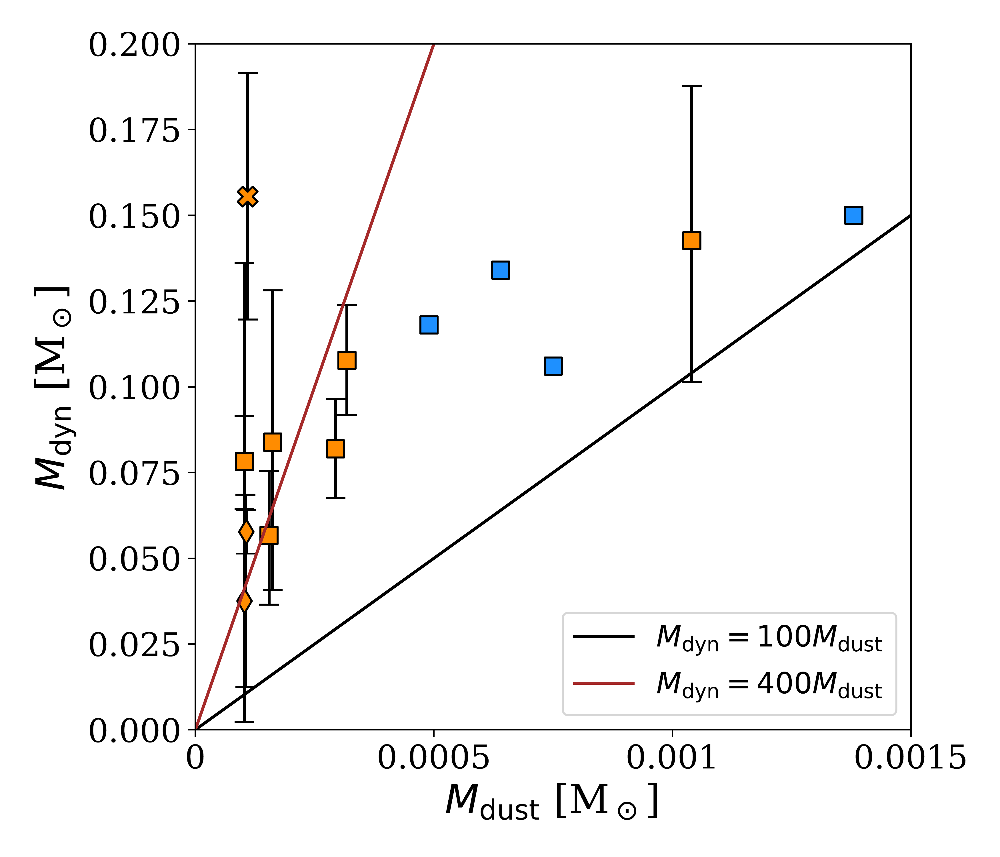
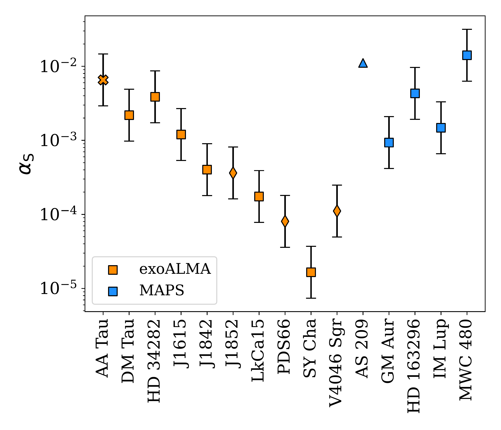

$\newcommand{\ensuremath}{}$
$\newcommand{\xspace}{}$
$\newcommand{\object}[1]{\texttt{#1}}$
$\newcommand{\farcs}{{.}''}$
$\newcommand{\farcm}{{.}'}$
$\newcommand{\arcsec}{''}$
$\newcommand{\arcmin}{'}$
$\newcommand{\ion}[2]{#1#2}$
$\newcommand{\textsc}[1]{\textrm{#1}}$
$\newcommand{\hl}[1]{\textrm{#1}}$
$\newcommand{\footnote}[1]{}$
$\newcommand{\vdag}{(v)^\dagger}$

# ${exoALMA XII}$ : Weighing and sizing exoALMA disks with rotation curve modelling

<mark>Appeared on: 2025-04-29</mark> -  _This paper is part of the exoALMA Focus Issue of The Astrophysical Journal Letters_

C. Longarini, et al. -- incl., <mark>A. Winter</mark>, <mark>M. Benisty</mark>, <mark>D. Fasano</mark>, <mark>M. Flock</mark>, <mark>I. Hammond</mark>

**Abstract:** The exoALMA large program offers a unique opportunity to investigate the fundamental properties of protoplanetary disks, such as their masses and sizes, providing important insights in the mechanism responsible for the transport of angular momentum. In this work, we model the rotation curves of CO isotopologues $^{12}$ CO and $^{13}$ CO of ten sources within the exoALMA sample, and we constrain the stellar mass, the disk mass and the density scale radiusthrough precise characterization of the pressure gradient and disk self gravity.We obtain dynamical disk masses for our sample measuring the self-gravitating contribution to the gravitational potential. We are able to parametrically describe their surface density, and all of them appear gravitationally stable.By combining dynamical disk masses with dust continuum emission data, we determine an averaged gas-to-dust ratio of approximately 400, not statistically consistent with the standard value of 100, assuming optically thin dust emission. In addition, the measurement of the dynamical scale radius allows for direct comparison with flux-based radii of gas and dust. This comparison suggests that substructures may influence the size of the dust disk, and that CO depletion might reconcile our measurements with thermochemical models. Finally, with the stellar mass, disk mass, scale radius, and accretion rate, and assuming self-similar evolution of the surface density, we constrain the effective $\alpha_S$ for these systems. We find a  broad range of $\alpha_S$ values ranging between $10^{-5}$ and $10^{-2}$ .

**Figure 7. -** Flux based radii (i.e. radii enclosing the 68\% of the emission) of $^{12}$CO, $^{13}$CO and dust compared with the dynamical scale radii $R_c$. The orange squares are the exoALMA sources, while the blue ones are the MAPS. The black line shows when the flux radius is equal to the dynamical one, and the brown line is the average value for the sources.  (*radii_comparison_plot*)

**Figure 2. -** {Dynamical masses against dust masses as computed in [Curone, Facchini and Andrews (2025)]() for the exoALMA and MAPS sources. The black line shows the $M_{\rm dyn}=100M_{\rm dust}$ and the brown line the $M_{\rm dyn}=400M_{\rm dust}$.} (*gtd_figure*)

**Figure 4. -** $\alpha_S$ for the exoALMA and MAPS sources, computed according to Eq. \ref{alpha_mdot} and comparison with literature values.  (*alpha_plot*)

