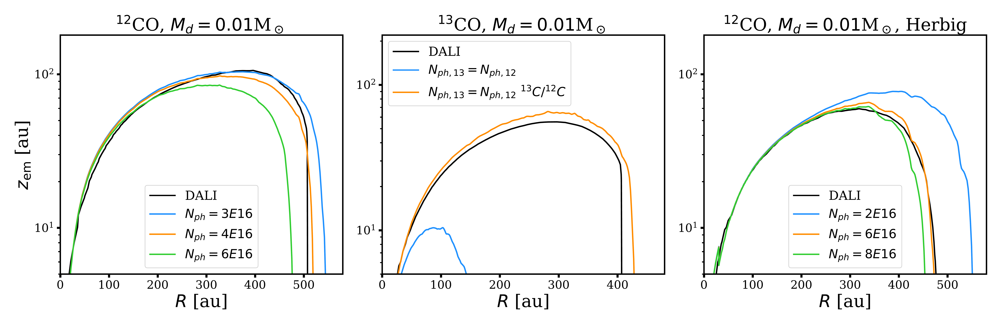
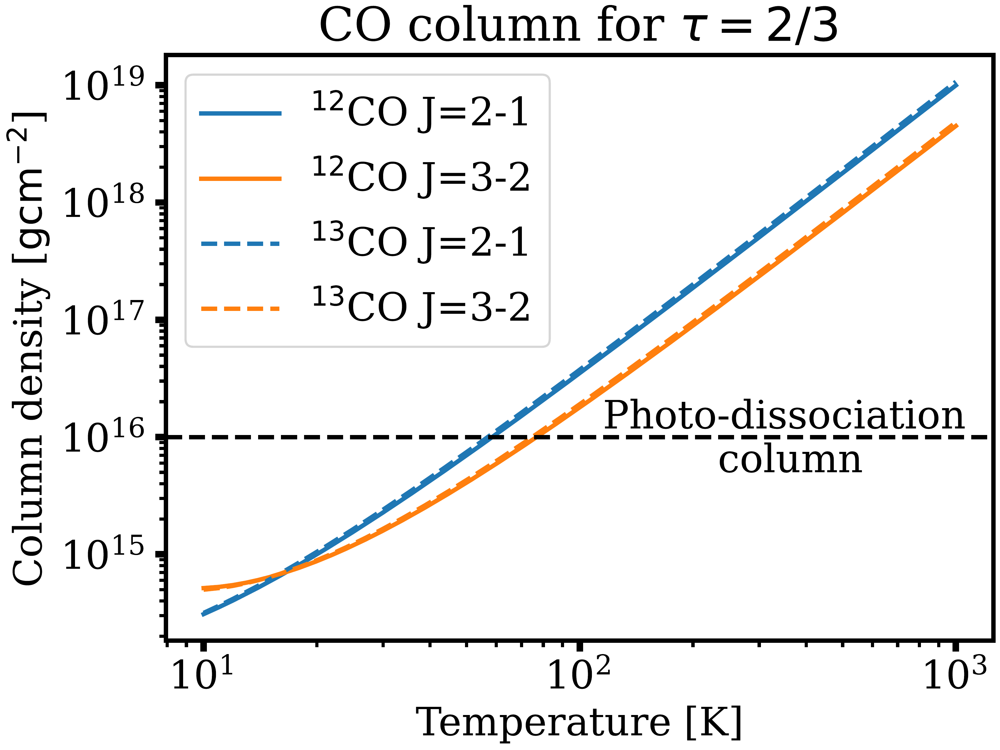

$\newcommand{\ensuremath}{}$
$\newcommand{\xspace}{}$
$\newcommand{\object}[1]{\texttt{#1}}$
$\newcommand{\farcs}{{.}''}$
$\newcommand{\farcm}{{.}'}$
$\newcommand{\arcsec}{''}$
$\newcommand{\arcmin}{'}$
$\newcommand{\ion}[2]{#1#2}$
$\newcommand{\textsc}[1]{\textrm{#1}}$
$\newcommand{\hl}[1]{\textrm{#1}}$
$\newcommand{\footnote}[1]{}$
$\newcommand{\vdag}{(v)^\dagger}$
$\newcommand$
$\newcommand$
$\newcommand{\gr}[1]{\textbf{\color{cyan}GR: #1}}$
$\newcommand{\cl}[1]{\textbf{\color{green} #1}}$
$\newcommand{\discminer}{\textsc{discminer} }$
$\newcommand{\disksurf}{\texttt{disksurf} }$

# exoALMA XV: Interpreting the height of CO emission layer

<mark>Appeared on: 2025-04-29</mark> -  _23 pages, 12 figures. This paper is part of the exoALMA Focus Issue of The Astrophysical Journal Letters available at this https URL_

G. P. Rosotti, et al. -- incl., <mark>M. Benisty</mark>, <mark>D. Fasano</mark>, <mark>M. Flock</mark>

**Abstract:** The availability of exquisite data and the development of new analysis techniques have enabled the study of emitting heights in proto-planetary disks. In this paper we introduce a simple model linking the emitting height of CO to the disk surface density and temperature structure. We then apply the model to measurements of the emitting height and disk temperature conducted as part of exoALMA, integrated with additional legacy measurements from the MAPS Large Programme, to derive CO column densities and surface density profiles (assuming a CO abundance) for a total of 14 disks. A unique feature of the method we introduce to measure surface densities is that it can be applied to optically thick observations, rather than optically thin as conventionally done. While we use our method on a sample of well studied disks where temperature structures have been derived using two emission lines, we show that reasonably accurate estimates can be obtained also when only one molecular transition is available. With our method we obtain independent constraints from $^{12}$ CO and $^{13}$ CO and we find they are in general good agreement using the standard $^{12}$ C/ $^{13}$ C isotopic ratio. The masses derived from our method are systematically lower compared with the values derived dynamically from the rotation curve if using an ISM CO abundance, implying that CO is depleted by a median factor $\sim$ 20 with respect to the ISM value, in line with other works that find that CO is depleted in proto-planetary disks.

**Figure 9. -** Left panel: Emitting height as a function of radius for $^{12}$CO, assuming a disk mass of 0.01 $M_\odot$. We show the values from the DALI thermo-chemical model, as well as from our semi-analytical model, for different values of the free parameter $N_\mathrm{ph}$. Central panel: Emitting height as a function of radius for $^{13}$CO, assuming a disk mass of 0.01 $M_\odot$ for different values of $N_{ph}$. We compare the DALI data (black line) with the emitting layer predicted assuming $N_{ph,13}=N_{ph,12}$(blue line) and $N_{ph,13}=N_{ph,12}$$   ^{13}\mathrm{C}/^{12}\mathrm{C}$(orange line). Right panel: Emitting height as a function of radius for $^{12}$CO, assuming a disk mass of 0.01 $M_\odot$ orbiting a Herbig star. We show the values from the DALI thermo-chemical model, as well as from our semi-analytical model, for different values of the free parameter $N_\mathrm{ph}$. (*fig:comparison_dali*)

**Figure 2. -** Surface density as a function of radius derived with the stratified model for LkCa 15. We show the results for both $^{12}$CO and $^{13}$CO; shaded regions show the uncertainties (see text for a discussion of the radial dependence of the uncertainty). For comparison we also show the surface density implied by the fit to the rotation curve presented in this paper series in [Longarini, Lodato and Rosotti (2025)]() and a constraint from optically thin C$^{18}$O and C$^{17}$O lines presented in [Sturm, et. al (2023)](). (*fig:results_lkca15*)

**Figure 1. -** $N_\tau$, the CO column to have $\tau=2/3$ for the J=3-2 and J=2-1 transition of $^{12}$CO and $^{13}$CO, as a function of temperature. The photo-dissociation column value we show is only a reference and it will be estimated more precisely in section \ref{sec:calibration}. (*fig:critical_column*)

