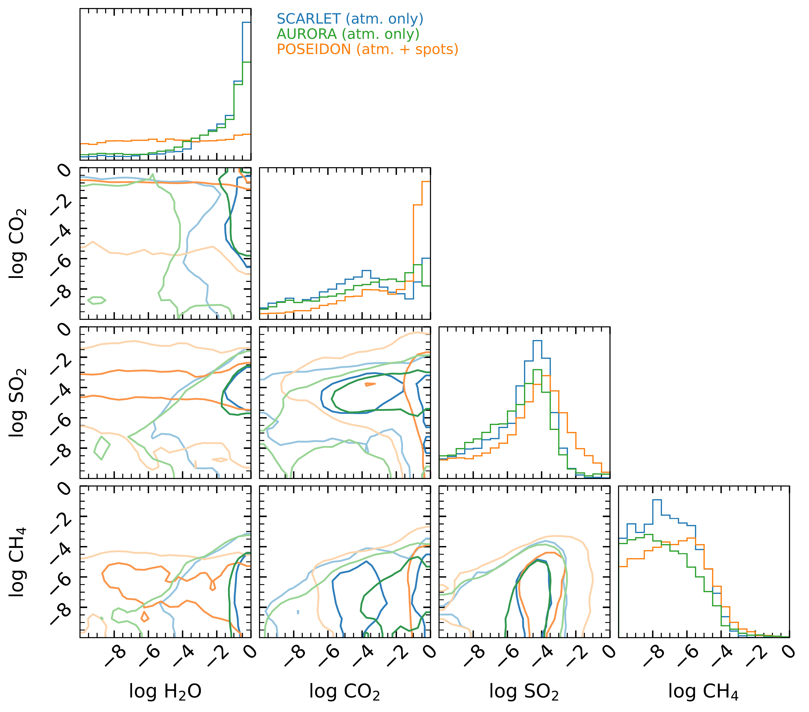
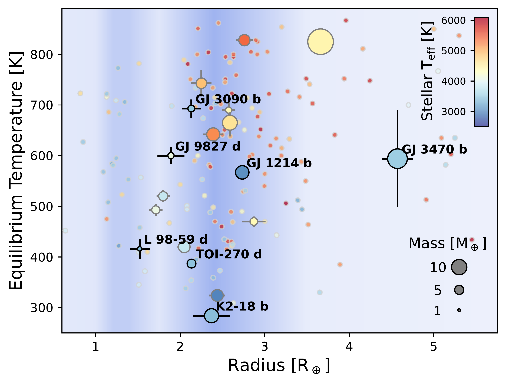

$\newcommand{\ensuremath}{}$
$\newcommand{\xspace}{}$
$\newcommand{\object}[1]{\texttt{#1}}$
$\newcommand{\farcs}{{.}''}$
$\newcommand{\farcm}{{.}'}$
$\newcommand{\arcsec}{''}$
$\newcommand{\arcmin}{'}$
$\newcommand{\ion}[2]{#1#2}$
$\newcommand{\textsc}[1]{\textrm{#1}}$
$\newcommand{\hl}[1]{\textrm{#1}}$
$\newcommand{\footnote}[1]{}$
$\newcommand{\mystar}{GJ 3090\xspace}$
$\newcommand{\myplanet}{GJ 3090 b\xspace}$
$\newcommand{\vdag}{(v)^\dagger}$
$\newcommand$
$\newcommand$
$\newcommand$
$\newcommand{\logX}[1]{\ensuremath{\log(\mathrm{X_{\ce{#1}}})}}$
$\newcommand{\logXratio}[2]{\ensuremath{\log(\mathrm{X_{\ce{#1}} / X_{\ce{#2}} })}}$
$\newcommand{\umontreal}{Department of Physics and Trottier Institute for Research on Exoplanets, Université de Montréal, Montréal, QC, Canada}$
$\newcommand{\mpia}{Max-Planck-Institut für Astronomie, Königstuhl 17, 69117 Heidelberg, Germany}$
$\newcommand{\thefigure}{A.\arabic{figure}}$

# ${Escaping Helium and a Highly Muted Spectrum Suggest a Metal-Enriched Atmosphere}$ on Sub-Neptune $\myplanet$ from JWST Transit Spectroscopy

<mark>Appeared on: 2025-04-30</mark> -  _36 pages, 21 figures, accepted for publication in ApJL_

<mark>E.-M. Ahrer</mark>, et al. -- incl., <mark>L. Acuña</mark>, <mark>D. Christie</mark>, <mark>C. Gapp</mark>

**Abstract:** Sub-Neptunes, the most common planet type, remain poorly understood. Their atmospheres are expected to be diverse, but their compositions are challenging to determine, even with JWST. Here, we present the first JWST spectroscopic study of the warm sub-Neptune $\myplanet$ (2.13 R $_\oplus$ , T $_\mathrm{eq, A=0.3}\sim$ 700 K) which orbits an M2V star, making it a favourable target for atmosphere characterization. We observed four transits of $\myplanet$ ; two each using JWST NIRISS/SOSS and NIRSpec/G395H, yielding wavelength coverage from 0.6 -- 5.2 $\microns$ . ${  We detect the signature of the 10833 Å metastable Helium triplet at a statistical significance of 5.5$\sigma$ with an amplitude of 434$\pm79$ ppm, marking the first such detection in a sub-Neptune with JWST. This amplitude is significantly smaller than predicted by solar-metallicity forward models, suggesting a metal-enriched atmosphere which decreases the mass-loss rate and attenuates the Helium feature amplitude.Moreover, we find that stellar contamination, in the form of the transit light source effect, dominates the NIRISS transmission spectra, with unocculted spot and faculae properties varying across the two visits separated in time by approximately six months.Free retrieval analyses on the NIRSpec/G395H spectrum find tentative evidence for highly muted features and a lack of $CH_4$.These findings are best explained by a high metallicity atmosphere ($>$100$\times$ solar at 3$\sigma$ confidence, for clouds at $\sim$\textmu bar pressures) using chemically-consistent retrievals and self-consistent model grids.Further observations of \myplanet are needed for tighter constraints on the atmospheric abundances, and to gain a deeper understanding of the processes that led to its potential metal enrichment.}$

**Figure 19. -** {  Joint and marginalized posterior distributions for the main atmospheric absorbers that NIRSpec/G395H is sensitive to, from the SCARLET (blue), POSEIDON (orange), and AURORA (green) retrievals performed on the visit 1+2 NIRSpec/G395H spectrum of GJ 3090 b. While POSEIDON marginalized over the potential contributions from unocculted spots, the SCARLET and AURORA results shown do not account for a TLS contribution, leading to overall higher water abundances. The contours correspond to 1 and 2$\sigma$ confidence (dark and light color shadings).} (*fig:corner_nirspec_molecules*)

**Figure 12. -** Comparison of transmission spectra of $\myplanet$ from different reduction pipelines. _Top left:_\texttt{Eureka!} transmission spectra from both  NIRSpec/G395H visits. Visit 1 is displayed in the darker colour and Visit 2 in the lighter colour and the differences between them are shown in the bottom panel in black.
    _Bottom left:_ Combined (visit 1 \& visit 2) NIRSpec transmission spectra from \texttt{Eureka!}(orange) and \texttt{exoTEDRF}(turquoise). The latter reduction is vertically offset by their average difference of 40 ppm to allow for direct comparison.
    _Top right:_\texttt{NAMELESS} transmission spectra of $\myplanet$ from both NIRISS/SOSS visits. Visit 1 is displayed in the darker purple colour and Visit 2 in the lighter orange. The differences between the two visits are shown in the bottom panel in black, demonstrating an $\sim$30 ppm offset between the two visits.
    _Bottom right:_ Comparison of the \texttt{NAMELESS}(orange, purple) and \texttt{exoTEDRF}(turquoise, dark blue) transmission spectra for both NIRISS/SOSS visits. (*fig:other-reductions-differences*)

**Figure 1. -** GJ 3090 b in context with the population of sub-Neptune planets in equilibrium temperature vs. planet radius space. Markers are coloured by the effective temperature of the stellar host and marker sizes reflect the planet mass. The background shading represents the distribution of sub-Neptune planets from fulton_california-kepler_2017, highlighting the radius valley near 1.7 R$_\oplus$. Planets with published JWST near-infrared atmosphere spectra are outlined in black and labelled. Planets that will have JWST atmosphere observations by the end of Cycle 3 are outlined in grey. (*fig: Population*)

