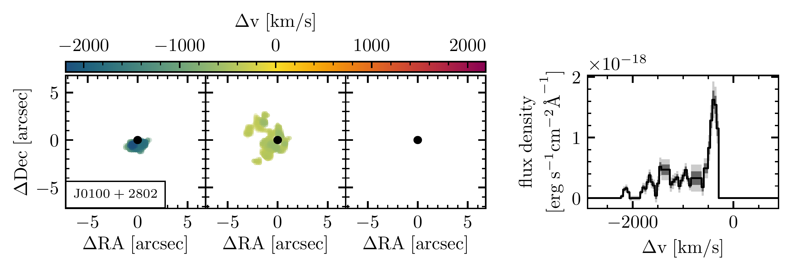

$\newcommand{\ensuremath}{}$
$\newcommand{\xspace}{}$
$\newcommand{\object}[1]{\texttt{#1}}$
$\newcommand{\farcs}{{.}''}$
$\newcommand{\farcm}{{.}'}$
$\newcommand{\arcsec}{''}$
$\newcommand{\arcmin}{'}$
$\newcommand{\ion}[2]{#1#2}$
$\newcommand{\textsc}[1]{\textrm{#1}}$
$\newcommand{\hl}[1]{\textrm{#1}}$
$\newcommand{\footnote}[1]{}$
$\newcommand{\vdag}{(v)^\dagger}$
$\newcommand$
$\newcommand$
$\newcommand{\msol}{M_\odot}$
$\newcommand{\vxhi}{\bar{x}_{\rm HI}}$
$\newcommand{\logtq}{\log{t_{\rm Q}}}$
$\newcommand{\zbar}{\langle z \rangle }$
$\newcommand{\chimp}{{\rm c Mpc}/h}$
$\newcommand{\lya}{Ly\alpha}$
$\newcommand{\lyb}{Ly\beta}$
$\newcommand{\lyc}{Ly\gamma}$
$\newcommand{\ciisf}{[C II]}$
$\newcommand{\cii}{[C{\small II}]}$
$\newcommand{\civ}{C{\small IV}}$
$\newcommand{\mgii}{Mg{\small II}}$
$\newcommand{\oiii}{[O{\small III}]}$
$\newcommand{\ha}{H\alpha}$
$\newcommand{\ddu}[1]{\texttt{\color{red}[DD: #1]}}$
$\newcommand{\change}[1]{\textbf{#1}}$

# Quasar lifetime measurements from extended $\lya$ nebulae at $z\sim 6$

<mark>Appeared on: 2025-05-02</mark> -  _14 pages, 7 figures_

D. {. D. c}{í}kov{á}, et al. -- incl., <mark>F. Walter</mark>

**Abstract:** The existence of billion-solar-mass black holes hosted in luminous quasars within the first gigayear of cosmic history poses a challenge to our understanding of supermassive black hole (SMBH) growth. The problem is further exacerbated by the very short quasar lifetimes of $t_{\rm Q}\lesssim 10^6$ years, as derived from the extent of their proximity zone (PZ) sizes observed in the quasars' rest-UV spectra. However, the quasar lifetime estimates based on the extents of the proximity zones may be underestimated, as time-variable obscuration effects might have limited the quasars' emission along our sightline in the past.In this work, we present independent quasar lifetime measurements for six quasars at $z \sim 6$ leveraging the extended nebular emission _perpendicular_ to our line-of-sight. We use observations from the Very Large Telescope/Multi-Unit Spectroscopic Explorer (MUSE) to search for extended $\lya$ emission in the circumgalactic medium around quasars with small proximity zones and estimate their lifetimes as the light travel time between the SMBH and the outer edge of the nebula. We find agreement between the independent lifetime estimates. For one object we find a proximate absorption system prematurely truncating the extent of the quasar's proximity zone, which thus results in an expected discrepancy between the lifetime estimates. Our results provide further evidence that the quasars' current accretion episode has only recently begun, challenging our models of SMBH growth.

**Figure 4. -** The extracted surface brightness profiles for the three quasars with nebular detections as a function of both the radial offset and the light travel time from the quasar. The black data points correspond to the surface brightness profile of the median nebula, as described in \S \ref{sec:nebulae}, where we only take into account the nebular pixels so as not to dilute signal at the edge of the nebula. We also show the surface brightness profile calculated via annular averaging of the full narrowband image of the detected nebula as gray data points to illustrate this signal dilution. In the background, we display the median stacked surface brightness profile of $z>5.7$ quasars from farina_mapping_2017 for comparison. The red dotted lines display the $16$th and $84$th percentile spread of the nebular extent when the nebular search parameters are varied. The quasar lifetime, $t_{\rm Q}^{\rm Ly\alpha}$, is measured as the light travel time from the quasar to the outer edge of the detected nebula in the transverse direction. Note that the horizontal error bars represent the binning of the annular apertures used to calculate the surface brightness. We also display the $1\sigma$(dark gray) and $2\sigma$(light gray) background derived from the sky variance in the outermost annular aperture. (*fig:SB*)

**Figure 1. -** Quasars in our sample with extended nebular emission. From left to right, the panels display pseudo-narrowband images of 1) the quasar's emission around $\lya$, 2) the PSF extracted from the broad wing of the quasar's $\lya$ line, 3) the PSF-subtracted data, 4) the $\chi$ data, essentially representing the SNR of the PSF-subtracted data, and 5) the smoothed $\chi$ data showing the extended nebular emission. Panels 1, 3, 4, and 5 are collapsed across the wavelength range of the detected nebula, and panel 2 is collapsed across the wavelength range of the PSF extraction as displayed in Appendix \ref{app:regions}. White patches correspond to masked foreground sources. (*fig:qsoswithnebulae*)

**Figure 3. -** Spectral decomposition of the three nebular detections. The left three panels display the detected nebulae in three spectral channels of equal widths ($822 {\rm km/s}$ for J0330--4025, $946 {\rm km/s}$ for J158--14, and $1458 {\rm km/s}$ for J0100+2802), whereby the middle panel is centered on the quasar's systemic redshift as given by \cref{tab:sample}. We also color-code each displayed voxel by the velocity offset from the quasar's $\lya$ emission. The right panel shows the integrated emission line profile of the detected nebula. (*fig:velocity*)

