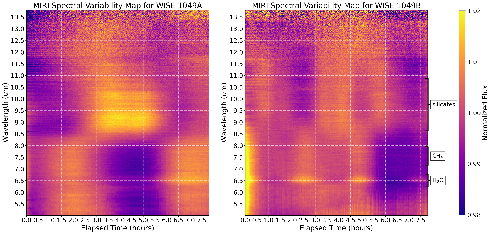

$\newcommand{\ensuremath}{}$
$\newcommand{\xspace}{}$
$\newcommand{\object}[1]{\texttt{#1}}$
$\newcommand{\farcs}{{.}''}$
$\newcommand{\farcm}{{.}'}$
$\newcommand{\arcsec}{''}$
$\newcommand{\arcmin}{'}$
$\newcommand{\ion}[2]{#1#2}$
$\newcommand{\textsc}[1]{\textrm{#1}}$
$\newcommand{\hl}[1]{\textrm{#1}}$
$\newcommand{\footnote}[1]{}$
$\newcommand{\todo}[1]{\textbf{\color{red} [#1]}}$
$\newcommand{\add}[1]{{\color{GREEN} #1}}$
$\newcommand{\thebibliography}{\DeclareRobustCommand{\VAN}[3]{##3}\VANthebibliography}$

# The JWST weather report from the nearest brown dwarfs II: Consistent variability mechanisms over 7 months revealed by 1–14 $\mu$m NIRSpec + MIRI monitoring of WISE 1049AB

<mark>Appeared on: 2025-05-05</mark> -  _21 pages, 18 figures, accepted for publication in MNRAS_

X. Chen, et al. -- incl., <mark>P. Molliere</mark>, <mark>T. Henning</mark>

**Abstract:** We present a new epoch of ${\sl JWST}$ spectroscopic variability monitoring of the benchmark binary brown dwarf WISE 1049AB, the closest, brightest brown dwarfs known. Our 8-hour MIRI low resolution spectroscopy (LRS) and 7-hour NIRSpec prism observations extended variability measurements for any brown dwarfs beyond 11 $\mu$ m for the first time, reaching up to 14 $\mu$ m. Combined with the previous epoch in 2023, they set the longest ${\sl JWST}$ weather monitoring baseline to date.We found that both WISE 1049AB show wavelength-dependent light curve behaviours. Using a robust k-means clustering algorithm, we identified several clusters of variability behaviours associated with three distinct pressure levels. By comparing to a general circulation model (GCM), we identified the possible mechanisms that drive the variability at these pressure levels:Patchy clouds rotating in and out of view likely shaped the dramatic light curves in the deepest layers between 1--2.5 $\mu$ m, whereas hot spots arising from temperature / chemical variations of molecular species likely dominate the high-altitude levels between 2.5--3.6 $\mu$ m and 4.3--8.5 $\mu$ m. Small-grain silicates potentially contributed to the variability of WISE 1049A at 8.5-11 $\mu$ m.While distinct atmospheric layers are governed by different mechanisms, we confirmed for the first time that each variability mechanism remains consistent within its layer over the long term.Future multi-period observations will further test the stability of variability mechanisms on this binary, and expanded ${\sl JWST}$ variability surveys across the L-T-Y sequence will allow us to trace and understand variability mechanisms across a wider population of brown dwarfs and planetary-mass objects.

**Figure 6. -** Variability maps (spectroscopic light curves) of WISE 1049 A and B from MIRI, generated by producing median-normalized light curves for each wavelength bin in the MIRI spectra, then plotting as a function of time and wavelength. The colorbars range from fractional flux values of 0.98 to 1.02 to highlight wavelength-dependent changes in amplitude. The wavelengths of various molecular absorption bands are marked on the left of the maps.  (*fig:varmap_miri*)

**Figure 9. -** NIRSpec light curves for WISE 1049A (left) and WISE 1049B (right), with 0.2 $\mu$m wavelength bins and a cadence of 90 s. Light curves have been normalized to their median values to highlight fractional variations. The light curves are offset with constants to visually separate them on the plot. The uncertainty for each light curve is shown as an error bar on the left side of the plot. (*fig:lc_nrs*)

**Figure 2. -** On the left: MIRI and NIRSpec target acquisition images showing the resolved point sources for WISE 1049 A (magenta) and B (red). The NIRSpec acquisition image also shows the positions of the additional point sources (dotted circles) caused by the mirror tilt event predicted by simulation using \texttt{STPSF}(formerly \texttt{WebbPSF}).
On the right: {\sl JWST} pipeline stage 2 calint images showing cropped regions of the resolved traces of WISE 1049AB from MIRI and NIRSpec. The detector pixels and hence the position of the two components are horizontally aligned with the acquisition images on the left. The white pixels indicate bad pixels on the MIRI/NIRSpec detector. (*fig:obs*)

