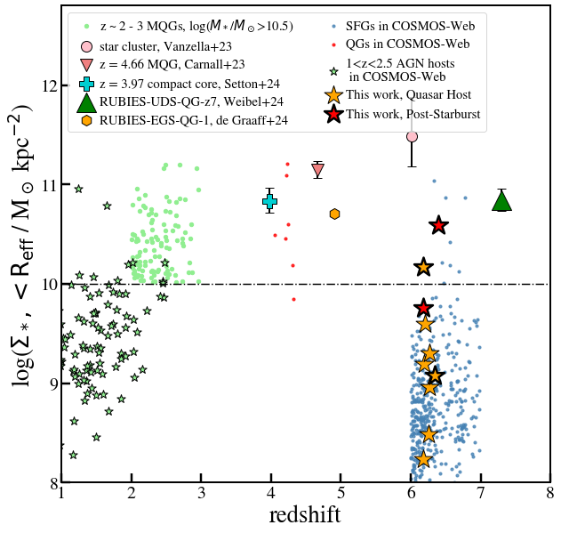
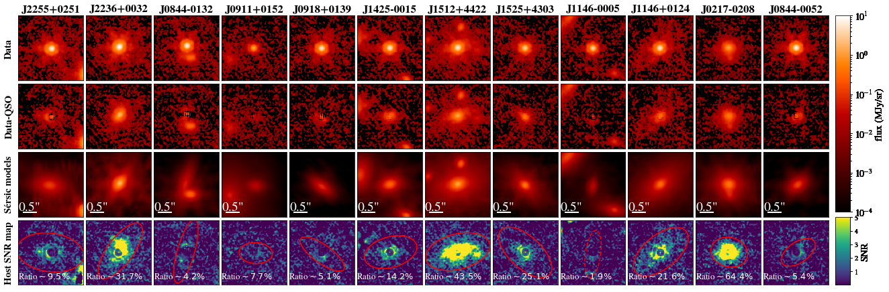
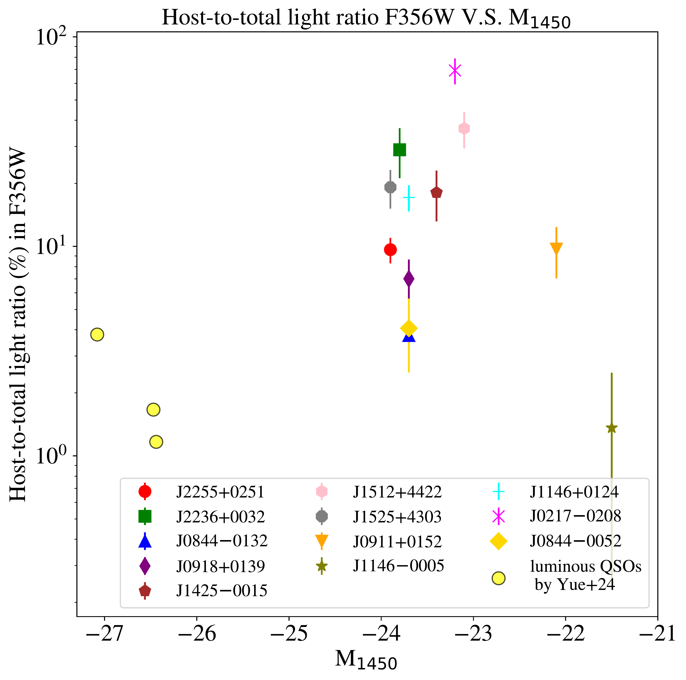

$\newcommand{\ensuremath}{}$
$\newcommand{\xspace}{}$
$\newcommand{\object}[1]{\texttt{#1}}$
$\newcommand{\farcs}{{.}''}$
$\newcommand{\farcm}{{.}'}$
$\newcommand{\arcsec}{''}$
$\newcommand{\arcmin}{'}$
$\newcommand{\ion}[2]{#1#2}$
$\newcommand{\textsc}[1]{\textrm{#1}}$
$\newcommand{\hl}[1]{\textrm{#1}}$
$\newcommand{\footnote}[1]{}$
$\newcommand{\vdag}{(v)^\dagger}$
$\newcommand$
$\newcommand$
$\newcommand{\TBD}{\textcolor{blue}{\textbf{TBD}}}$
$\newcommand{\todo}[1]{\textcolor{blue}{\textbf{TODO: #1}}}$
$\newcommand{\blue}[1]{\textcolor{black}{#1}}$
$\newcommand{\newblue}[1]{\textcolor{blue}{#1}}$
$\newcommand$
$\newcommand$
$\newcommand$
$\newcommand$

# SHELLQs-JWST Unveils the Host Galaxies of Twelve Quasars at $z>6$

<mark>Appeared on: 2025-05-08</mark> -  _22 pages, 10 figures, 6 tables. submitted to ApJ; Comments welcome_

X. Ding, et al. -- incl., <mark>K. Jahnke</mark>, <mark>J. Li</mark>

**Abstract:** The advent of JWST has opened new horizons in the study of quasar host galaxies during the reionization epoch ( $z > 6$ ). Building upon our previous initial uncovering of stellar light from two quasar host galaxies at these redshifts, we now report the detection of the stellar light from the full Cycle 1 sample of 12 distant moderate-luminosity quasar ( $M_{1450}>-24$ mag) host galaxies at $z>6$ from the Hyper Suprime-Cam Subaru Strategic Program (HSC-SSP). Using JWST/NIRCam observations at 1.5 and 3.6 $\mu$ m combined with 2D image decomposition analysis, we successfully detect the host galaxies in 11 out of 12 targets, underscoring the high detection rates achievable with moderate-luminosity quasars. Based on two-band photometry and SED fitting, we find that our host galaxies are massive with log M $_*$ /M $_{\odot} = 9.5 \text{--} 11.0$ . The effective radii range from 0.6 to 3.2 kpc which is comparable to the sizes of inactive galaxies with similar masses as measured with imaging from COSMOS-Web.Intriguingly, the two quasar hosts with post-starburst features, which reside at the high-mass end of our sample and exhibit relatively compact morphologies, are consistent (at the 1- $\sigma$ level) with quiescent galaxies at $z\sim\text{4--5}$ in terms of their sizes and stellar mass surface densities.These findings support the so-called galaxy compaction scenario already being valid at the reionization epoch ( $z>6$ ), in which gas inflows during starburst phases drive centrally concentrated star formation followed by rapid quenching, bridging the structural transition of massive galaxies from relatively extended star-forming disks to compact quiescent systems.

**Figure 7. -** (Left) Size - stellar mass relation of our quasar host galaxies compared with the control sample of star-forming galaxies (SFGs) and from COSMOS-Web \citep[see][]{Yang2025arXiv250407185Y} at redshift $6<z<7$. The two gray stars with arrows are the host measurements with size or stellar mass as upper limits. We also show the quiescent galaxies (QGs) sample at $4<z<5$ and the best-fit result from the COSMOS-Web.
We measure the sizes of our sample host galaxies using the F356W filter, while the COSMOS-Web sample adopts the F444W filter (see Section \ref{subsec:SizeMass} for methodological details).
The results show that the sizes of our quasar host sample appear to be similar to the SFGs for a given stellar mass, while the two post-starbursts are consistent with the QGs within 1-$\sigma$ level. The dashed horizontal line indicates the PSF size at redshift 6.
(Right) Projected 2D stellar mass surface density within the \reff compared with those of quiescent galaxies from the literature  ([Skelton, Whitaker and Momcheva 2014](), [Carnall, McLure and Dunlop 2023](), [Vanzella, Claeyssens and Welch 2023](), [Setton and Brammer 2024](), [Setton, Khullar and Miller 2024](), [Weibel and Setton 2024]())  as well as with $1<z<2.5$ AGN host galaxies revealed by COSMOS-web  ([Tanaka, Silverman and Ding 2025]()) .
Most of our quasar hosts fall below the typical quiescent threshold \citep[i.e., dashed line as introduced in][]{Weibel2024}. The two post-starburst targets are in the top region of our sample. The typical uncertainty associated with the density measurement of our sample is 0.5 dex. (*fig:size-mass*)

**Figure 3. -** Quasar-host decomposition of NIRCam/F356W images for all twelve targets. The rows are as follows from top to bottom: (1) original science image (data), (2) data minus quasar model, i.e., the host galaxy and neighbors, (3) best-fit host \sersic model(s), and (4) Signal-to-noise maps of the host significance; the noise is a combination of that from the data and the scatter of the corresponding top-five PSFs. In Row (4), we show the elliptical apertures, within which we calculate the host signal-to-noise ratio (SNR), as reported in Table \ref{tab:F356W_result}. When drawing these apertures, we use solid lines to highlight those with confirmed host detections. The inferred host-to-total flux ratios from the best fit are also indicated in the bottom panels. Our simulation results indicate that even in challenging cases, such as J0844$-$0132, we are able to accurately recover the host galaxy properties, as demonstrated in Figure \ref{fig:sim_onecase}.
     (*fig:F356Wfit*)

**Figure 2. -** 
Host-to-total flux ratio as a function of the quasar's absolute magnitude. The plot includes three luminous $z\sim6$ quasars reported in [Yue, Eilers and Simcoe (2024)](). Our results demonstrate that the intrinsically low luminosity of our quasars leads to a significantly higher host-to-total flux ratio than found in luminous quasars. Note that the photometric measurements of the host galaxies in [Yue, Eilers and Simcoe (2024)]() are subject to minimal statistical uncertainty, resulting in exceptionally small error bars for their sample.
 (*fig:ratio*)

