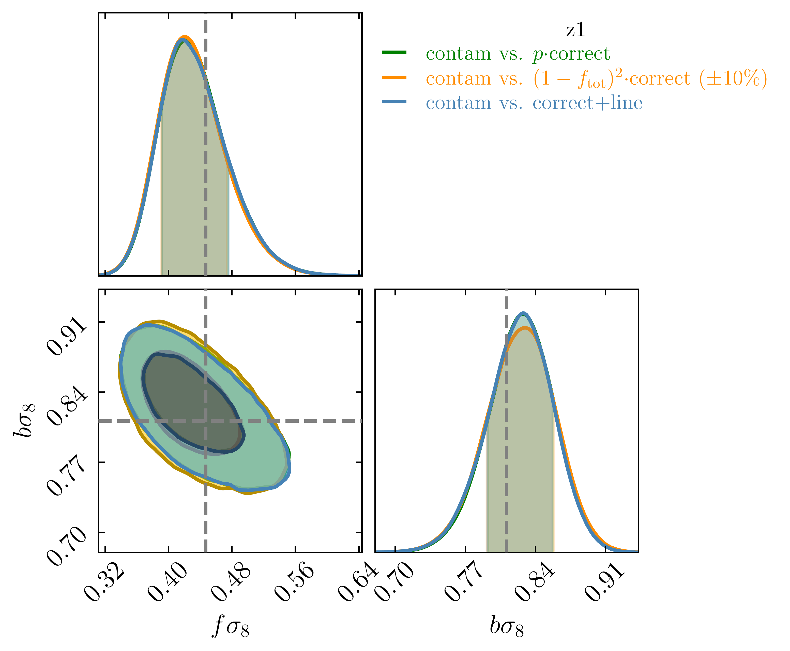
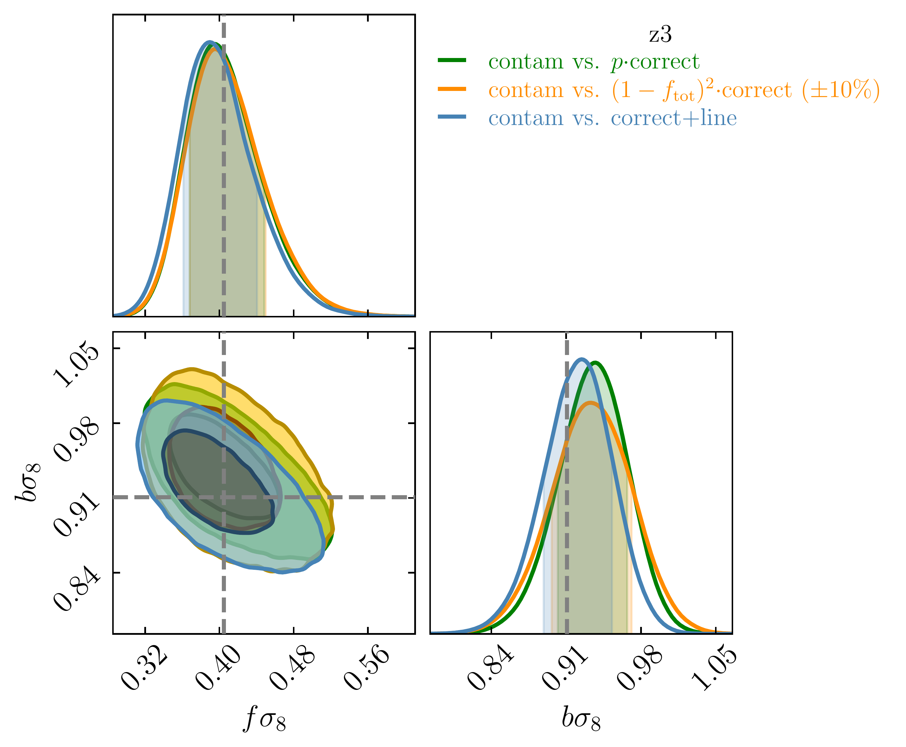

$\newcommand{\ensuremath}{}$
$\newcommand{\xspace}{}$
$\newcommand{\object}[1]{\texttt{#1}}$
$\newcommand{\farcs}{{.}''}$
$\newcommand{\farcm}{{.}'}$
$\newcommand{\arcsec}{''}$
$\newcommand{\arcmin}{'}$
$\newcommand{\ion}[2]{#1#2}$
$\newcommand{\textsc}[1]{\textrm{#1}}$
$\newcommand{\hl}[1]{\textrm{#1}}$
$\newcommand{\footnote}[1]{}$
$\newcommand{\xic}{\xi_{\rm m}}$
$\newcommand{\xit}{\xi_{\rm cc}}$
$\newcommand{\xin}{\xi_{\rm nn}}$
$\newcommand{\xil}{\xi_{\ell\ell}}$
$\newcommand{\xitn}{\xi_{\rm cn}}$
$\newcommand{\xitl}{\xi_{\rm c\ell}}$
$\newcommand{\xiln}{\xi_{\ell \rm n}}$
$\newcommand{\rt}{R_{\rm c}}$
$\newcommand{\rn}{R_{\rm n}}$
$\newcommand{\rl}{R_{\ell}}$
$\newcommand{\rc}{R_{\rm m}}$
$\newcommand{\fc}{f_{\rm tot}}$
$\newcommand{\bx}{\mathbf{x}}$
$\newcommand{\br}{\mathbf{r}}$
$\newcommand{\orcid}[1]$
$\newcommand{\arraystretch}{1.3}$

# $\Euclid$ preparation: The impact of redshift interlopers on the two-point correlation function analysis

<mark>Appeared on: 2025-05-09</mark> -  _27 pages, 22 figures, submitted to A&A_

E. Collaboration, et al. -- incl., <mark>Y. Wang</mark>, <mark>K. Jahnke</mark>

**Abstract:** The $\Euclid$ galaxy survey is designed to measure the spectroscopic redshift of emission-line galaxies (ELG) by identifying the $\ha$ emission line in their slitless spectra. The efficacy of this approach depends crucially on the signal-to-noise ratio (SNR) of the line, as sometimes noise fluctuations in the spectrum continuum can be misidentified as $\ha$ . In addition, other genuine strong emission lines can be mistaken for $\ha$ , depending on the redshift of the source. Both effects lead to ambiguities in the redshift measurement, potentially resulting in catastrophic redshift errors and the inclusion of `interloper galaxies in the sample. This paper forecasts the impact on the galaxy clustering analysis of the expected redshift errors in the $\Euclid$ spectroscopic sample. Specifically, it investigates the effect of the redshift interloper contamination on the galaxy two-point correlation function (2PCF) and, in turn, on the inferred growth rate of structure $\(f \sigma_8\)$ and Alcock--Paczynski (AP) parameters, $\(\alpha_\parallel\)$ and $\(\alpha_\perp\)$ . This work is based on the analysis of $\num{1000}$ synthetic spectroscopic catalogues, the _EuclidLargeMocks_ , which mimic the area and selection function of the $\Euclid$ Data Release 1 (DR1) sample. We estimate the 2PCF of contaminated catalogues and separate the different contributions, particularly those coming from galaxies with correct measured redshift and from contaminants. We explore different models with increasing complexity to describe the measured 2PCF at fixed cosmology, with the aim of identifying the most efficient model in reproducing the data. Finally, we perform a cosmological inference and evaluate the systematic error on the inferred $\(f \sigma_8\)$ , $\(\alpha_\parallel\)$ and $\(\alpha_\perp\)$ values associated with different models. Our results demonstrate that a minimal modelling approach, which only accounts for an attenuation of the clustering signal regardless of the type of contaminants, is sufficient to recover the correct values of $\(f \sigma_8\)$ and $\(\alpha_\parallel\)$ , $\(\alpha_\perp\)$ at DR1. The accuracy and precision of the estimated AP parameters are largely insensitive to the presence of interlopers. The adoption of a minimal modelling induces a 1 \% --3 \% systematic error on the growth rate of structure estimation, depending on the considered redshift. However, this error remains smaller than the statistical error expected for the $\Euclid$ DR1 analysis.

**Figure 18. -** $f\sigma_8$ and $b\sigma_8$ values and $1 \sigma$ uncertainties for all tests in the two reference redshift bins. They grey band corresponds to $1 \sigma$ around the values inferred in the reference case. (*fig:errorbars-parameters*)

**Figure 16. -** Monopole, quadrupole and hexadecapole moments of all terms in Eq. \eqref{eq:contam-2pcf-RR} averaged over all mock catalogues for $z \in \left[0.9, 1.1\right]$(_left_) and $z \in \left[1.3, 1.5\right]$(_right_). All terms comprise the correlation function and the corresponding prefactor. To simplify the visualization of all terms, the rightmost column of each panel shows a zoom-in on the smallest contributions in the corresponding redshift bin. (*fig:multipoles-z1-z3*)

**Figure 7. -** Contour plots for $f\sigma_8$ and $b\sigma_8$ derived from three representative tests in $z \in [0.9, 1.1]$(_top_) and $z \in [1.3, 1.5]$(_bottom_). The dashed grey lines indicate the mean values of the reference case posterior distribution. (*fig:fs8b_contour_all*)

