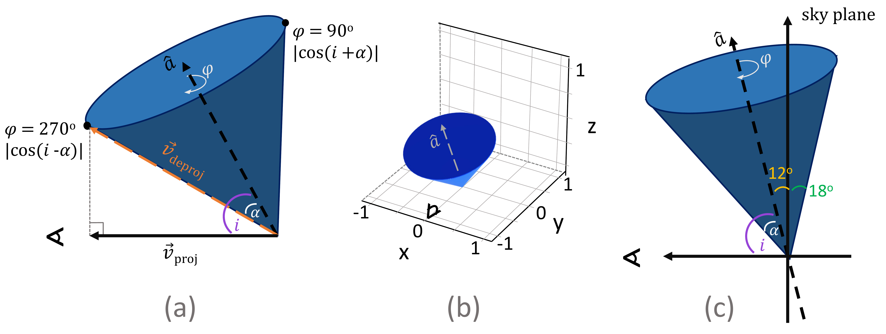
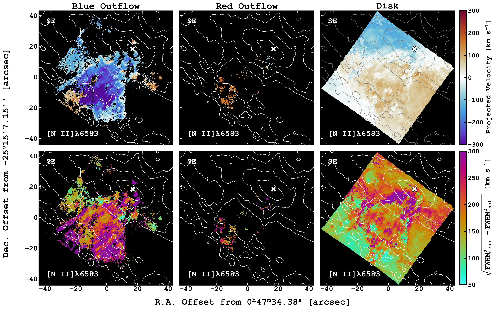

$\newcommand{\ensuremath}{}$
$\newcommand{\xspace}{}$
$\newcommand{\object}[1]{\texttt{#1}}$
$\newcommand{\farcs}{{.}''}$
$\newcommand{\farcm}{{.}'}$
$\newcommand{\arcsec}{''}$
$\newcommand{\arcmin}{'}$
$\newcommand{\ion}[2]{#1#2}$
$\newcommand{\textsc}[1]{\textrm{#1}}$
$\newcommand{\hl}[1]{\textrm{#1}}$
$\newcommand{\footnote}[1]{}$
$\newcommand{\vdag}{(v)^\dagger}$
$\newcommand$
$\newcommand$
$\newcommand$
$\newcommand$
$\newcommand$
$\newcommand$
$\newcommand$
$\newcommand$
$\newcommand$
$\newcommand$
$\newcommand$
$\newcommand$
$\newcommand$
$\newcommand$
$\newcommand$
$\newcommand$
$\newcommand$
$\newcommand$
$\newcommand$
$\newcommand$
$\newcommand$
$\newcommand$

# Physical Conditions of the Ionized Superwind in NGC 253 with VLT/MUSE

<mark>Appeared on: 2025-05-09</mark> -  _21 pages, 14 figures, submitted to ApJ, incorporated feedback from referee report_

S. A. Cronin, et al. -- incl., <mark>K. Kreckel</mark>, <mark>F. Walter</mark>

**Abstract:** We present an analysis of the $\ha$ -emitting ionized gas in the warm phase of the NGC 253 outflow using integral field spectroscopy from the Multi Unit Spectroscopic Explorer (MUSE). In each spaxel, we decompose $\ha$ , $\nii$ , and $\sii$ emission lines into a system of up to 3 Gaussian components, accounting for the velocity contributions due to the disk and both intercepted walls of an outflow cone. In the approaching southern lobe of the outflow, we find maximum deprojected outflow velocities down to $\sim -500$  $\kms$ . Velocity gradients of this outflowing gas range from $\sim -350$ to $-550$  $\kms$ kpc $^{-1}$ with increasing distance from the nucleus.  Additionally, $\nii$ / $\ha$ and $\sii$ / $\ha$ integrated line ratios are suggestive of shocks as the dominant ionization source throughout the wind. Electron densities, inferred from the $\sii$ doublet, peak at $2100$ cm $^{-3}$ near the nucleus and reach $\lesssim 50$ cm $^{-3}$ in the wind. Finally, at an uncertainty of $0.3$ dex on the inferred mass of $4\times10^{5}$  $\msun$ , the mass-outflow rate of the $\ha$ -emitting gas in the southern outflow lobe is $\sim 0.4$  $\msunperyear$ . This yields a mass-loading factor of $\eta \sim 0.1$ and a $\sim 2\%$ starburst energy efficiency.

**Figure 8. -** Geometry of a cone with inclination $i$ and semi-opening angle $\alpha$ measured with respect to its rotational axis ($\hat{a}$; dashed line). (a) As a function of $\varphi$(the azimuthal angle around the cone axis), $\vec{v}_{\rm deproj}$ traces the wall of the cone, and the projected velocity vector $\vec{v}_{\rm proj}$(solid black line) lies in the $XY$ plane. Here, $\vec{v}_{\rm deproj}$ points toward the observer at $\varphi = 270^\circ$(left black point), in which the velocity has a maximum projection factor ($|\cos(i - \alpha)|$) toward the observer. The maximum projection factor away from the observer is then $|\cos(i + \alpha)|$ at $\varphi = 90^\circ$(right black point). (b) A 3D cone in the $XYZ$ plane with the observer at $X = 0$. (c) The same cone as (a), but noting the angle projected from the sky plane. For $i = 78^{\circ}$, this angle is small ($12^{\circ}$), which is why most lines-of-sight do not detect the back wall of the cone. (*fig:deproj*)

**Figure 9. -** Kinematics of the southern outflow lobe in \ngc. _Top:_ Projected \niibwvl velocities of the main outflow cone ("Blue Outflow"), additional redshifted outflow components ("Redshifted Outflow") and disk components ("Disk"). The average projected velocities of the southern outflow cone are between $\sim -150$ and $-250$ \kms. In the bluest region of the Blue Outflow map, velocities reach $\sim -350$ \kms. Redshifted components in both outflow maps may be caused by confusion with the intervening disk. _Bottom:_ Intrinsic FWHM calculated by subtracting in quadrature the instrumental resolution ($100$ \kms) from the measured FWHM. The average Blue Outflow linewidth map is $\sim 250$ \kms. Broad linewidths may indicate that the ionized gas is filling the outflow cone.  _ Both:_ JWST MIRI F770W contours highlight the nucleus, spiral arms, and outflow filaments. The white $\times$ marks the galaxy center. (*fig:kinematics_se*)

**Figure 7. -** Integrated flux of \ha, \niiawvl$+$\niibwvl, and \siiawvl$+$\siibwvl in each component in the SE cube. The white $\times$ marks the galaxy center. All emission lines are brightest in Hii regions and the starbursting nucleus. The emission is not uniformly bright throughout the Blue Outflow, indicating that the outflow cone is clumpy. (*fig:flux_se*)

