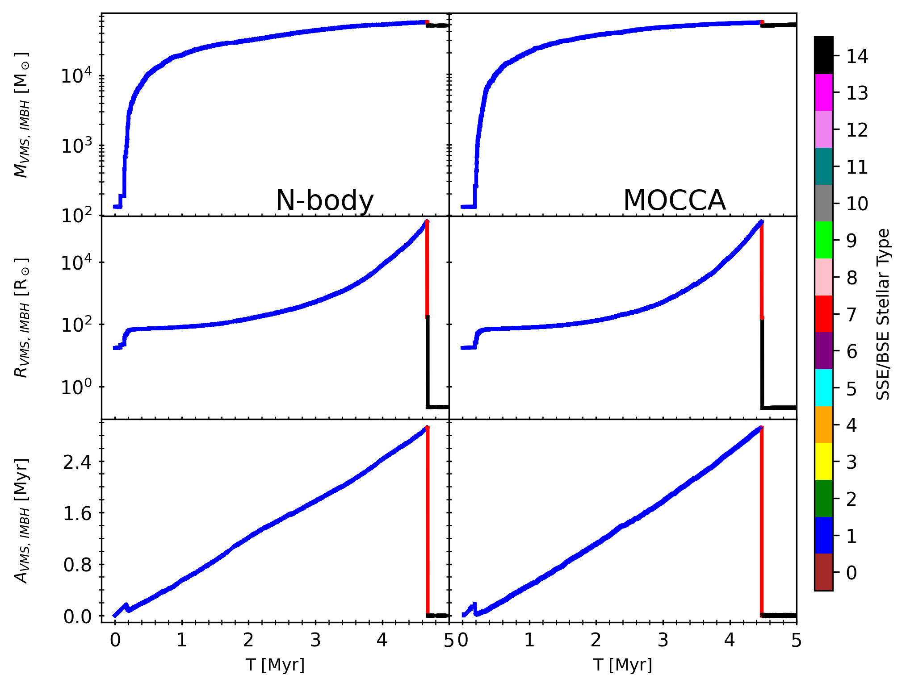
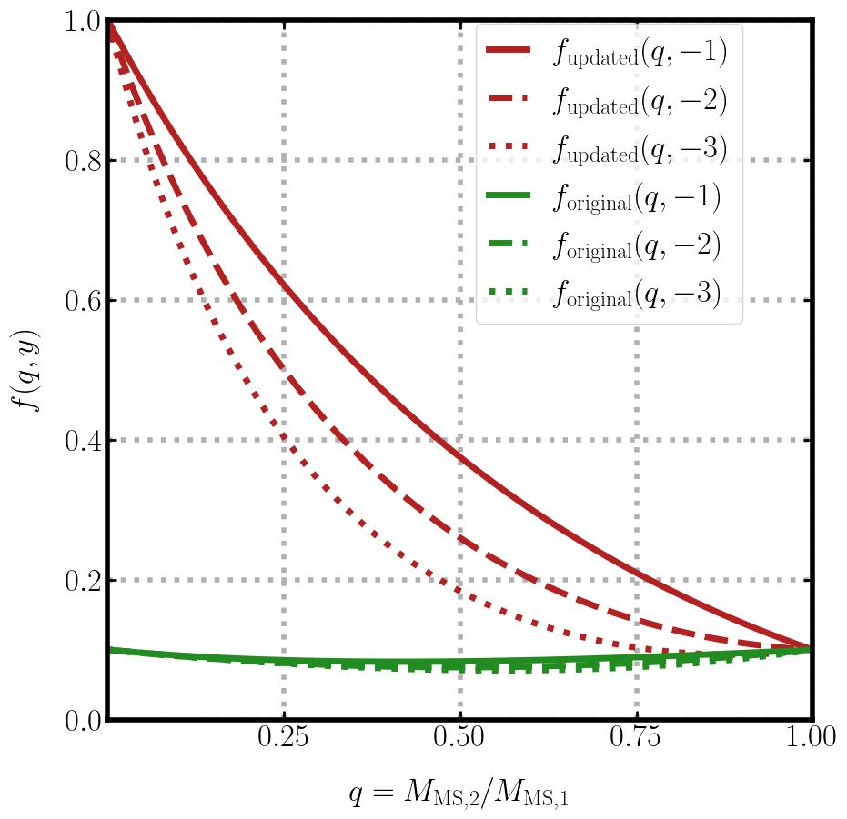

$\newcommand{\ensuremath}{}$
$\newcommand{\xspace}{}$
$\newcommand{\object}[1]{\texttt{#1}}$
$\newcommand{\farcs}{{.}''}$
$\newcommand{\farcm}{{.}'}$
$\newcommand{\arcsec}{''}$
$\newcommand{\arcmin}{'}$
$\newcommand{\ion}[2]{#1#2}$
$\newcommand{\textsc}[1]{\textrm{#1}}$
$\newcommand{\hl}[1]{\textrm{#1}}$
$\newcommand{\footnote}[1]{}$
$\newcommand{\nsc}{NSC}$
$\newcommand{\albrecht}[1]{\textcolor{black}{#1}}$
$\newcommand{\rainer}[1]{\textcolor{black}{#1}}$
$\newcommand{\mirek}[1]{\textcolor{black}{#1}}$
$\newcommand{\manuel}[1]{\textcolor{black}{#1}}$
$\newcommand{\nadine}[1]{\textcolor{black}{#1}}$
$\newcommand{\xiaoying}[1]{\textcolor{black}{#1}}$
$\newcommand{\ataru}[1]{\textcolor{black}{#1}}$
$\newcommand{\jarrod}[1]{\textcolor{black}{#1}}$
$\newcommand{\abbas}[1]{\textcolor{black}{#1}}$
$\newcommand{\peter}[1]{\textcolor{black}{#1}}$
$\newcommand{\marcelo}[1]{\textcolor{black}{#1}}$
$\newcommand{\dominik}[1]{\textcolor{black}{#1}}$
$\newcommand{\renyue}[1]{\textcolor{black}{#1}}$
$\newcommand{\nils}[1]{\textcolor{black}{#1}}$
$\newcommand{\arek}[1]{\textcolor{black}{#1}}$
$\newcommand{\thorsten}[1]{\textcolor{black}{#1}}$
$\newcommand{\francesco}[1]{\textcolor{black}{#1}}$
$\newcommand{\andres}[1]{\textcolor{black}{#1}}$
$\newcommand{\msol}{\mathrm{M}_{\odot}}$
$\newcommand{\rsol}{\mathrm{R}_{\odot}}$

# Rapid formation of a very massive star  $>\!\!50000 \mathrm{M}_{\odot}$ and subsequently an IMBH from runaway collisions: Direct $N$-body and Monte Carlo simulations of dense star clusters

<mark>Appeared on: 2025-05-13</mark> -  _18 pages, 11 figures_

M. C. Vergara, et al. -- incl., <mark>N. Hoyer</mark>, <mark>N. Neumayer</mark>

**Abstract:** We present simulations of a massive young star cluster using Nbody6++GPU and MOCCA . The cluster is initially more compact than previously published models, with one million stars, a total mass of $5.86 \times 10^5 \mathrm{M}_{\odot}$ , and a half-mass radius of $0.1 \mathrm{pc}$ . We analyse the formation and growth of a very massive star (VMS) through successive stellar collisions and investigate the subsequent formation of an intermediate-mass black hole (IMBH) in the core of a dense star cluster. We use both direct _N_ -body and Monte Carlo simulations, incorporating updated stellar evolution prescriptions (SSE/BSE) tailored to massive stars and VMSs. These include revised treatments of stellar radii, rejuvenation, and mass loss during collisions. While the prescriptions represent reasonable extrapolations into the VMS regime, the internal structure and thermal state of VMSs formed through stellar collisions remain uncertain, and future work may require further refinement. We find that runaway stellar collisions in the cluster core produce a VMS exceeding $5 \times 10^4 \mathrm{M}_{\odot}$ within 5 Myr, which subsequently collapses into an IMBH. Our model suggests that dense stellar environments may enable the formation of very massive stars and massive black hole seeds through runaway stellar collisions. These results provide a potential pathway for early black hole growth in star clusters and offer theoretical context for interpreting recent JWST observations of young, compact clusters at high redshift.

**Figure 9. -** 
Evolution of the VMS (and IMBH thereafter) over time.
Top panel: Mass of the VMS/IMBH, $M_{\mathrm{VMS IMBH}} [\mathrm{M}_{\odot}]$.
Middle panel: Stellar radius of the VMS/IMBH, $R_{\mathrm{VMS IMBH}} [\mathrm{R}_{\odot}]$(logarithmic scale).
Bottom panel: Effective age of the VMS during its main-sequence phase, $A_{\mathrm{VMS IMBH}} [\mathrm{Myr}]$.
 (*fig:VMS_M_Rsun_ageeffective.jpg*)

**Figure 6. -** 
    Figure showing the family of functions for the original treatment $f_{\mathrm{original}}(q,y)$  and the family of functions with our updated treatment $f_{\mathrm{updated}}(q,y)$ for three distinct values of $y \in (-1,-2,-3)$ against the mass ratio $q$ of the MS star collision parnters.
   (*fig:function_family_age3.jpg*)

**Figure 10. -** Radii of massive stars (five masses as given in key) as a function of age in units of main sequence lifetime; right panel: results by standard SSE; left panel: results from our upgraded SSE. (*fig:radius*)

