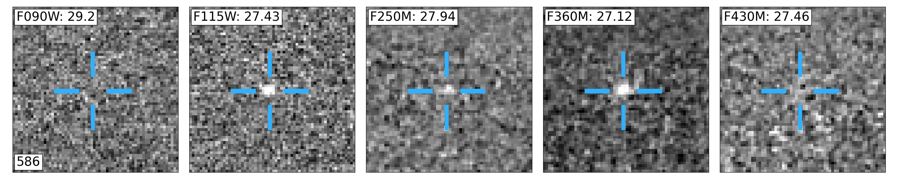
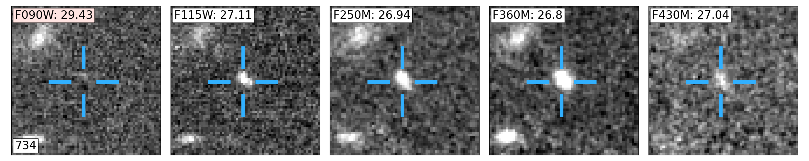
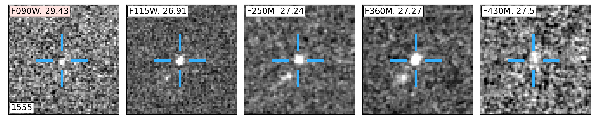
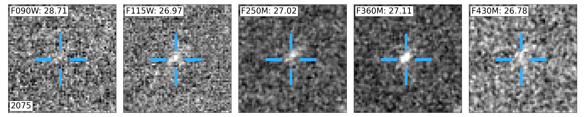
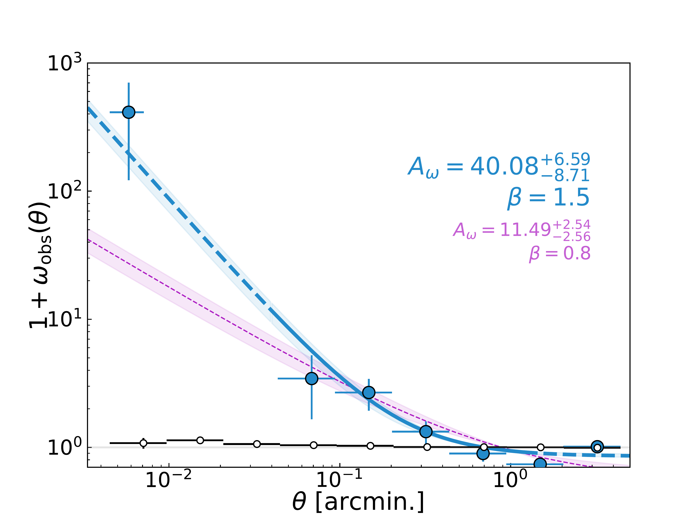

$\newcommand{\ensuremath}{}$
$\newcommand{\xspace}{}$
$\newcommand{\object}[1]{\texttt{#1}}$
$\newcommand{\farcs}{{.}''}$
$\newcommand{\farcm}{{.}'}$
$\newcommand{\arcsec}{''}$
$\newcommand{\arcmin}{'}$
$\newcommand{\ion}[2]{#1#2}$
$\newcommand{\textsc}[1]{\textrm{#1}}$
$\newcommand{\hl}[1]{\textrm{#1}}$
$\newcommand{\footnote}[1]{}$
$\newcommand{\vdag}{(v)^\dagger}$
$\newcommand$
$\newcommand$
$\newcommand{\rb}[1]{\textbf{\textcolor{red}{#1}}}$

# Lyman-Break Galaxies in the Mpc-Scale Environments Around Three $z\sim 7.5$ Quasars With JWST Imaging

<mark>Appeared on: 2025-05-14</mark> -  _31 Pages, 10 Figures, Accepted by ApJ_

M. Pudoka, et al. -- incl., <mark>E. Bañados</mark>, <mark>S. Belladitta</mark>, <mark>J. Wolf</mark>

**Abstract:** We study the Mpc-scale environments of the three highest redshift luminous quasars at $z\geq 7.5$ (J031343.84-180636.40, J134208.11+092838.61, and J100758.27+211529.21) to understand their connection to large-scale structure.  Cosmological simulations show that these early supermassive black holes (SMBHs) are expected to form in the most massive dark matter halos.  Therefore, it is expected that they are anchors of galaxy overdensities if luminous matter traces the underlying dark matter structure of the Universe. Using JWST NIRCam (F090W/F115W/F250M/F360M/F430M)imaging, we observe the large-scale structure out to $\sim13$ comoving Mpc around these quasars.  We select F090W-dropout Lyman Break galaxies (LBGs) and F430M-excess [ $\ion{O}{3}$ ] emitters in the three fields.  We find 18, 21, and 6LBG candidates in the fields of J0313, J1342, and J1007, respectively,  resulting in a wide range of overdensities ( $1+\delta \sim 19, 24,$ and $7$ ).  The photometric redshifts indicate serendipitous foreground and background overdensities in the J0313 field.  The joint angular autocorrelation of the combined LBG sample shows significant clustering on $<1.8$ comoving Mpc scales, demonstrating that the selected galaxies are likely associated with the large-scale structure surrounding the quasars.  This first systematic study of $z\sim 7.5$ quasars shows a diverse set of quasar environments at the onset of their formation, providing empirical data to help constrain theoretical predictions of early structure formation.

**Figure 4. -** Cutouts of each selected LBG candidate. Each panel is a $2\times2$ arcminute cutout in the F090W, F115W, F250M, F360M, and F430M filters from left to right with magnitudes shown in the top left of each panel (a red background means it is not detected and replaced by the $2\sigma$ limit). Crosshairs are to guide the eye and each cutout color is normalized separately to account for the large dynamical range of flux in each filter. (*fig:cut1*)

**Figure 3. -** The Landy-Szalay estimated angular ACF for the combined fields shown as blue markers. Errors along the x-axis are the bin sizes while y-axis errors show the Poisson errors described in the text.  Open circles show the ACF for randomly distributed sources within the field consistent with zero.  The solid blue line shows the MCMC fit within the constrained bin range excluding the largest and smallest bins ($\beta=1.5$) while the dashed section shows the fit results extrapolated to the full range of the data.  The shaded regions represents the 16th and 84th percentiles of the posterior distribution of $A_{\omega}$.  In magenta is the same best fit keeping $\beta = 0.8$.  (*fig:acfplot*)

**Figure 12. -** _Left:_ Transmission curves of the NIRCam filters used in this analysis are shaded in grey with the  rest-optical spectrum of a galaxy selected from the JAGUAR suite of galaxy templates redshifted to $z=7.5$ is shown in blue. The three black vertical ticks show the H$\beta$ line and [$\ion${O}{3}] doublet from left to right.  In magenta is a representative L-type brown dwarf from the Sonora brown dwarf models with $T_{\rm eff} = 1100$ K and (F090W-F115W, F115W-F250M)$=(2.03, -2.41)$.  _Right:_ Color vs redshift for the JAGUAR galaxy templates from $z=6$ to $z=9$ calculated using the reported F090W and F115W fluxes in the catalog taking into account the image depths.  Using only galaxy templates that are detected in F115W, the blue shaded region shows the 1$\sigma$ spread in color values in bins containing an equal number of galaxies.  The solid line shows the average value in each bin.  The grey region shows the dropout selection criteria of F090W-F115W$>$1.5 while the black dashed line shows F090W-F115W=2 discussed in the text. (*fig:dropout*)

