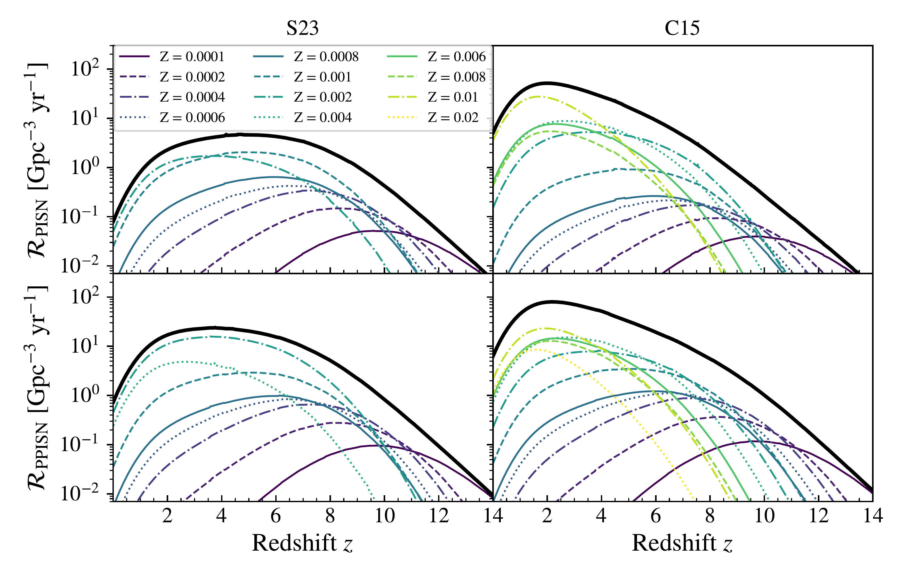
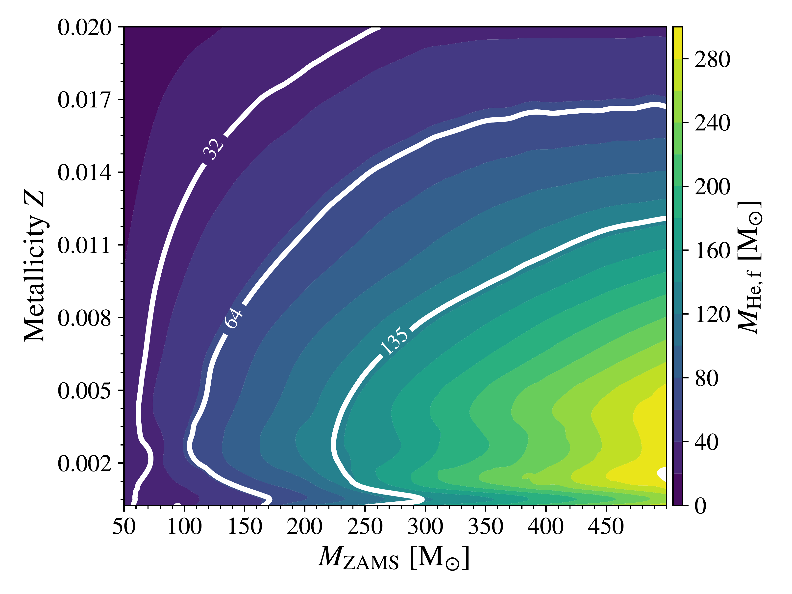

$\newcommand{\ensuremath}{}$
$\newcommand{\xspace}{}$
$\newcommand{\object}[1]{\texttt{#1}}$
$\newcommand{\farcs}{{.}''}$
$\newcommand{\farcm}{{.}'}$
$\newcommand{\arcsec}{''}$
$\newcommand{\arcmin}{'}$
$\newcommand{\ion}[2]{#1#2}$
$\newcommand{\textsc}[1]{\textrm{#1}}$
$\newcommand{\hl}[1]{\textrm{#1}}$
$\newcommand{\footnote}[1]{}$
$\newcommand{\ST}[1]{\textcolor{steelblue!100}{#1_{\mathrm{ST}}}}$

# Impact of stellar winds on the pair-instability supernova rate

<mark>Appeared on: 2025-05-14</mark> -  _12 pages, 10 figures, 2 tables. Comments welcome_

F. Simonato, et al. -- incl., <mark>S. Torniamenti</mark>

**Abstract:** Very massive stars (VMSs, $M_{\star}$ $\geq$ 100 M $_{\odot}$ ) play a crucial role in several astrophysical processes. At low metallicity, they might   collapse directly into black holes, or end their lives as pair-instability supernovae.      Recent observational results set an upper limit of $0.7  \mathrm{ yr}^{-1}   \mathrm{ Gpc}^{-3}$ on the  rate density of pair-instability supernovae in the nearby Universe. However, most theoretical models predict rates  exceeding this limit.      Here, we compute new VMS tracks with the mesa code, and use them to analyze the evolution of the (pulsational) pair-instability supernova rate density across cosmic time.   We show that stellar wind models accounting for the transition between optically thin and  thick winds  yield a pair-instability supernova rate $\mathcal{R}_{\mathrm{PISN}}\sim 0.1$ Gpc $^{-3}$ yr $^{-1}$ at redshift $z\sim 0$ , about two orders of magnitude lower than our previous models. We find that the main contribution to the pair-instability supernova rate comes from stars with metallicity $Z\sim 0.001-0.002$ . Stars with higher metallicities cannot enter the pair-instability supernova regime, even if their zero-age main sequence mass is up to 500 M $_\odot$ . The main reason is that VMSs enter the regime for optically thick winds during the main sequence at metallicity as low as $Z\sim{4}\times 10^{-4}$ . This enhances the mass loss rate, quenching the growth of the He core and thus preventing the onset of pair-instability in later evolutionary stages.   This result highlights the critical role of mass loss  in shaping the final fate of very massive stars and the rate of pair-instability supernovae.

**Figure 2. -** Contour plot showing the He core masses at the end of the He burning for our mesa tracks adopting \protect\citetalias{Sabhahit2023} winds  as a function of the metallicity and ZAMS mass. The white lines highlight the levels at $32 \protect\text{M}_{\odot}$, $ 64 \protect\text{ M}_{\odot}$ and $135 \protect\text{ M}_{\odot}$, which set the boundaries to have PPISNe, PISNe, and direct collapse via photodisintegration. (*fig:He_mass_cont*)

**Figure 9. -** PISN (upper panels) and PPISN (lower panels) rate density evolution as a function of redshift.
    The left-hand and right-hand plots show the results obtained with the new wind model by \protect\citetalias{Sabhahit2023}  and the one by \protect\citetalias{Chen2015}, respectively. The black thick line represents the total rate density, whereas the colored lines show the contribution of individual metallicities from $Z = 1 \times 10^{-4}$(violet solid line) to $Z = 2 \times 10^{-2}$(dashed yellow line). (*fig:pisn_new*)

**Figure 3. -** Same as Fig. \ref{fig:He_mass_cont}, but for models  \protect\citetalias{Chen2015}. (*fig:He_mass_cont_old*)

