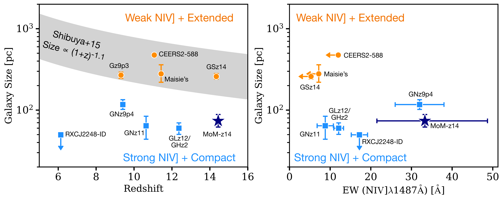
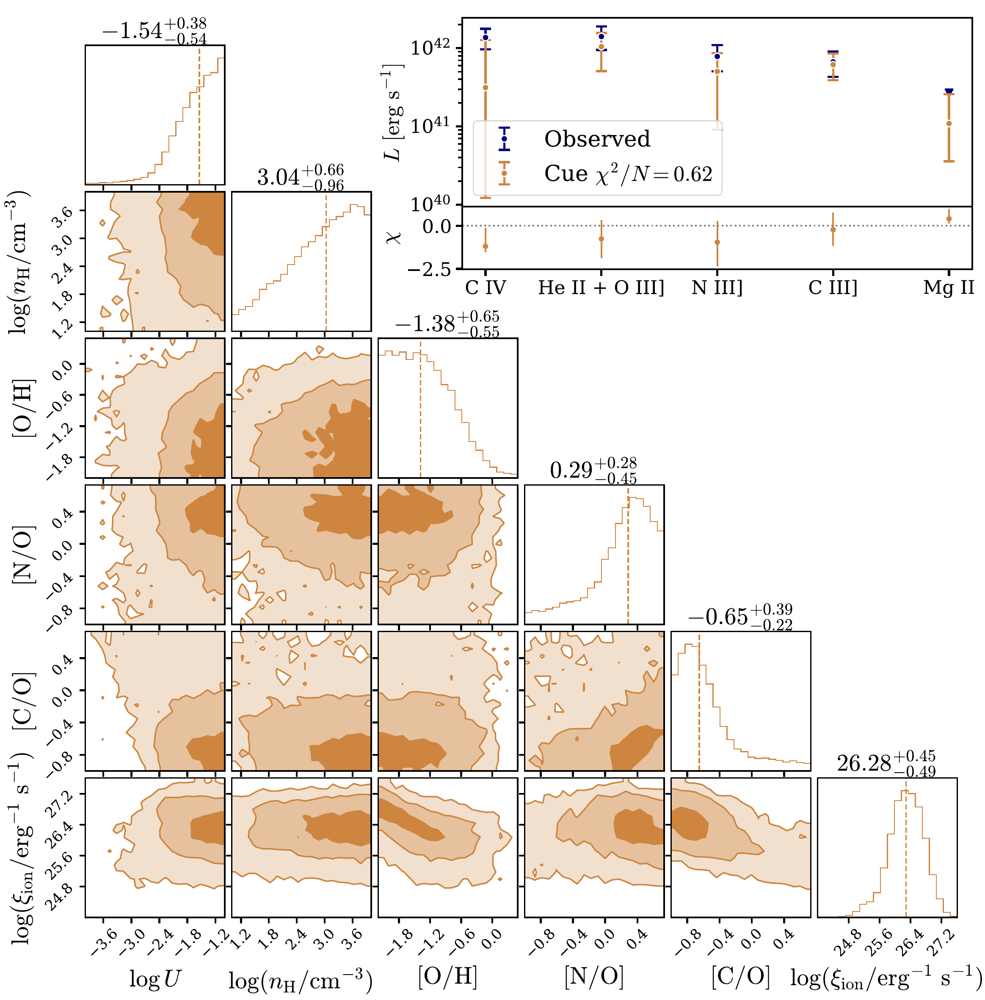

$\newcommand{\ensuremath}{}$
$\newcommand{\xspace}{}$
$\newcommand{\object}[1]{\texttt{#1}}$
$\newcommand{\farcs}{{.}''}$
$\newcommand{\farcm}{{.}'}$
$\newcommand{\arcsec}{''}$
$\newcommand{\arcmin}{'}$
$\newcommand{\ion}[2]{#1#2}$
$\newcommand{\textsc}[1]{\textrm{#1}}$
$\newcommand{\hl}[1]{\textrm{#1}}$
$\newcommand{\footnote}[1]{}$
$\newcommand{\xiion}{\xi_{\rm{ion}}}$
$\newcommand{\halpha}{H\ensuremath{\alpha}}$
$\newcommand{\hbeta}{H\ensuremath{\beta}}$
$\newcommand{\mstar}{\ensuremath{\log(M_{\rm{\star}}/M_{\rm{\odot}})}}$
$\newcommand{\orcidauthor}[3]{\author{\href{http://orcid.org/#1}{#2^{#3}}}}$
$\newcommand{\nion}[2]{#1 \textsc{#2}}$

# $\vspace{-1cm}$ A Cosmic Miracle: A Remarkably Luminous Galaxy at $\MakeLowercase{z}_{\MakeLowercase{\rm{spec}}}=14.44$ Confirmed with JWST $\vspace{-1.8cm}$

<mark>Appeared on: 2025-05-19</mark> -  _Submitted to the Open Journal of Astrophysics. Comments greatly appreciated and warmly welcomed!_

R. P. Naidu, et al. -- incl., <mark>A. d. Graaff</mark>, <mark>F. Walter</mark>

**Abstract:** JWST has revealed a stunning population of bright galaxies at surprisingly early epochs, $z>10$ , where few such sources were expected. Here we present the most distant example of this class yet -- MoM-z14, a luminous ( $M_{\rm{UV}}=-20.2$ ) source in the COSMOS legacy field at $z_{\rm{spec}}=14.44^{+0.02}_{-0.02}$ that expands the observational frontier to a mere 280 million years after the Big Bang. The redshift is confirmed with NIRSpec/prism spectroscopy through a sharp Lyman- $\alpha$ break and $\approx3\sigma$ detections of five rest-UV emission lines. The number density of bright $z_{\rm{spec}}\approx14-15$ sources implied by our "Mirage or Miracle" survey spanning $\approx350$ arcmin $^{2}$ is $>100\times$ larger ( $182^{+329}_{-105}\times$ ) than pre-JWST consensus models. The high EWs of UV lines ( ${\approx}15{-}35$ Å) signal a rising star-formation history, with a ${\approx}10\times$ increase in the last 5 Myr ( $\rm{SFR_{\rm{5Myr}}}/\rm{SFR_{\rm{50Myr}}}=9.9^{+3.0}_{-5.8}$ ). The source is extremely compact (circularized $r_{\rm{e}} = 74^{+15}_{-12}$ pc), and yet resolved, suggesting an AGN is not the dominant source of light. The steep UV slope ( $\beta=-2.5^{+0.2}_{-0.2}$ ) implies negligible dust attenuation and a young stellar population. The absence of a strong damping wing may indicate that the immediate surroundings of MoM-z14 are partially ionized at a redshift where virtually every reionization model predicts a $\approx100\%$ neutral fraction. The nitrogen emission and highly super-solar [ N/C ] $>1$ hint at an abundance pattern similar to local globular clusters that may have once hosted luminous supermassive stars. Since this abundance pattern is also common among the most ancient stars born in the Milky Way, we may be directly witnessing the formation of such stars in dense clusters, connecting galaxy evolution across the entire sweep of cosmic time.

**Figure 6. -** ** Summary of spectroscopic redshift constraints.****Top-left:** We use the sharp Lyman-$\alpha$ break to derive the redshift ($z_{\rm{break}}$). Our best-fit model (hot pink) accounts for the IGM neutral fraction along the line of sight ($\rm{x}_{\rm{HI}}$) as well as the shape and normalization of the spectrum ($\beta_{\rm{UV}}$, $M_{\rm{UV}}$). See \S\ref{sec:lyaz} for details. **Top-right:** We are also able to determine the redshift by fitting the rest-UV emission lines that are detected in this source. Each individual line or blend is detected at $\approx3\sigma$. Collectively, this array of lines is detected at $\approx6\sigma$ resulting in an extremely precise redshift. **Bottom-left:** The photometric redshift distribution derived from NIRCam (silver) shows multiple peaks at $z<5$("Schrodinger galaxy"-like solutions; \citealt{Naidu22Schro}) and a dominant $z>10$ solution that led us to target this source. **Bottom-right:** Comparison of the break redshift and UV line redshift posteriors. Only a handful of galaxies of comparable luminosity at $z>10$ have shown a UV spectrum with multiple lines allowing for a precise redshift determination (\citealt{Bunker23,Castellano24}; both interestingly point-like sources interpreted as putative AGN). Typically, only break redshifts with relatively wide posteriors as shown in pink have been possible \citep[e.g.,][]{Curtis-Lake23, Wang23UNCOVERz12, Carniani24}.  (*fig:specz*)

**Figure 8. -** ** A size-abundance bimodality among bright $z>10$ galaxies.**Figure adapted from \citet{Harikane2025UVLF} who reported this trend (see also \citealt[][]{Schaerer24}). Two types of sources are evident in the size-redshift plane (left) and size-EW plane (right) -- compact $\nion${N}{iv}] emitters such as MoM-z14 (purple, navy) and extended sources with weak $\nion${N}{iv}] such as JADES-GS-z14-0 (orange). The extrapolated size evolution from \citet{Shibuya15}(silver band) is shown in the left panel for guidance. MoM-z14 joins GNz11 and GLASSz12/GHz2 as extremely compact outliers at $z>10$, with sizes $<5-10\times$ what would be expected from the scaling relation. The measurements shown here are compiled from the following sources: GNz11 \citep[][]{Tacchella23GNz11, Bunker23}, GLASS-z12/GHz2 \citep[][]{Castellano24}, GNz9p4 \citep[][]{Schaerer24}, JADES-GS-z14-0 \citep[][]{Carniani24}, Maisie's Galaxy \citep[][]{Finkelstein23, ArrabalHaro23}, RXCJ2248-ID \citep[][]{Topping24}, Gz9p3 \citep[][]{Boyett24}, and CEERS2-588 \citep[][]{Harikane24specuvlf}.  (*fig:bimodal*)

**Figure 10. -** **Emission line modeling results using \texttt{Cue**}\citep[][]{Li24cue}. MoM-z14's UV spectrum, with hints of several emission lines, provides a unique window into the physics of bright galaxies at cosmic dawn -- the ionizing sources powering them ($\log \xi_{\rm{ion}}$), the state of the gas in their ISM ($\log n_{\rm{H}}$, $\log U$), and their chemical abundance patterns ([O/H], [N/O], [C/O]). Satisfactory fits to the emission lines are shown in the top-right panel, while the corner-plot illustrates the inferred posteriors. Even with only SNR$\approx3$ emission lines, and despite the low-resolution of the data (e.g., $\nion${He}{ii}$\lambda1640$Å+$\nion${O}{iii}]$\lambda1661,1666$Å are observed as a blend), the model is not entirely unconstrained. Consistent with the lack of neutral gas around the source, a highly ionizing radiation field is inferred (e.g., $\log \xi_{\rm{ion}}/\rm{erg s^{-1}}\approx26.3$). There are also indications of a super-solar [N/O] and sub-solar [C/O] abundance pattern already in place by $z=14.44$ reminiscent of GN-z11 \citep[e.g.,][]{Cameron23} and other recently discovered N-emitters \citep[e.g.,][]{Schaerer24}.
     (*fig:cue*)

