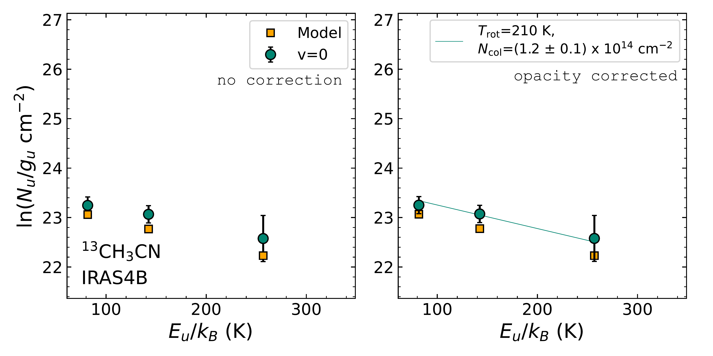
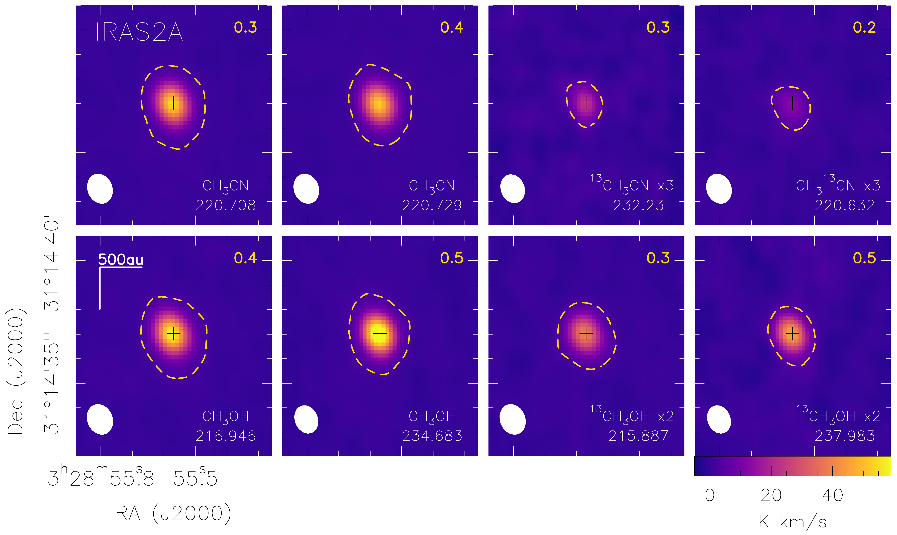

$\newcommand{\ensuremath}{}$
$\newcommand{\xspace}{}$
$\newcommand{\object}[1]{\texttt{#1}}$
$\newcommand{\farcs}{{.}''}$
$\newcommand{\farcm}{{.}'}$
$\newcommand{\arcsec}{''}$
$\newcommand{\arcmin}{'}$
$\newcommand{\ion}[2]{#1#2}$
$\newcommand{\textsc}[1]{\textrm{#1}}$
$\newcommand{\hl}[1]{\textrm{#1}}$
$\newcommand{\footnote}[1]{}$
$\newcommand{\mmc}{CH_3SH\xspace}$
$\newcommand{\met}{CH_3OH\xspace}$
$\newcommand{\metc}{CH_3CN\xspace}$
$\newcommand{\metctr}{CH_3^{13}CN\xspace}$
$\newcommand{\et}{C_2H_5OH\xspace}$
$\newcommand{\etc}{C_2H_5CN\xspace}$
$\newcommand{\vc}{C_2H_3CN\xspace}$
$\newcommand{\dme}{CH_3OCH_3\xspace}$
$\newcommand{\mf}{CH_3OCHO\xspace}$
$\newcommand{\mic}{CH_3NCO\xspace}$
$\newcommand{\ad}{CH_3CHO\xspace}$
$\newcommand{\fmm}{NH_2CHO\xspace}$
$\newcommand{\2}{_2}$
$\newcommand{\3}{_3}$
$\newcommand{\5}{_5}$
$\newcommand{\7}{_7}$
$\newcommand{\ct}{^{13}}$
$\newcommand{\cd}{^{12}}$
$\newcommand{\ratio}{^{12}C / ^{13}C\xspace}$
$\newcommand{\oratio}{^{16}O / ^{18}O\xspace}$
$\newcommand{\odh}{^{18}}$
$\newcommand{\scm}{cm^{-2}\xspace}$
$\newcommand{\kms}{ km s^{-1}\xspace}$

# PRODIGE -- envelope to disk with NOEMA: V. Low $\ratio$ ratios for $\met$ and $\metc$ in hot corinos

<mark>Appeared on: 2025-05-28</mark> -  _Accepted for publication in A&A_

L. A. Busch, et al. -- incl., <mark>C. Gieser</mark>, <mark>T. Henning</mark>, <mark>D. Semenov</mark>

**Abstract:** The $\ratio$ isotope ratio has been derived towards numerous cold clouds ( $\sim$ 20--50 K) and a couple protoplanetary disks and exoplanet atmospheres.  However, direct measurements of this ratio in the warm gas ( $>$ 100 K) around young low-mass protostars remain scarce, but are required to study its evolution during star and planet formation. We aim to derive $\ratio$ ratios from the isotopologues of the complex organic molecules (COMs) $\met$ and $\metc$ in the warm gas towards seven Class 0/I protostellar systems to improve our understanding of the evolution of the $\ratio$ ratios during star and planet formation. We used the data that were taken as part of the PRODIGE (PROtostars \& DIsks: Global Evolution) large program with the Northern Extended Millimeter Array (NOEMA) at 1 mm. The $\ct$ C isotopologue of $\met$ was detected towards seven sources of the sample, the ones of $CH_3$ CN towards six. The emission spectra were analysed by deriving synthetic spectra and population diagrams assuming conditions of local thermodynamic equilibrium (LTE). The emission of $\met$ and $\metc$ is spatially unresolved in the PRODIGE data with a resolution of $\sim$ 1 $\arcsec$ ( $\sim$ 300 au) for the seven targeted systems. Rotational temperatures derived from both COMs exceed 100 K, telling us that they trace the gas of the hot corino, where $\metc$ probes hotter regions than $\met$ on average (290 K versus 180 K). The column density ratios between the $\cd$ C and $\ct$ C isotopologues range from 4 to 30, thus, are lower by factors of a few up to an order of magnitude than the expected local ISM isotope ratio of $\sim$ 68. We conducted astrochemical models to understand the origins of the observed low ratios. We studied potential precursor molecules of $\met$ and $\metc$ , since the model does not include COMs, assuming that the ratio is transferred in reactions from the precursors to the COMs. The model predicts $\ratio$ ratios close to the ISM value for CO and $H_2$ CO, precursors of $CH_3$ OH, in contrast to our observational results. For the potential precursors of $CH_3$ CN (CN, HCN, and HNC), the model predicts low $\ratio$ ratios close to the protostar ( $<300$ au), hence, they may also be expected for $\metc$ . Our results show that an enrichment in $\ct$ C in COMs at the earliest protostellar stages is likely inherited from the COMs' precursor species, whose $\ratio$ ratios are set during the prestellar stage via isotopic exchange reactions. This also implies that low $\ratio$ ratios observed at later evolutionary stages such as protoplanetary disks and exoplanetary atmospheres could at least partially be inherited. A final conclusion on $\ratio$ ratios in protostellar environments requires observations at higher angular and spectral resolution that simultaneously cover a broad bandwidth, to tackle current observational limitations, and additional modelling efforts.

**Figure 12. -** Population diagrams for $\met$, $\ct$$\met$, $\met$c, $\ct$$\met$c, and $\met$ctr towards IRAS 4B. Observed data points are shown with teal circles as indicated in the top right corner of the left panel while the modelled data points from Weeds are shown orange squares. No corrections are applied in the left panel while in the right panel corrections for opacity and contamination by other molecules have been considered for the observed and modelled populations.
    The results of the linear fit to the observed data points are shown in the right panels.  (*pd:iras4b*)

**Figure 5. -** Integrated intensity maps (in K $\kms$) using two transitions for both isotopologues of $\met$, the main $\met$c isotopologue, and one transition for each $\ct$ C isotopologue towards IRAS 2A. Respective rest frequencies in GHz are shown in the bottom right corner, the beam (half power beam width, HPBW) on the bottom left. Multiplication factors (e.g. $\times$3, next to the species name) were applied to some species and transitions to be able to use the same intensity scale for all panels. The yellow dashed contour is at 5$\sigma$, where $\sigma$ is the rms noise level (in K $\kms$) and is written in the top right corner. (*maps:iras2a*)

**Figure 22. -** Overview of the PRODIGE data towards IRAS 4B and presentation of the spectral-line analysis . _Panel a:_ Integrated intensity map (in K $\kms$) for the $\met$c$12_3-11_3$ transition at 220.708 GHz. The beam (half power beam width, HPBW) is shown in the bottom left. The dashed yellow contour is at 5$\sigma$, where $\sigma$ is the rms noise level (in K $\kms$) and is written in the top right corner. _Panel b:_ Observed spectra towards the peak position, which is at $(\Delta\alpha,\Delta\beta)=(0$\arcsec$,0$\arcsec$)$(black cross in panel a), of $\met$c at low ($\sim$2 MHz, black) and high ($\sim$62.5 kHz, teal) spectral resolution, where the latter was shifted by 8 K for visualisation. The low spectral resolution data were analysed in this work (see Sect. \ref{s:method}). The modelled $\met$c spectra from Weeds are shown in red (low resolution) and orange (high resolution), where the same input parameters were used for both. _Panel c:_ Population diagram for $\met$c. Teal circles show the observed data points while the modelled data points from Weeds are shown with orange squares (see Sect. \ref{ss:caveats} for possible origins of differences between the two). No corrections are applied in the left panel while in the right panel corrections for opacity and contamination by other molecules have been considered (negligible effect in this case) and only transitions with optical depths $<$ 0.5 (i.e. all transitions in this case) are shown.
    The results of the linear fit to the observed data points are shown in the right panels. (*fig:overview*)

