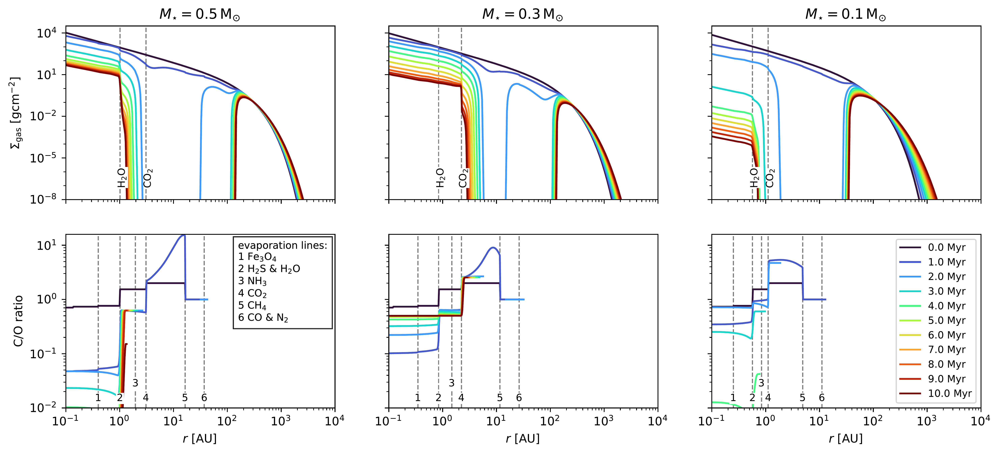

$\newcommand{\ensuremath}{}$
$\newcommand{\xspace}{}$
$\newcommand{\object}[1]{\texttt{#1}}$
$\newcommand{\farcs}{{.}''}$
$\newcommand{\farcm}{{.}'}$
$\newcommand{\arcsec}{''}$
$\newcommand{\arcmin}{'}$
$\newcommand{\ion}[2]{#1#2}$
$\newcommand{\textsc}[1]{\textrm{#1}}$
$\newcommand{\hl}[1]{\textrm{#1}}$
$\newcommand{\footnote}[1]{}$

# Changing disc compositions via internal photoevaporation II: \ M dwarf systems

<mark>Appeared on: 2025-05-28</mark> - 

J. L. Lienert, B. Bitsch, <mark>T. Henning</mark>

**Abstract:** The chemical evolution of the inner regions of protoplanetary discs is a complex process. It is influenced by several factors, one being the inward drift and evaporation of volatile-rich pebbles that can enrich the inner disc with vapour. During the evolution of the disc, its inner part is first enriched with evaporating water-ice, resulting in a low C/O ratio. Afterwards, carbon-rich gas from the outer disc, originating from the evaporation of CO, $CO_2$ and $CH_4$ ice, is viscously transported inwards, while at the same time, the supply of water-rich pebbles ceases and the water vapour in the inner disc is accreted onto the star. Consequently, the C/O ratio of the inner disc increases again after $2   \text{Myr}$ . Previously, we studied how internal photoevaporation influences the chemical composition and evolution of discs around Sun-like stars by carrying away gas and opening gaps that block inward drifting pebbles. We now extend our study to lower-mass stars ( $M_{\star} = 0.1 - 0.5   \text{M}_{\odot}$ ), where the time evolution of the disc's C/O ratio is different due to the closer-in position of the evaporation fronts and differences in disc mass, size and structure. Our simulations are carried out with a semi-analytical 1D disc model. The code \texttt{chemcomp} includes viscous evolution and heating, pebble growth and drift, pebble evaporation and condensation, as well as a simple chemical partitioning model for the disc. We show that internal photoevaporation plays a major role in the evolution of protoplanetary discs and their chemical composition: As for solar-mass stars, photoevaporation opens a gap, which stops inward drifting pebbles. They then cannot contribute to the volatile content of the gas in the inner disc any more. In addition, volatile-rich gas from the outer disc, originating from evaporated CO, $CO_2$ or $CH_4$ ice, is carried away by the photoevaporative winds. Consequently, the C/O ratio in the inner disc remains low, contradicting observations of the composition of discs around low-mass stars. Our model implies that inner discs at young ages ( $< 2   \text{Myr}$ ) should be oxygen-rich and carbon-poor, while older discs ( $> 2   \text{Myr}$ ) should be carbon-rich. The survival of discs to this age can be attributed to lower photoevaporation rates. These lower rates could either originate from the large spread of observed X-ray luminosities or from the photoevaporation model used in this study \citep[based on][]{picognaDispersalProtoplanetaryDiscs2021b} , which likely overestimates the photoevaporation efficiency at a given X-ray luminosity, leading to discrepancies with the observed C/O ratios in discs around low-mass stars. A reduction of the photoevaporation rate brings the calculated elemental abundances into better agreement with observations.

**Figure 4. -** Disc evolution for a viscous disc with internal photoevaporation due to X-rays, using the nominal photoevaporative mass loss rates from table \ref{table:fit_parameters}. The host star masses vary from $0.5   \text{M}_{\odot}$(on the left) to $0.1   \text{M}_{\odot}$(on the right). **Top:** Gas surface density as a function of disc radius, time evolution is shown in colour - from black, which corresponds to $0   \text{Myr}$, to dark red, which corresponds to $10   \text{Myr}$. **Bottom:** Gaseous C/O ratio as a function of disc radius and time (colour-coded). The evaporation lines for different molecules are given as grey dashed lines. Note that the C/O ratio is calculated from number densities and that we, by definition, have no specified C/O ratio in the gas phase beyond the CO evaporation front. We use our standard parameters for this simulation, as given in table \ref{table:simulation_parameters}. (*fig:overview_disc_with_PE*)

**Figure 8. -** Disc evolution for a viscous disc without internal photoevaporation. The host star masses vary from $0.5   \text{M}_{\odot}$(on the left) to $0.1   \text{M}_{\odot}$(on the right). **Top:** Gas surface density as a function of disc radius and time. **Bottom:** Gaseous C/O ratio as a function of disc radius and time. Colour coding, plotting and simulation parameters as in figure \ref{fig:overview_disc_with_PE}. (*fig:overview_viscous_disc*)

**Figure 2. -** X-ray luminosity, derived from the measured X-ray flux, as a function of stellar mass for all detected \ac{XEST} sources, re-plotted from gudelXMMNewtonExtendedSurvey2007 using their original data. The distance to Taurus is estimated with $140   \text{pc}$, although we note that Taurus consists of subgroups with varying distances  (galliStructureKinematicsTaurus2019) . The flux of stars with more than one measurement has been averaged to retrieve only one data point for the plot. The circle, star and diamond symbols define the stellar class, as defined for \ac{XEST} sources, and the straight line gives a linear regression for the logarithmic values, being described by the following equation, $\log(L_{\text{X}}) = 1.54 \log(M_{\star}) + 30.31$. Synthetic values from our simulations from sections \ref{ssec:Reduced_photoevaporation_rate} and \ref{ssec:Disc_lifetimes} are added as purple coloured squares, with the colour indicating the gap opening time of the disc, $t_{\text{gap}}$. (*fig:guedel_fig_12*)

