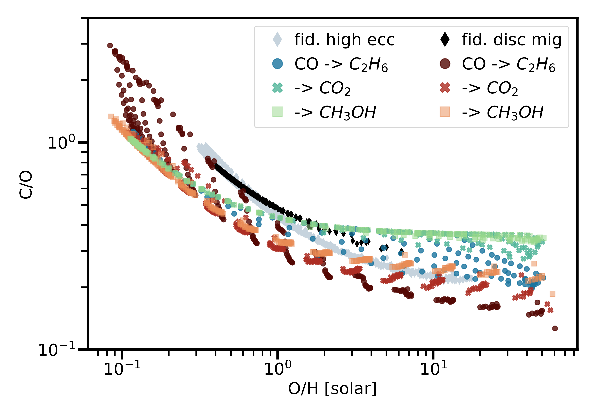
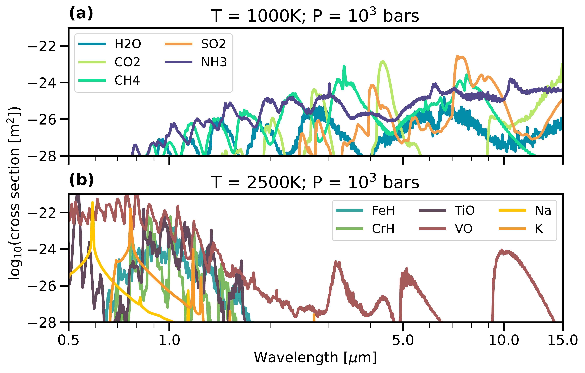

$\newcommand{\ensuremath}{}$
$\newcommand{\xspace}{}$
$\newcommand{\object}[1]{\texttt{#1}}$
$\newcommand{\farcs}{{.}''}$
$\newcommand{\farcm}{{.}'}$
$\newcommand{\arcsec}{''}$
$\newcommand{\arcmin}{'}$
$\newcommand{\ion}[2]{#1#2}$
$\newcommand{\textsc}[1]{\textrm{#1}}$
$\newcommand{\hl}[1]{\textrm{#1}}$
$\newcommand{\footnote}[1]{}$
$\newcommand{\vdag}{(v)^\dagger}$
$\newcommand$
$\newcommand$
$\newcommand{\water}{H_2O}$
$\newcommand{\sotwo}{SO_2}$
$\newcommand{\cotwo}{CO_2}$
$\newcommand{\methane}{CH_4}$
$\newcommand{\ammonia}{NH_3}$

# On Linking Planet Formation Models, Protoplanetary Disk Properties, and Mature Gas Giant Exoplanet Atmospheres

<mark>Appeared on: 2025-06-03</mark> -  _24 pages (37 pages with references), 8 figures, 1 table. Submitted to AAS Journals. This article is intended to reflect the discussions and perspectives of workshop participants, and not provide a comprehensive review of the fields covered_

Adina~D.~Feinstein, et al. -- incl., <mark>E.-M. Ahrer</mark>, <mark>I. J. M. Crossfield</mark>, <mark>L. Kreidberg</mark>, <mark>G. Perotti</mark>, <mark>D. Semenov</mark>

**Abstract:** Measuring a single elemental ratio (e.g., carbon-to-oxygen) provides insufficient information for understanding the formation mechanisms and evolution that affect our observations of gas  giant planet atmospheres. Although the fields of planet formation, protoplanetary disks, and exoplanets are well established and interconnected, our understanding of how to self-consistently and accurately link the theoretical and observational aspects of these fields together is lacking. To foster interdisciplinary conversations, the Max-Planck Institut für Astronomie (MPIA) hosted a week-long workshop called, "Challenge Accepted: Linking Planet Formation with Present-Day Atmospheres."  Here, we summarize the latest theories and results in planet formation modeling, protoplanetary disk observations, and atmospheric observations of gas giant atmospheres to address one of the challenges of hosting interdisciplinary conferences: ensuring everyone is aware of the state-of-the-art results and technical language from each discipline represented. Additionally, we highlight key discussions held at the workshop. Our main conclusion is that it is unclear what the ideal observable is to make this link between formation scenarios and exoplanet atmospheres, whether it be multiple elemental abundance ratios, measuring refractory budgets, or something else. Based on discussions held throughout the workshop, we provide several key takeaways of what the workshop attendees feel need the most improvement and exploration within each discipline.

**Figure 1. -** The impact of CO depletion on the composition of hot Jupiters using the formation model of [Penzlin, Booth and Kirk (2024)](). Here, 90\% of the CO in the fiducial model has been replaced with either $C_2$$H_6$, $CO_2$, or $CH_3$OH. In all of the different disk models, the composition of hot Jupiters that underwent high-eccentricity migration differs from those that did not. However, different assumptions about CO depletion in the disk produce larger changes in the C/O ratio than the differences in formation history. (*fig:co_comp*)

**Figure 4. -** The cross-sections for molecular species which could exist in a (a) hot Jupiter at 1000 K and (b) ultra hot Jupiter at 2500 K atmosphere. The wavelengths plotted here are within the range of JWST's NIRISS, NIRCam, NIRSpec, and MIRI/LRS. With access to the broader wavelength coverage of JWST, we are now able to potentially detect multiple absorption features from the same species and multiple species, simultaneously. Cross sections computed following the methods and sources of opacity listed in [Welbanks and Madhusudhan (2021)](). We note that several versions of this plot already exist in the literature \citep[e.g.,][]{madhusudhan19}. (*fig:spaghetti*)

**Figure 5. -** A comparison of the measured carbon-to-oxygen (C/O) ratio for planets, as observed with different instruments/wavelength coverages (see Table \ref{tab:exoplanet_c2o} for details). Panels marked with $\triangle$ highlight upper limits on the C/O. Grayed out squares do not have C/O measurements for those planets with those instruments. While the majority of measurements of C/O for each of these planets are consistent within $2\sigma$, the difference in wavelength coverage, and thus which molecular species are detected, change the measured C/O for the same planet.  (*fig:exoplanet_c2o*)

