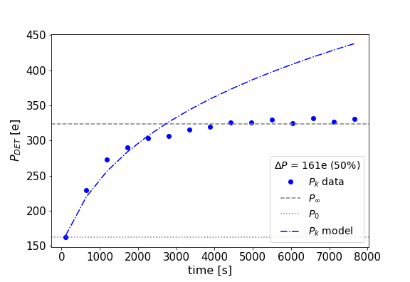
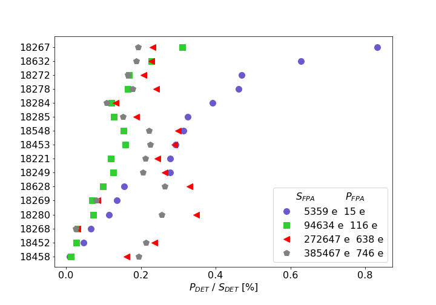

$\newcommand{\ensuremath}{}$
$\newcommand{\xspace}{}$
$\newcommand{\object}[1]{\texttt{#1}}$
$\newcommand{\farcs}{{.}''}$
$\newcommand{\farcm}{{.}'}$
$\newcommand{\arcsec}{''}$
$\newcommand{\arcmin}{'}$
$\newcommand{\ion}[2]{#1#2}$
$\newcommand{\textsc}[1]{\textrm{#1}}$
$\newcommand{\hl}[1]{\textrm{#1}}$
$\newcommand{\footnote}[1]{}$
$\newcommand{\baselinestretch}{1.0}$
$\newcommand{\thesubfigure}{\Alph{subfigure}}$

# Performance of the image persistence model for ${\LARGE_**Euclid**_}$ infrared detectors

<mark>Appeared on: 2025-06-04</mark> -  _SPIE Astronomical Telescopes + Instrumentation, 2024, Yokohama, Japan_

B. Kubik, et al. -- incl., <mark>K. Jahnke</mark>, <mark>K. Paterson</mark>, <mark>M. Schirmer</mark>, <mark>O. Krause</mark>

**Abstract:** Large-format infrared detectors are at the heart of major ground and space-based astronomical instruments, and the HgCdTe HxRG is the most widely used. The Near Infrared Spectrometer and Photometer (NISP) of the ESA's $\Euclid$ mission launched in July 2023 hosts 16 H2RG detectors in the focal plane. Their performance relies heavily on the effect of image persistence, which results in residual images that can remain in the detector for a long time contaminating any subsequent observations.Deriving a precise model of image persistence is challenging due to the sensitivity of this effect to observation history going back hours or even days. Nevertheless, persistence removal is a critical part of image processing because it limits the accuracy of the derived cosmological parameters.We will present the empirical model of image persistence derived from ground characterization data, adapted to the $\Euclid$ observation sequence and compared with the data obtained during the in-orbit calibrations of the satellite.

**Figure 4. -**  Median parameters $\alpha$(left panel) and $\beta$(right panel) of the persistence model for one detector as function of fluence. The unfilled circles show the parameters $\alpha_\text{gd}$ and $\beta_\text{gd}$ measured during ground characterizations for unsaturating stimuli. The * markers show the parameters $\alpha_\text{gd}$ and $\beta_\text{gd}$ from ground characterizations for saturating stimuli. The filled circular markers represent the coefficients measured from flight calibrations $\alpha_\text{flight}$ and $\beta_\text{flight}$. (*fig:alpha_beta_median*)

**Figure 8. -** Stabilisation of detector median stimulus amplitude (left panel) and persistence amplitude (right panel) in a sequence of measurements consisting of 15 pairs of flat and dark exposures at a constant nominal fluence, taken after the detector has been in the dark for a long period of time. The steady-state values of signal $S_\infty$ and persistence $P_\infty$ amplitudes are indicated by grey dashed lines. (*fig:pers_stabilisation*)

**Figure 9. -** Relative persistence in NISP detectors for typical photometric exposure of 87s. Unsaturating stimuli are represented by blue circles and green squares. Saturating fluences are represented by red triangles and grey pentagons. (*fig:pers_to_signal*)

