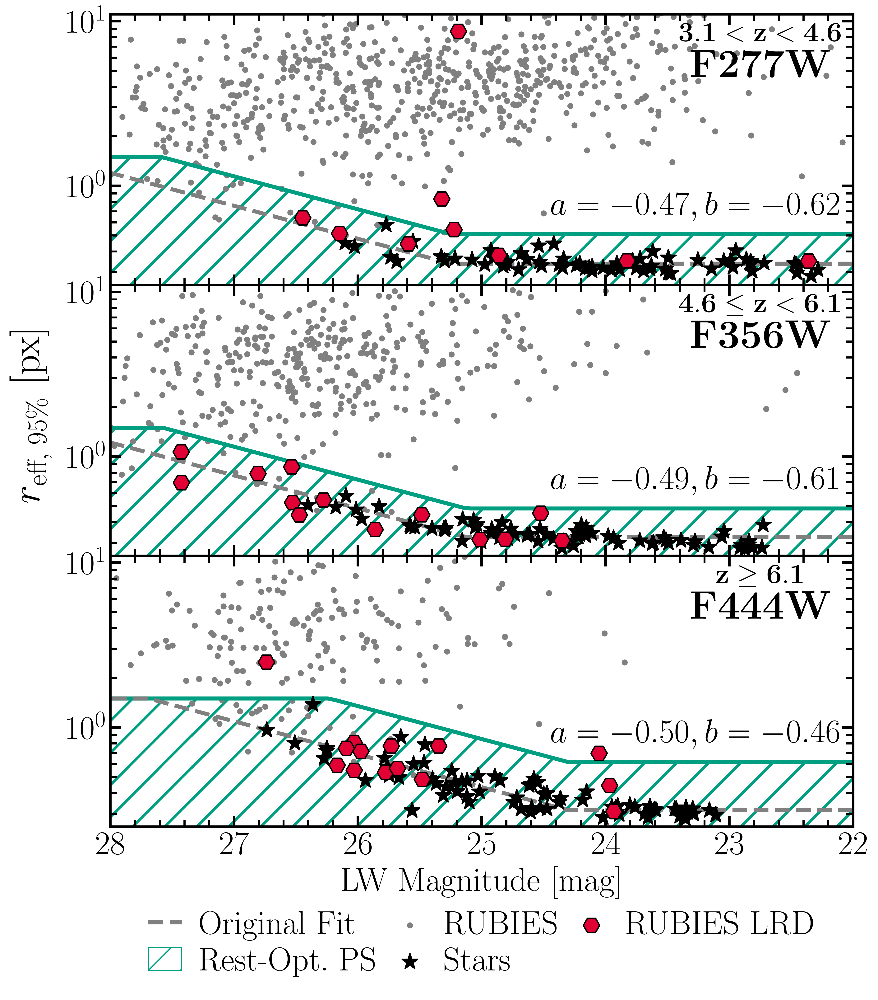
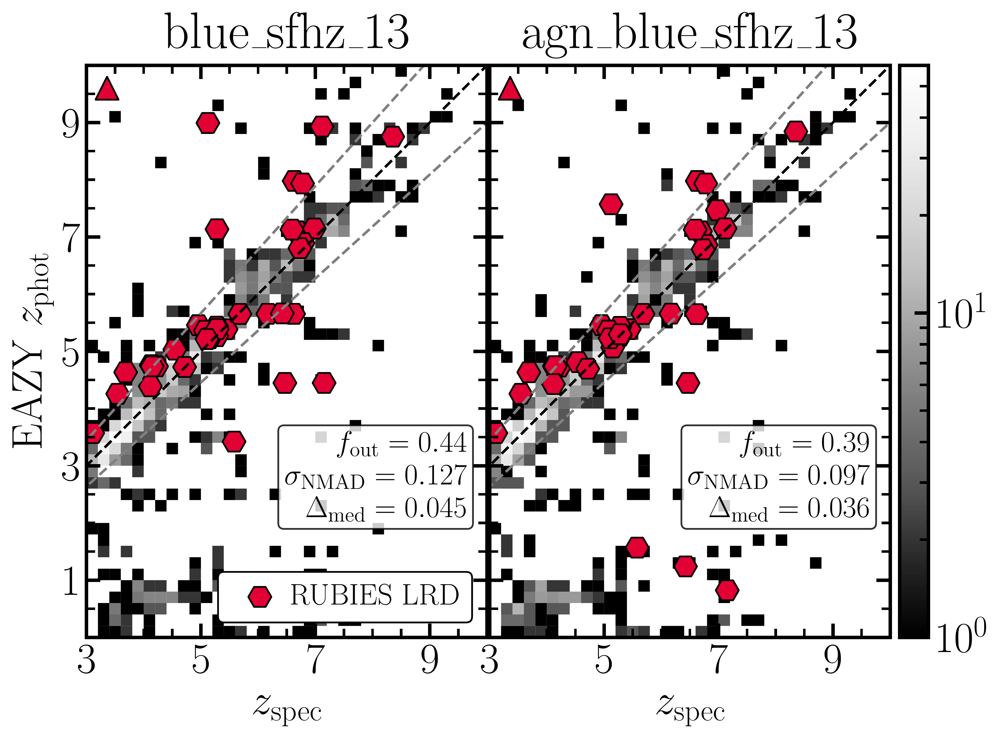

$\newcommand{\ensuremath}{}$
$\newcommand{\xspace}{}$
$\newcommand{\object}[1]{\texttt{#1}}$
$\newcommand{\farcs}{{.}''}$
$\newcommand{\farcm}{{.}'}$
$\newcommand{\arcsec}{''}$
$\newcommand{\arcmin}{'}$
$\newcommand{\ion}[2]{#1#2}$
$\newcommand{\textsc}[1]{\textrm{#1}}$
$\newcommand{\hl}[1]{\textrm{#1}}$
$\newcommand{\footnote}[1]{}$
$\newcommand{\micron}{\rm \mu m}$
$\newcommand{\kms}{ \rm km s^{-1}}$
$\newcommand{\Msun}{\rm M_\odot}$
$\newcommand{\Ha}{{\rm H}\alpha\xspace}$
$\newcommand{\Nii}{[N {\sc ii}]\xspace}$
$\newcommand{\Hb}{{\rm H}\beta\xspace}$
$\newcommand{\Oiii}{[O {\sc iii}]\xspace}$
$\newcommand{\zspec}{z_{\rm spec}}$
$\newcommand{\zphot}{z_{\rm phot}}$
$\newcommand{\arraystretch}{1.2}$
$\newcommand{\arraystretch}{1.1}$
$\newcommand{\arraystretch}{1.1}$
$\newcommand{\arraystretch}{1.1}$

# RUBIES: A Spectroscopic Census of Little Red Dots: All Point Sources with V-Shaped Continua Have Broad Lines

<mark>Appeared on: 2025-06-09</mark> -  _Main text: 17 pages, 10 figures. Appendix: 7 pages, 3 figures. Submitted to A&A_

R. E. Hviding, et al. -- incl., <mark>A. d. Graaff</mark>

**Abstract:** The physical nature of Little Red Dots (LRDs) -- a population of compact, red galaxies revealed by JWST -- remains unclear.    Photometric samples are constructed from varying selection criteria with limited spectroscopic follow-up available to test intrinsic spectral shapes and prevalence of broad emission lines.    We use the RUBIES survey, a large spectroscopic program with wide color-morphology coverage and homogeneous data quality, to systematically analyze the emission-line kinematics, spectral shapes, and morphologies of $\sim$ 1500 galaxies at $z > 3.1$ .    We identify broad Balmer lines via a novel fitting approach that simultaneously models NIRSpec/PRISM and G395M spectra, yielding 80 broad-line sources with 28 (35 \% ) at $z > 6$ .    A large subpopulation naturally emerges from the broad Balmer line sources, with 36 exhibiting `v-shaped' UV-to-optical continua and a dominant point source component in the rest-optical; we define these as spectroscopic LRDs, constituting the largest such sample to date.    Strikingly, the spectroscopic LRD population is largely recovered when either a broad line or rest-optical point source is required in combination with a v-shaped continuum, suggesting an inherent link between these three defining characteristics.    We compare the spectroscopic LRD sample to published photometric searches.    Although these selections have high accuracy, down to $\rm F444W<26.5$ , only 50-62 \% of the RUBIES LRDs were previously identified.    The remainder were missed due to a mixture of faint rest-UV photometry, comparatively blue rest-optical colors, or highly uncertain photometric redshifts.    Our findings highlight that well-selected spectroscopic campaigns are essential for robust LRD identification, while photometric criteria require refinement to capture the full population.

**Figure 2. -** Stellar locus and morphological classification in LW NIRCam filters. Black stars show the 95th percentile effective radius posterior ($r_{\rm eff, 95\%}$) vs. magnitude for reference stars, with the best-fit stellar locus (grey dashed). We classify galaxies as point sources (green hashed) if they fall below the $+4\sigma_\textrm{resid}$ offset of this relation ($r_\textrm{rsv}$; green line). Grey circles show all RUBIES sources with robust $\zspec>3.1$ while red hexagons highlight spectroscopic LRDs (Section \ref{sec:lrd}), plotted in the LW filter that traces the rest-5500Å filter depending on their redshift. (*fig:morph*)

**Figure 3. -** Best-fit photometric versus spectroscopic redshift for RUBIES sources with robust $\zspec > 3.1$(grey histogram) and the LRD sample (red hexagons; triangle indicates out of plot). Photometric redshifts were measured using \texttt{eazy} ([Brammer and Coppi 2008]())  with two different template sets: the \texttt{blue\_sfhz\_13} set optimized for high-redshift galaxies (left) and the \texttt{agn\_blue\_sfhz\_13} set which additionally includes an AGN template constructed from the LRD of [Killi, Watson and Brammer (2024)]() and a torus model (right). Dashed lines show $|\Delta z|/(1+$\zspec$) = 0.1$. Although including this AGN template reduces the number of outliers and photometric redshift scatter for the LRD sample, a small bias toward higher photometric redshifts remains.  (*fig:photoz*)

**Figure 8. -** Left: Euler diagram displaying the overlap between the three LRD characteristic criteria: a broad Balmer line, a dominant point source component at rest-optical wavelengths, and a spectroscopic v-shaped continuum. Right: Histogram showing the composition of overlaps in the Euler diagram where only two of the three features are measured.
    We note that objects with a rest-optical point source and a v-shaped continuum are 80\% likely to have a broad line.
    In fact, in the remaining 20\% we cannot reject a broad line, but our quality cuts restrict us from being fully confident.
    This suggests an underpinning physical link between the three LRD features. (*fig:euler*)

