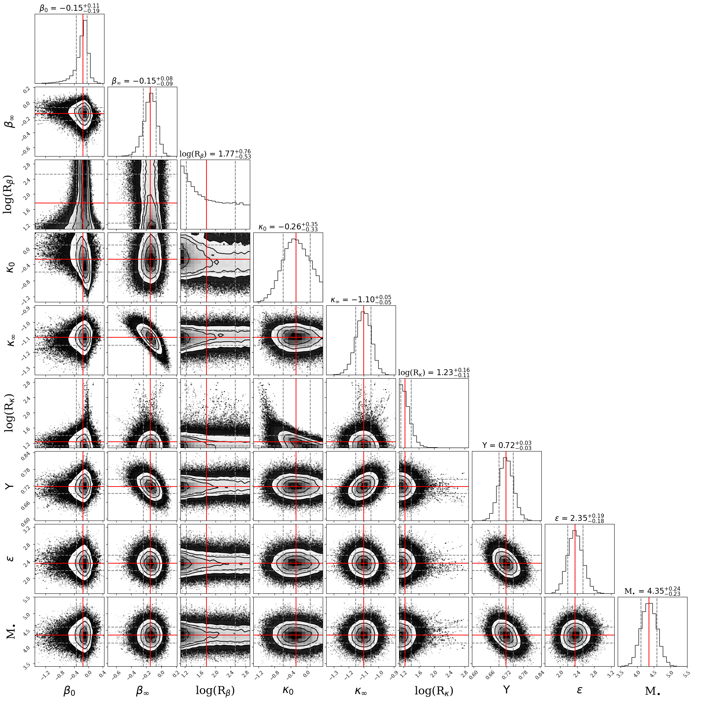
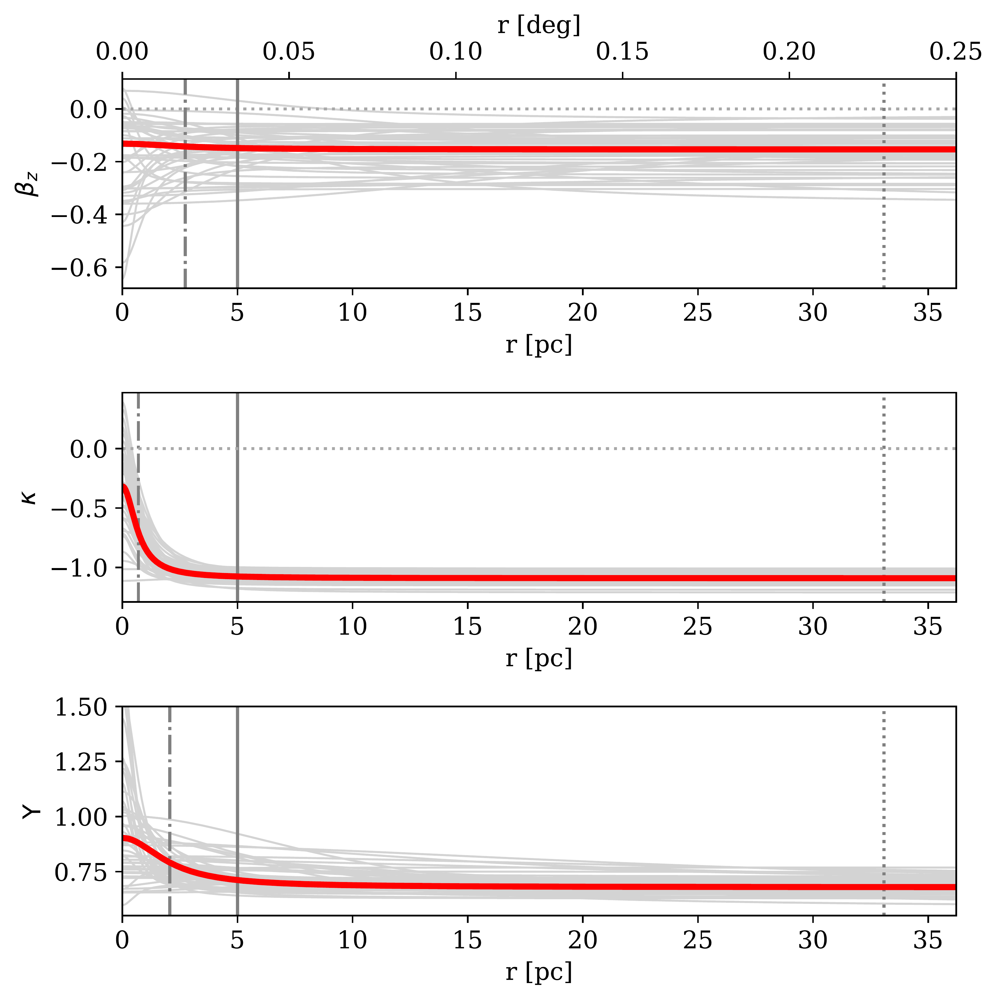

$\newcommand{\ensuremath}{}$
$\newcommand{\xspace}{}$
$\newcommand{\object}[1]{\texttt{#1}}$
$\newcommand{\farcs}{{.}''}$
$\newcommand{\farcm}{{.}'}$
$\newcommand{\arcsec}{''}$
$\newcommand{\arcmin}{'}$
$\newcommand{\ion}[2]{#1#2}$
$\newcommand{\textsc}[1]{\textrm{#1}}$
$\newcommand{\hl}[1]{\textrm{#1}}$
$\newcommand{\footnote}[1]{}$
$\newcommand{\masyr}{mas yr\ensuremath{^{-1}}\xspace}$
$\newcommand{\lsun}{\ensuremath{L_{\sun}}\xspace}$
$\newcommand{\micron}{\ensuremath{\mu}m\xspace}$
$\newcommand{\teff}{\ensuremath{T_\textrm{eff}}\xspace}$
$\newcommand{\re}{\ensuremath{R_\textrm{e}}\xspace}$
$\newcommand{\mh}{[M/H]\xspace}$
$\newcommand{\kms}{km s\ensuremath{^{-1}}\xspace}$
$\newcommand{\msun}{\ensuremath{M_{\sun}}\xspace}$
$\newcommand{\mbh}{\ensuremath{M_{\bullet}}\xspace}$
$\newcommand{\col}{\ensuremath{H-K_{S}}\xspace}$
$\newcommand{\vlos}{\ensuremath{V_\textrm{LOS}}\xspace}$
$\newcommand{\dlos}{\ensuremath{d_\textrm{LOS}}\xspace}$
$\newcommand{\slos}{\ensuremath{\sigma_{\textrm{LOS}}}\xspace}$
$\newcommand{\sgra}{Sgr~A^\star\xspace}$

# Dynamical mass distribution and velocity structure of the Galactic centre

<mark>Appeared on: 2025-06-09</mark> -  _15 pages (+ 5 pages Appendix), 10 (+ 5) figures, accepted A&A_

A. Feldmeier-Krause, et al. -- incl., <mark>N. Neumayer</mark>

**Abstract:** The inner $\sim$ 200 pc region of the Milky Way contains a nuclear stellar disc and a nuclear star cluster that are embedded in the larger Galactic bar. These stellar systems overlap spatially, which makes it challenging to separate stars that belong to the nuclear stellar systems, to deduce their internal dynamics, and to derive the central Galactic potential. Discrete stellar kinematics probe the mass distribution of a stellar system, and chemical tracers such as stellar metallicity can further separate multiple stellar populations that can have distinct kinematic properties.  We took advantage of the information provided by discrete stellar kinematics and the metallicity of stars in the Galactic centre using discrete chemo-dynamical modelling. We fitted axisymmetric Jeans models to discrete data of 4 600 stars. We fitted the stars as either one population plus a background component or as two populations plus a background that represents the bar. In the one-population case, we tested the robustness of the inferred gravitational potential against a varying mass of the supermassive black hole, including dark matter, or a radially varying mass-to-light ratio. We obtained robust results on the stellar dynamical fit with a single population and a background component. We obtained a supermassive black hole mass of (4.35 $\pm 0.24) \times 10^6$ $\msun$ , and we find that a dark matter component adds no more than a few percent to the total enclosed mass of the nuclear star cluster. The radial variation in the mass-to-light ratio is also negligible.  We derived the enclosed mass profile of the inner $\sim$ 60 pc of the Milky Way and found a lower mass than reported in the literature in the region of $\sim$ 5-30 pc.  In our two-population fit, we found a high- $\mh$ population with a mild tangentially anisotropic velocity distribution and stronger rotational support than for the low- $\mh$ population, which is radially anisotropic. The high- $\mh$ population is dominant and contributes more than 90 \% to the total stellar density. The properties of the high- $\mh$ population are consistent with in situ formation after gas inflow from the Galactic disc via the bar. The distinct kinematic properties of the low- $\mh$ population indicate a different origin.

**Figure 11. -** MCMC post burn-in  distributions for the one-population models with $\mbh$ as free parameter  (Sect. $\re$f{sec:fitbh}). The scatter plots show the projected two-dimensional distributions, the red lines the respective 50th percentile, and the dashed grey lines the 16th and 84th percentiles. Their values are also written on top of each column, displaying the projected one-dimensional distributions. From top to bottom and left to right, the panels show the inner anisotropy $\beta_0$, outer anisotropy $\beta_\infty$, the anisotropy transition radius $\log(R_\beta)$, inner rotation parameter $\kappa_0$, outer rotation parameter $\kappa_\infty$, the rotation transition radius $\log(R_\kappa)$, the mass-to-light ratio $\Upsilon$, fraction of background stars $\epsilon$ in percent, and the black hole mass $\mbh$ in $10^6$\msun.  (*fig:cornerbh*)

**Figure 3. -** Radial profile of the velocity anisotropy $\beta_z$(top), the rotation $\kappa$(middle), and
  the mass-to-number density conversion $\Upsilon$(bottom) as derived in Sect. $\re$f{sec:fitmlr} using a three-parameter function. The red lines denote the median of the posterior distribution, and the grey lines are 50 randomly drawn realisations from the posterior distribution. The vertical solid lines denote 1 $\re$=5 pc, the dotted lines show the outer limit of the kinematic data, and the dot-dashed lines show the median of $R_\beta$, $R_\kappa$, and $R_\Upsilon$, respectively.
 (*fig:betakappaml*)

**Figure 10. -** Spatial distribution of stars, colour-coded from top to bottom by the velocity dispersion along $l$, along $b$, along the line of sight, $\vlos$, $\vlos$/$\slos$, for the 50th percentile two-population model, with high-$\mh$ stars (left), and with low-$\mh$ stars (right).
   (*fig:modelmh*)

