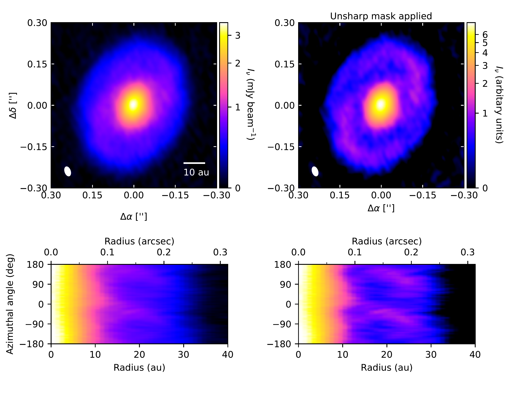
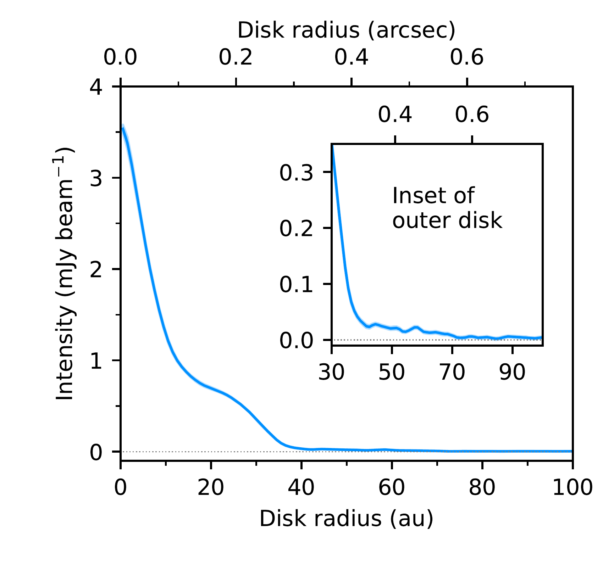

$\newcommand{\ensuremath}{}$
$\newcommand{\xspace}{}$
$\newcommand{\object}[1]{\texttt{#1}}$
$\newcommand{\farcs}{{.}''}$
$\newcommand{\farcm}{{.}'}$
$\newcommand{\arcsec}{''}$
$\newcommand{\arcmin}{'}$
$\newcommand{\ion}[2]{#1#2}$
$\newcommand{\textsc}[1]{\textrm{#1}}$
$\newcommand{\hl}[1]{\textrm{#1}}$
$\newcommand{\footnote}[1]{}$
$\newcommand{\url}[1]{\href{#1}{#1}}$
$\newcommand{\dodoi}[1]{doi:~\href{http://doi.org/#1}{\nolinkurl{#1}}}$
$\newcommand{\doeprint}[1]{\href{http://ascl.net/#1}{\nolinkurl{http://ascl.net/#1}}}$
$\newcommand{\doarXiv}[1]{\href{https://arxiv.org/abs/#1}{\nolinkurl{https://arxiv.org/abs/#1}}}$
$\newcommand{\vdag}{(v)^\dagger}$
$\newcommand$
$\newcommand$
$\newcommand\natexlab{#1}$

# Grand Design Spiral Arms in the Compact, Embedded Protoplanetary Disk of Haro 6-13

<mark>Appeared on: 2025-06-10</mark> -  _Accepted by ApJ_

J. Huang, et al. -- incl., <mark>M. Benisty</mark>

**Abstract:** Millimeter continuum spiral arms have so far only been detected in a handful of protoplanetary disks, and thus we have a limited understanding of the circumstances in which they can form. In particular, substructures in small disks ( $R\lessapprox 50$ au) have not been well-characterized in comparison with large disks. We present ALMA 1.3 mm continuum observations of the disk around the T Tauri star Haro 6-13 at a resolution of $\sim0\farcs04$ ( $\sim5$ au). A pair of low-contrast spiral arms are detected at disk radii from $\sim10-35$ au. They can be approximated as Archimedean spirals with pitch angles ranging from $\sim10-30^\circ$ . The low value of the disk-averaged spectral index between 1.3 and 3 mm ( $\alpha=2.1$ ) and the high brightness temperatures suggest that the millimeter continuum is likely optically thick and thus may hide sufficient mass for the disk to become gravitationally unstable and form spiral arms. CO observations have shown that Haro 6-13 is surrounded by an envelope, raising the possibility that infall is facilitating spiral arm formation.

**Figure 4. -** Left: 1.3 mm continuum image of Haro 6-13 and the corresponding intensity map as a function of radius and azimuthal angle in disk coordinates. An arcsinh stretch is used for the color scale. The synthesized beam is shown in the lower left corner of the CLEAN image. Right: The CLEAN image with an unsharp mask applied and the corresponding intensity map in $R$, $\theta$ coordinates.  (*fig:continuumoverview*)

**Figure 5. -** Top left: 300 random $I(r)$ samples from \texttt{protomidpy} modeling. Center left: CLEAN image of axisymmetric \texttt{protomidpy} model. Bottom left: Corresponding intensity plot in $R$ and $\theta$ coordinates. Top right: Comparison of radial profiles calculated from CLEAN images of the observations and model. Center right: CLEAN image of the continuum residual visibilities created by subtracting the _maximum a posteriori_\texttt{protomidpy} model from the observed visibilities. The purple star marks the disk center. The black dots mark the spiral arm positions identified by \texttt{filfinder}. Bottom right: Plot of the continuum residuals in $R$ and $\theta$ coordinates.   (*fig:protomidpy*)

**Figure 1. -** Azimuthally averaged, deprojected radial profile of the 1.3 mm continuum image. The shaded ribbon shows the scatter in each radial bin divided by the square root of the number of synthesized beams spanning each bin. The inset shows the faint emission at larger radii. (*fig:radialprofile*)

