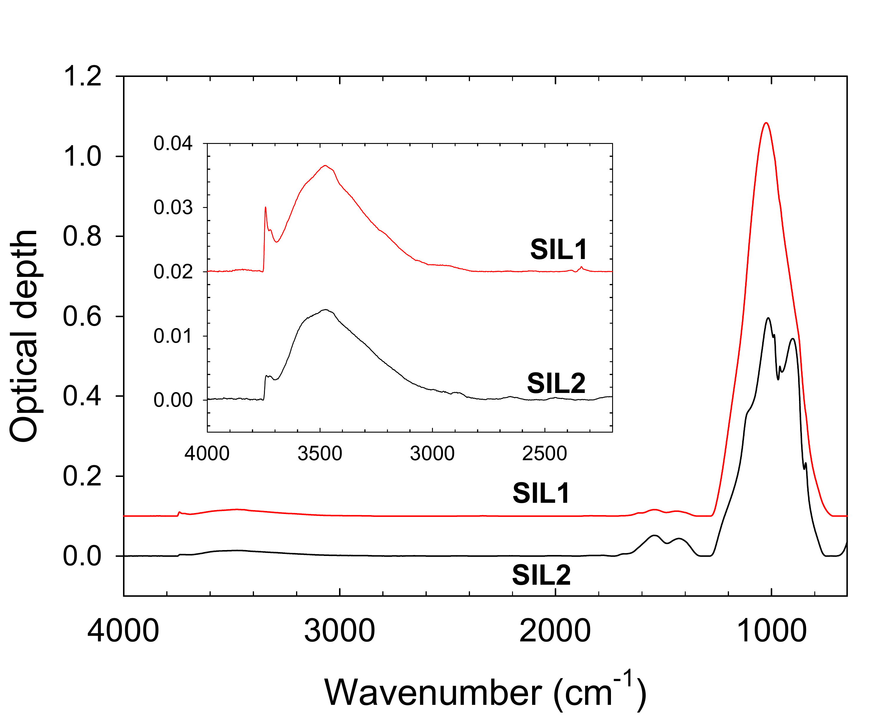

$\newcommand{\ensuremath}{}$
$\newcommand{\xspace}{}$
$\newcommand{\object}[1]{\texttt{#1}}$
$\newcommand{\farcs}{{.}''}$
$\newcommand{\farcm}{{.}'}$
$\newcommand{\arcsec}{''}$
$\newcommand{\arcmin}{'}$
$\newcommand{\ion}[2]{#1#2}$
$\newcommand{\textsc}[1]{\textrm{#1}}$
$\newcommand{\hl}[1]{\textrm{#1}}$
$\newcommand{\footnote}[1]{}$
$\newcommand{\vdag}{(v)^\dagger}$
$\newcommand$
$\newcommand$

# Hydroxylated Mg-rich amorphous silicates as catalysts for molecular hydrogen formation in the interstellar medium

<mark>Appeared on: 2025-06-16</mark> -  _10 pages, 6 figures_

V. Mennella, <mark>T. Suhasaria</mark>, B. Kerkeni, G. Ouerfelli

**Abstract:** We present results from an experimental study on the interaction of atomic deuterium with Mg-rich amorphous enstatite and forsterite type silicates. Infrared spectroscopy was used to examine the process. During D atom exposure, deuteroxyl group formation was observed. The cross section for OD group formation, estimated from the OD stretching band intensity with D atom fluence, is $\sigma _{f,OD}$ = 4.2 $\times10^{-18}$ cm $^{2}$ for both silicates. HD ($D_2$ ) molecules form via D atom abstraction of chemisorbed H (D) atoms from OH (OD) groups, with a cross section of $\sigma _{f,D_2}$ = 7.0 $\times10^{-18}$ cm $^{2}$ . Quantum chemical calculations on enstatite and forsterite amorphous nano-clusters were used to analyze chemisorption and abstraction energies of H atoms. The formation of OH groups on forsterite is barrierless, while enstatite has a small energy barrier. $H_2$ abstraction from hydroxyl groups is barrierless in both silicates. The results support our interpretation of IR spectral changes during D atom exposure as addition and exchange reactions, with catalytic molecular deuterium formation. These findings, obtained at 300 K, are relevant to astrophysical environments like photodissociation regions and interstellar clouds at lower temperatures. Amorphous silicates, like carbon grains, undergo hydrogenation in the diffuse interstellar medium due to interactions with atomic hydrogen and UV photons. The detection of these components on comet 67P/Churyumov-Gerasimenko connects primitive solar system objects to interstellar dust, offering new insights into their evolution.

**Figure 2. -** A) Evolution of the O-H and O-D stretching bands during D atom irradiation of the SIL1 and SIL2 silicates. The spectra  of the exposed silicates are shown after subtraction
of the spectrum of the samples as produced. The SIL1 spectra are offset in ordinate for the sake of clarity.
B) The O-D stretching band of SIL1 after D exposure compared with the O-H mode of SIL1 as shown in the inset to Figure \ref{fig1}. The later has been red shifted, reducing the frequency of a factor 1.36, to take into account the H/D isotope substitution.
  (*fig2*)

**Figure 6. -** The ER potential energy surface along the minimum energy path for (a) H atom approaching an hydroxyl group from infinity and (b) $H_2$ molecule abstraction from the enstatite nanocluster. (*fig6*)

**Figure 1. -** Continuum subtracted mid-IR spectra of SIL1 and SIL2. The details of the O-H stretching region are shown in the inset. The spectra are offset in ordinate for the sake of clarity.  (*fig1*)

