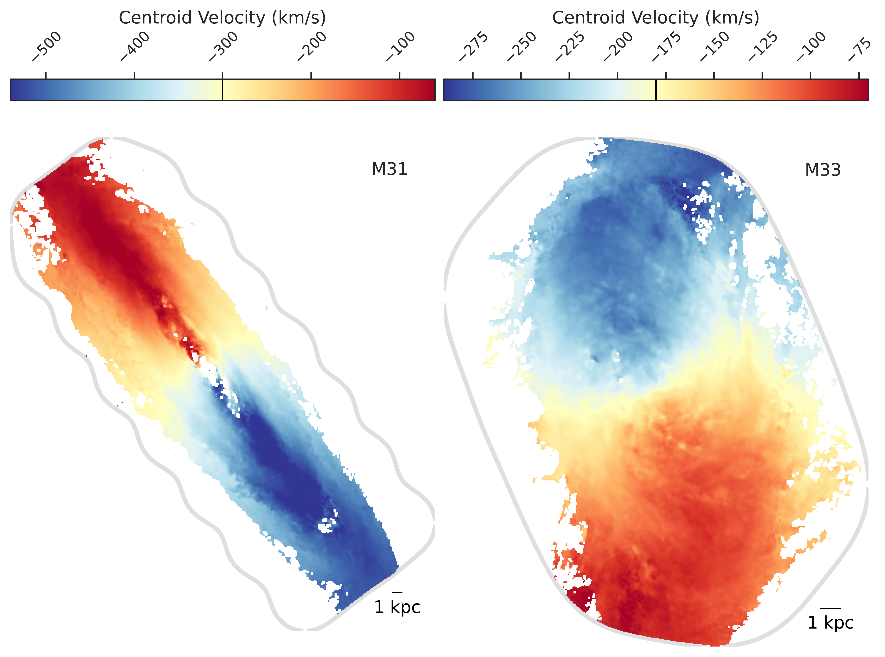

$\newcommand{\ensuremath}{}$
$\newcommand{\xspace}{}$
$\newcommand{\object}[1]{\texttt{#1}}$
$\newcommand{\farcs}{{.}''}$
$\newcommand{\farcm}{{.}'}$
$\newcommand{\arcsec}{''}$
$\newcommand{\arcmin}{'}$
$\newcommand{\ion}[2]{#1#2}$
$\newcommand{\textsc}[1]{\textrm{#1}}$
$\newcommand{\hl}[1]{\textrm{#1}}$
$\newcommand{\footnote}[1]{}$
$\newcommand{\vdag}{(v)^\dagger}$
$\newcommand$
$\newcommand$
$\newcommand{\msolpcsq}{M_\odot pc^{-2}\xspace}$
$\newcommand{\msolyr}{M_\odot yr^{-1}\xspace}$
$\newcommand{\msol}{M_\odot\xspace}$
$\newcommand{\twelveco}{^{12}CO\xspace}$
$\newcommand{\twelvecoto}{^{12}CO\mbox{(2-1)}\xspace}$
$\newcommand{\twelvecotht}{^{12}CO\mbox{(3-2)}\xspace}$
$\newcommand{\thirtco}{^{13}CO\xspace}$
$\newcommand{\thirtcoto}{^{13}CO\mbox{(2-1)}\xspace}$
$\newcommand{\thirtcotht}{^{13}CO\mbox{(3-2)}\xspace}$
$\newcommand{\ceighto}{C^{18}O\xspace}$
$\newcommand{\hcop}{HCO^{+}\xspace}$
$\newcommand{\hi}{\ion{H}{1}\xspace}$
$\newcommand{◦ee}{\ensuremath{\circ}}$
$\newcommand{\hii}{{\sc H\textsc{ ii}}\xspace}$
$\newcommand{\kms}{km s^{-1}\xspace}$
$\newcommand{\htwo}{H_{2}\xspace}$
$\newcommand{\halpha}{H\alpha\xspace}$
$\newcommand{\Msun}{M_{\odot}\xspace}$
$\newcommand{\Ox}{Sub-department of Astrophysics, Department of Physics, University of Oxford, Keble Road, Oxford OX1 3RH, UK}$
$\newcommand{\UGent}{Sterrenkundig Observatorium, Universiteit Gent, Krijgslaan 281 S9, B-9000 Gent, Belgium}$
$\newcommand{\STScI}{Space Telescope Science Institute, 3700 San Martin Drive, Baltimore, MD 21218, USA}$
$\newcommand{\IWR}{Universität Heidelberg, Interdisziplinäres Zentrum für Wissenschaftliches Rechnen, Im Neuenheimer Feld 205, 69120 Heidelberg, Germany}$
$\newcommand{\Radcliffe}{Elizabeth S. and Richard M. Cashin Fellow at the Radcliffe Institute for Advanced Studies at Harvard University, 10 Garden Street, Cambridge, MA 02138, U.S.A.}$
$\newcommand{\MPIA}{Max-Planck-Institut für Astronomie, Königstuhl 17, D-69117, Heidelberg, Germany}$
$\newcommand{\AURA}{AURA for the European Space Agency (ESA), Space Telescope Science Institute, 3700 San Martin Drive, Baltimore, MD 21218, USA}$
$\newcommand{\UCSD}{Department of Astronomy \& Astrophysics, University of California, San Diego, 9500 Gilman Dr., La Jolla, CA 92093, USA}$
$\newcommand{\Whitman}{Whitman College, 345 Boyer Avenue, Walla Walla, WA 99362, USA}$
$\newcommand{\JHU}{Department of Physics and Astronomy, The Johns Hopkins University, Baltimore, MD 21218, USA}$
$\newcommand{\OSU}{Department of Astronomy, The Ohio State University, 140 West 18th Avenue, Columbus, OH 43210, USA}$
$\newcommand{\OSUPhys}{Department of Physics, The Ohio State University, Columbus, Ohio 43210, USA}$
$\newcommand{ÇAPP}{Center for Cosmology and Astroparticle Physics (CCAPP), 191 West Woodruff Avenue, Columbus, OH 43210, USA}$
$\newcommand{\ARI}{Astronomisches Rechen-Institut, Zentrum für Astronomie der Universität Heidelberg, Mönchhofstr. 12-14, D-69120 Heidelberg, Germany}$
$\newcommand{\ANU}{Research School of Astronomy and Astrophysics, Australian National University, Canberra, ACT 2611, Australia}$
$\newcommand{\UConn}{Department of Physics, University of Connecticut, 196A Auditorium Road, Storrs, CT 06269, USA}$
$\newcommand{\UHawaii}{Institute for Astronomy, University of Hawaii, 2680 Woodlawn Drive, Honolulu, HI 96822, USA}$
$\newcommand{\UniCA}{Université C\^{o}te d'Azur, Observatoire de la C\^{o}te d'Azur, CNRS, Laboratoire Lagrange, 06000, Nice, France}$
$\newcommand{\UAlberta}{Dept. of Physics, University of Alberta, 4-183 CCIS, Edmonton, Alberta, T6G 2E1, Canada}$
$\newcommand{\Arcetri}{INAF — Osservatorio Astrofisico di Arcetri, Largo E. Fermi 5, I-50125, Florence, Italy}$
$\newcommand{\UWyoming}{Department of Physics and Astronomy, University of Wyoming, Laramie, WY 82071, USA}$
$\newcommand{\LJMU}{Astrophysics Research Institute, Liverpool John Moores University, 146 Brownlow Hill, Liverpool L3 5RF, UK}$
$\newcommand{\ITA}{Universität Heidelberg, Zentrum für Astronomie, Institut für Theoretische Astrophysik, Albert-Ueberle-Str 2, D-69120 Heidelberg, Germany}$
$\newcommand{\CfA}{Center for Astrophysics \mid Harvard \& Smithsonian, 60 Garden St., 02138 Cambridge, MA, USA}$
$\newcommand{\MPE}{Max-Planck-Institut für Extraterrestrische Physik (MPE), Giessenbachstr. 1, D-85748 Garching, Germany}$
$\newcommand{\UMD}{Department of Astronomy and Joint Space-Science Institute, University of Maryland, College Park, MD 20742, USA}$
$\newcommand{\UVA}{Department of Astronomy, University of Virginia, Charlottesville, VA, USA}$
$\newcommand{\NRAO}{National Radio Astronomy Observatory, Charlottesville, VA, USA}$
$\newcommand{\ASIAA}{Institute of Astronomy and Astrophysics, Academia Sinica, No. 1, Sec. 4, Roosevelt Road, Taipei 106216, Taiwan}$
$\newcommand{\kipac}{Kavli Institute for Particle Astrophysics \& Cosmology (KIPAC), Stanford University, CA 94305, USA}$
$\newcommand{\aifa}{Argelander-Institut für Astronomie, University of Bonn, Auf dem Hügel 71, 53121 Bonn, Germany}$
$\newcommand{\TKU}{Department of Physics, Tamkang University, No.151, Yingzhuan Road, Tamsui District, New Taipei City 251301, Taiwan}$
$\newcommand{\CarnegieObs}{The Observatories of the Carnegie Institution for Science. 813 Santa Barbara Street, Pasadena, CA 91101, USA}$
$\newcommand{\Princeton}{Department of Astrophysical Sciences, Princeton University, Princeton, NJ 08544, USA}$
$\newcommand{\IAS}{Institute for Advanced Study, 1 Einstein Drive, Princeton, NJ 08540, USA}$
$\newcommand{\COOL}{Cosmic Origins Of Life (COOL) Research DAO, coolresearch.io}$
$\newcommand{\ESO}{European Southern Observatory (ESO), Karl-Schwarzschild-Stra{\ss}e 2, 85748 Garching, Germany}$
$\newcommand{\ULyon}{Univ Lyon, Univ Lyon 1, ENS de Lyon, CNRS, Centre de Recherche Astrophysique de Lyon UMR5574, F-69230 Saint-Genis-Laval, France}$
$\newcommand{\UoM}{Jodrell Bank Centre for Astrophysics, Department of Physics and Astronomy, University of Manchester, Oxford Road, Manchester M13 9PL, UK}$
$\newcommand{\farcs}{\hbox{.\!\!^{\prime\prime}}}$
$\newcommand{\lesssim}{\mathrel{\hbox{\rlap{\hbox{\lower4pt\hbox{\sim}}}\hbox{<}}}}$
$\newcommand{\gtrsim}{\mathrel{\hbox{\rlap{\hbox{\lower4pt\hbox{\sim}}}\hbox{>}}}}$

# The Karl G. Jansky Very Large Array Local Group L-band Survey (LGLBS)

<mark>Appeared on: 2025-06-16</mark> -  _ApJS in press. LGLBS HI v1.0 data release is available here: this https URL (with permanent DOI to follow)_

E. W. Koch, et al. -- incl., <mark>F. Walter</mark>, <mark>E. Schinnerer</mark>

**Abstract:** We present the Local Group L-Band Survey (LGLBS), a Karl G. Jansky Very Large Array (VLA) survey producing the highest quality 21-cm and $1{-}2$ GHz radio continuum images to date for the six VLA-accessible, star-forming, Local Group galaxies. Leveraging the VLA's spectral multiplexing power, we simultaneously survey the 21-cm line at high $0.4$ km s $^{-1}$ velocity resolution, the 1--2 GHz polarized continuum, and four OH lines. For the massive spiral M31, the dwarf spiral M33, and the dwarf irregular galaxies NGC6822, IC10, IC1613, and the Wolf-Lundmark-Melotte Galaxy (WLM), we use all four VLA configurations and the Green Bank Telescope to reach angular resolutions of $< 5"$ ( $10{-}20$ pc) for the 21-cm line with $<10^{20}$ cm $^{-2}$ column density sensitivity, and even sharper views ( $< 2"$ ; $5{-}10$ pc) of the continuum. Targeting these nearby galaxies ( $D\lesssim1$ Mpc) reveals a sharp, resolved view of the atomic gas, including 21-cm absorption, and continuum emission from supernova remnants and $\ion{H}{2}$ regions. These datasets can be used to test theories of the abundance and formation of cold clouds, the driving and dissipation of interstellar turbulence, and the impact of feedback from massive stars and supernovae. Here, we describe the survey design and execution, scientific motivation, data processing, and quality assurance. We provide a first look at and publicly release the wide-field 21-cm $\hi$ data products for M31, M33, and four dwarf irregular targets in the survey, which represent some of the highest physical resolution 21-cm observations of any external galaxies beyond the LMC and SMC.

**Figure 14. -** **$\hi$ line width maps of the four LGLBS dwarf galaxies, as measured with the effective width,** defined as $\sigma = I_{\rm HI} / \sqrt{2\pi}   T_{\rm peak}$. Each map is shown at a common physical resolution of 120 pc. Regions with recent massive star formation in NGC6822 and IC10 tend to show larger velocity dispersions, while IC1613 and WLM with lower recent star formation rates tend to have lower dispersions. (*fig:hi_dwarfs_ew*)

**Figure 2. -** **Median percent of flagged data per SPW, where the errorbars reflect the 15$^{\rm th**$ to 85$^{\rm th}$ percentile range of 337 LGLBS tracks}. The continuous blue lines indicate flagging percentages for the continuum SPWs, and the orange diamonds are the line SPWs for $\hi$ and the 4 OH lines (the OH1665/1667 are recorded together in the same SPW). The current LGLBS processing does not include the Hydrogen RRLs included in the spectral setup. (*fig:flagging_by_freq*)

**Figure 13. -** **$\hi$ centroid velocity maps of M31 and M33** at a common physical resolution of 120 pc. The colormaps are centered at the galaxy's systemic velocity indicated by the vertical black line in each colorbar and extend to $\pm V_{\rm max}$(the maximum rotation velocity). (*fig:hi_m31m33_mom1*)

