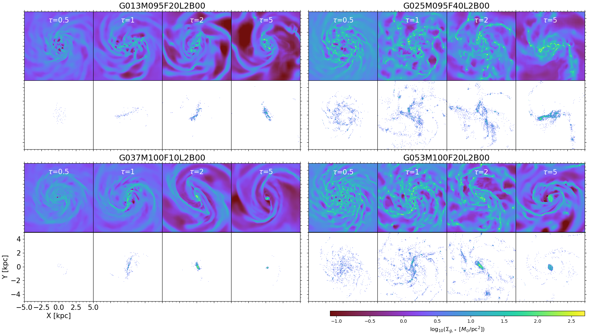
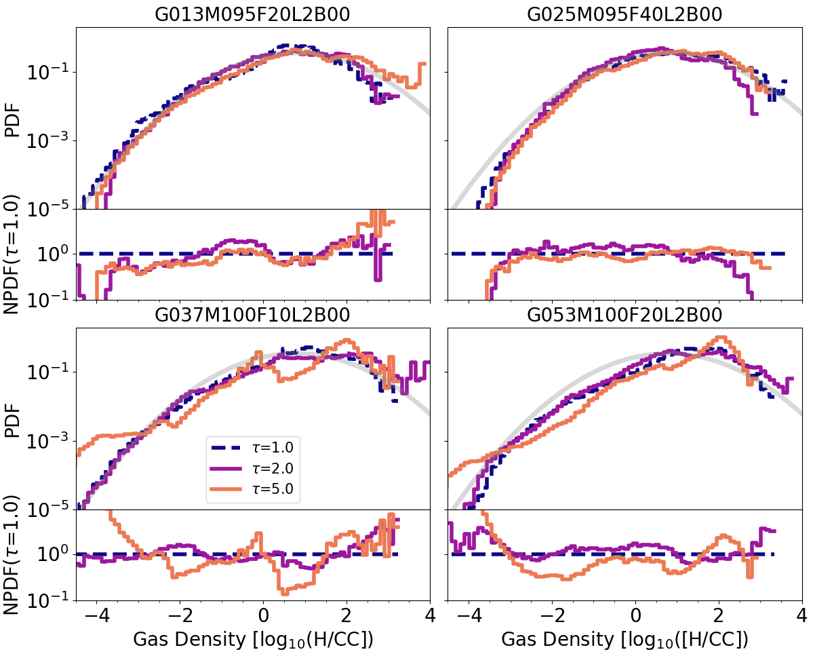

$\newcommand{\ensuremath}{}$
$\newcommand{\xspace}{}$
$\newcommand{\object}[1]{\texttt{#1}}$
$\newcommand{\farcs}{{.}''}$
$\newcommand{\farcm}{{.}'}$
$\newcommand{\arcsec}{''}$
$\newcommand{\arcmin}{'}$
$\newcommand{\ion}[2]{#1#2}$
$\newcommand{\textsc}[1]{\textrm{#1}}$
$\newcommand{\hl}[1]{\textrm{#1}}$
$\newcommand{\footnote}[1]{}$
$\newcommand{\A}{A_{2}}$
$\newcommand{\tb}{t_{\rm bar}}$
$\newcommand{\ls}{l_{*}}$
$\newcommand{\lgas}{l_{g}}$
$\newcommand{\Msun}{\mbox{M}_{\sun}}$
$\newcommand{\sigz}{\sigma_{z}}$
$\newcommand{\sigrel}{\sigma_{\rm rel}}$
$\newcommand{\vesc}{v_{\rm esc}}$
$\newcommand{\om}{\Omega}$
$\newcommand{\omb}{\Omega_{b}}$
$\newcommand{\kms}{km s^{-1}}$

# Simulating nearby disc galaxies on the main star formation sequence: II. The gas structure transition in low  and high stellar mass discs

<mark>Appeared on: 2025-06-17</mark> -  _17 pages, 14 figures_

P. Verwilghen, et al. -- incl., <mark>J. Neumann</mark>, <mark>E. Schinnerer</mark>

**Abstract:** Recent  hydrodynamical simulations of isolated barred disc galaxies have suggested a structural change in the distribution of the interstellar medium (ISM) around a stellar mass M $_{*}$ of $10^{10}$  $\Msun$ .  In the higher-mass regime (M $_{*} \geq 10^{10}$ $\Msun$ ), we observe the formation of a central gas and stellar disc with a typical size of a few hundred parsecs connected through lanes to the ends of the stellar bar. In the lower-mass regime (M $_{*} < 10^{10}$ $\Msun$ ), such an inner disc is absent and the gas component exhibits a more chaotic distribution. Observations of nearby star-forming galaxies support the existence of such a change. These inner gas discs may represent an important intermediate scale connecting the large kiloparsec-scale structures with the nuclear (sub-parsec) region, transporting gas  inwards to fuel the central supermassive black hole (SMBH). For this work we used an extended set of high-resolution hydrodynamical simulations of isolated disc galaxies with initial properties (i.e. stellar mass, gas fraction, stellar disc scale length, and the bulge mass fraction) with properties covering the range of galaxies in the PHANGS sample to investigate this change of regime. We studied the physical properties of the star-forming ISM in both stellar mass regimes and extracted a few physical tracers: the inner Lindblad resonance (ILR), the probability distribution function (PDF), the virial parameter, and the Mach number. In line with observations, we confirm a structure transition in the simulations that occurs between a stellar mass of $10^{9.5}$ and $10^{10}$ $\Msun$ . We show that the physical origin of this change of regime is driven by stellar feedback and its contribution relative to the underlying gravitational potential. With their shallower potential and typically higher gas mass fraction, lower-mass disc PHANGS galaxies combine two ingredients that significantly delay or even prevent the formation of a central gas (and stellar) disc. These results shed some light on the observed properties of star-forming barred galaxies and have implications for the star formation regimes, the growth of central structures, and the overall secular evolution of disc galaxies.

**Figure 9. -** Evolution (from left to right) of the vertical velocity dispersion $\sigma_z$(two bottom rows) and $\sigma_z$ normalised by the local escape velocity (two top rows). The blue (resp. red) curves represent models with an initial stellar mass of $10^{9.5}$ $\Msun$(resp. above or equal to $10^{10}$ $\Msun$, see inset in  top left panel). The grey lines are models that do not display a bar at the end of the simulation. The line thickness corresponds to the gas fraction (see inset in the top middle  panel). The green shaded areas show vertical velocity dispersions ranging from 10 to 40 $\kms$ and the purple shaded areas show a percentage above 5\%. (*fig:feedback_potential*)

**Figure 6. -** Surface density map of gas and newly formed stars ($\leq 100$ Myr) of four models in two stellar mass bins (G013, G025, with an initial stellar mass of $10^{9.5}$ $\Msun$; G037, and G053 with an initial stellar mass of $10^{10}$ $\Msun$) from our set of simulations. Each panel shows one model at different values of the parameter $\tau$, with $\tau=1$ corresponding to the bar formation timescale. G013 and G053 have the same 20\% gas mass fraction, while G025 and G037 have a 40\% and 10\% gas mass fraction, respectively (the latter two following the averaged properties of star-forming main-sequence galaxies at their respective stellar masses). (*fig:sig_gas_tau05-5*)

**Figure 2. -** Evolution of the mass-weighted gas density PDFs as a function of $\tau$(for $\tau=1$, 2, and 5) of four of our simulated galaxies (see also Fig. \ref{fig:sig_gas_tau05-5}), namely models G013, G025 with initial stellar masses of $10^{9.5}$ $\Msun$(top row), and G037 and G053 with initial stellar masses of $10^{10}$ $\Msun$(bottom row). The bottom panels in each row show the PDF normalised by the PDF at $\tau=1$(NPDF). The faded grey curve shows a fit of a Log-normal to the PDF at $\tau=1$ of model G013 and serves as a reference in all panels. (*fig:pdfnorm*)

