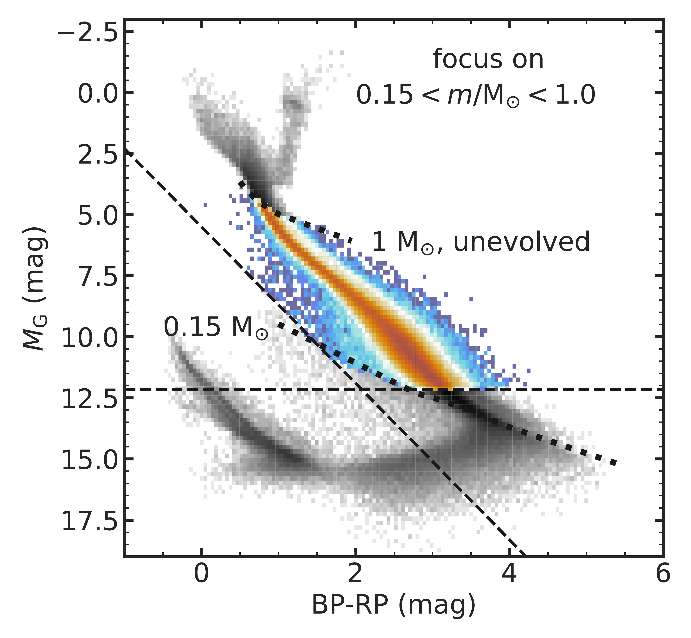
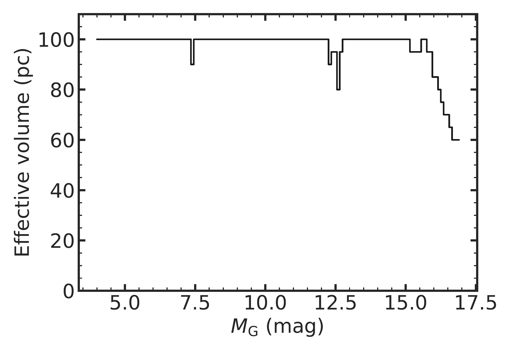

$\newcommand{\ensuremath}{}$
$\newcommand{\xspace}{}$
$\newcommand{\object}[1]{\texttt{#1}}$
$\newcommand{\farcs}{{.}''}$
$\newcommand{\farcm}{{.}'}$
$\newcommand{\arcsec}{''}$
$\newcommand{\arcmin}{'}$
$\newcommand{\ion}[2]{#1#2}$
$\newcommand{\textsc}[1]{\textrm{#1}}$
$\newcommand{\hl}[1]{\textrm{#1}}$
$\newcommand{\footnote}[1]{}$
$\newcommand{\citeg}[1]{\citep[e.g.,][]{#1}}$
$\newcommand{\tabincell}[2]{\begin{tabular}{@ #1@ }#2\end{tabular}}$
$\newcommand{\indentpar}[1]{\noindent\hangindent=2em\hangafter=1 #1}$
$\newcommand{\arraystretch}{1.25}$
$\newcommand{\arraystretch}{1.4}$
$\newcommand{\thebibliography}{\DeclareRobustCommand{\VAN}[3]{##3}\VANthebibliography}$

# Stellar initial mass function in the 100-pc solar neighbourhood

<mark>Appeared on: 2025-06-17</mark> -  _Submitted to MNRAS_

Y.-T. Wang, C. Liu, <mark>J. Li</mark>

**Abstract:** The stellar initial mass function (IMF) is one of the most important astrophysical distribution function, and is defined as the mass distribution for stars formed in a single star-formation event and when they just enter the main-sequence stage. The measurement of IMF is challenging even in the solar neighbourhood where IMF can be extracted by star-counting. This is because the definition of the IMF should be handled cautiously, and there are multiple corrections should be made from observation to a well-founded measurement. We present a new parametrisation of the stellar IMF in the 100-pc solar neighbourhood, leveraging the astrometric and photometric data from \textsl{Gaia} DR3: we model the colour-magnitude diagram of the field star population while accounting for observational uncertainties, Malmquist bias, Lutz-Kelker bias, the effect of varying mass-luminosity relation caused by mixture of different metallicity, and the effect of unresolved binaries. In particular, we synthesise the binaries with a process imitating the dynamical evolution observed in star clusters to model their present-day mass-ratio distribution. We derive a stellar IMF consistent with canonical IMFs but with significantly reduced uncertainties: $\alpha_1=0.81^{+0.06}_{-0.05}$ , $\alpha_2=2.12^{+0.04}_{-0.04}$ , and a break point at $m_{\mathrm{break}}=0.41^{+0.01}_{-0.01}$ $\mathrm{M_{\odot}}$ . Our model also constrains the binary fraction to $\sim$ 25 \% and the \textsl{Gaia} DR3 angular resolution to $1.31^{+0.24}_{-0.29}$ arcsec. We also provide the $\xi$ -parameter for our IMF to be $0.5075_{-0.0051}^{+0.0112}$ for the users to compare our result with other work.

**Figure 2. -** colour-magnitude diagram for stars in the 100-pc solar neighbourhood. The scatter with gray colour map illustrates the density distribution for all GCNS sample, overlapped with the object density distribution resulting from our sample selection procedure in Sec.\ref{sec:MS sample}. Black dashed lines denote the selection standards for Main-sequence stars in \citet{penoyre2022}, while black dotted lines denote the iso-mass lines for $0.15 \mathrm{M_{\odot}}$ and unevolved $0.15 \mathrm{M_{\odot}}$ stars from PARSEC model. (*fig:GCNS_cmd*)

**Figure 11. -** The posterior distribution of the model parameters with our main sample described in Fig.\ref{fig:GCNS_cmd}. (*fig:mcmc*)

**Figure 1. -** Completeness limit as a function of absolute magnitude in the G-band. (*fig:completeness*)

