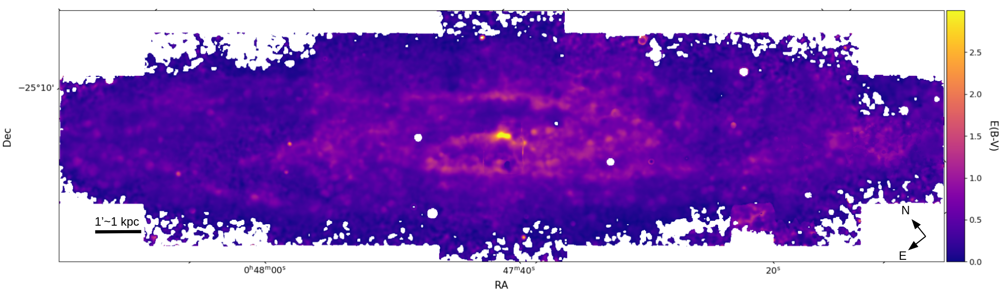

$\newcommand{\ensuremath}{}$
$\newcommand{\xspace}{}$
$\newcommand{\object}[1]{\texttt{#1}}$
$\newcommand{\farcs}{{.}''}$
$\newcommand{\farcm}{{.}'}$
$\newcommand{\arcsec}{''}$
$\newcommand{\arcmin}{'}$
$\newcommand{\ion}[2]{#1#2}$
$\newcommand{\textsc}[1]{\textrm{#1}}$
$\newcommand{\hl}[1]{\textrm{#1}}$
$\newcommand{\footnote}[1]{}$
$\newcommand{\Hb}{\hbox{H\beta}}$
$\newcommand{\Ha}{\hbox{H\alpha}}$
$\newcommand{\oi}{[O~\textsc{i}]\lambda6300}$
$\newcommand{\oiii}{[O~\textsc{iii}]\lambda5007}$
$\newcommand{\nii}{[N~\textsc{ii}]\lambda6584}$
$\newcommand{\siia}{[S~\textsc{ii}]\lambda6717}$
$\newcommand{\siib}{[S~\textsc{ii}]\lambda6731}$
$\newcommand{\sii}{[S~\textsc{ii}]\lambda\lambda6717,6731}$
$\newcommand{\siii}{[S~\textsc{iii}]\lambda9068}$
$\newcommand{\hei}{He~\textsc{i}~\lambda5875}$
$\newcommand{\heii}{He~\textsc{ii}~\lambda4685}$
$\newcommand{\oion}{[O~\textsc{i}]}$
$\newcommand{\oiion}{[O~\textsc{ii}]}$
$\newcommand{\oiiion}{[O~\textsc{iii}]}$
$\newcommand{\niion}{[N~\textsc{ii}]}$
$\newcommand{\siiion}{[S~\textsc{iii}]}$
$\newcommand{\siion}{[S~\textsc{ii}]}$
$\newcommand{\heion}{He~\textsc{i}}$
$\newcommand{\heiion}{He~\textsc{ii}}$
$\newcommand{\ngc}{NGC~}$
$\newcommand{\Msun}{\mbox{M}_{\sun}}$
$\newcommand{\Lsun}{\mbox{L}_{\sun}}$
$\newcommand{\hii}{H~{\sc ii}}$
$\newcommand{\sn}{S/N}$
$\newcommand{\ebv}{E(B-V)}$
$\newcommand{\izi}{{\tt IZI}}$
$\newcommand{\arraystretch}{1.5}$
$\newcommand{\arraystretch}{1.5}$
$\newcommand{\arraystretch}{1.1}$
$\newcommand{\arraystretch}{1.1}$

# The MUSE view of the Sculptor galaxy: survey overview and the planetary nebulae luminosity function.

<mark>Appeared on: 2025-06-20</mark> -  _21 pages, 17 figures, accepted for publication in A&A_

E. Congiu, et al. -- incl., <mark>K. Kreckel</mark>, <mark>E. Schinnerer</mark>

**Abstract:** $\ngc$ 253, the Sculptor galaxy, is the southern, massive, star-forming disk galaxy closest to the Milky Way.  In this work, we present a new 103-pointing MUSE mosaic of this galaxy covering the majority of its star-forming disk up to $0.75\times$ R $_{25}$ .  With an area of $\sim20\times5 \si{arcmin^2}$ ( $\sim20\times5 \si{kpc^2}$ , projected) and a physical resolution of $\sim 15 \si{pc}$ , this mosaic constitutes one of the largest, highest physical resolution integral field spectroscopy surveys of any star-forming galaxy to date.  Here, we exploit the mosaic to identify a sample of $\sim$ 500 planetary nebulae ( $\sim 20$ times larger than in previous studies) to build the planetary nebula luminosity function (PNLF) and obtain a new estimate of the distance to $\ngc$ 253.  The value obtained is $17\%$ higher than estimates returned by other reliable measurements, mainly obtained via the top of the red giant branch method (TRGB).  The PNLF also varies between the centre (r $< 4 \si{kpc}$ ) and the disk of the galaxy.  The distance derived from the PNLF of the outer disk is comparable to that of the full sample, while the PNLF of the centre returns a distance $\sim$ $\SI{0.9}{Mpc}$ larger.  Our analysis suggests that extinction related to the dust-rich interstellar medium and edge-on view of the galaxy (the average $\ebv$ across the disk is $\sim 0.35 \si{mag}$ ) plays a major role in explaining both the larger distance recovered from the full PNLF and the difference between the PNLFs in the centre and in the disk.

**Figure 17. -** $\ebv$ map of $\ngc$253. The $\ebv$ has been calculated from the Balmer decrement using a convolved (to a \SI{5}{arcsec} FWHM Gaussian PSF) and binned version of the data, in order to detect both $\Ha$ and $\Hb$ across the majority of the FOV. (*fig:ebv*)

**Figure 4. -** Comparison between our PNe photometry, [Rekola, Richer and McCall (2005)]() and [Jacoby, et. al (2024)](). For [Jacoby, et. al (2024)]() we performed the comparison using both the data reduced by us, and the cubes directly recovered from the ESO archive. Solid symbols represent PNe that were used by the original authors in their PNLF computation. Open symbols represent objects that were not included in the final fit. (*fig:phot_comp*)

**Figure 12. -** Colour images of $\ngc$253 produced by combining broad-band images and emission line maps extracted from the MUSE data cube. The mosaic covers an area of $20\times5 \si{arcmin^2}$ and it includes roughly 9 million independent spectra. The top panel show a composition of three broad-band filters: g-band in blue, r-band in green, and i-band in red (Acknowledgement: ESO/M. Kornmesser). We can see the full structure of the galaxy disk, with the prominent bar and complex dust filaments that follow the distribution of the spiral arms of the galaxy. We can also see the change in colour caused by the presence of the central starburst of the galaxy.
    The bottom panel is a composition of emission line maps with $\oi$ii in blue, $\Ha$ in green and $\sii$ in red.
    This highlights the multitude of ionised gas structures we observe in the galaxy.
    The $\hii$ regions distribution highlights the structure of the spiral arms, while the $\oi$ii and $\sii$ emission clearly show the outline of the outflow. Nebulae with different properties can be identified across the field, like the blue, $\oi$ii emitting PNe, the green $\Ha$ bright $\hii$ regions, and the pink, $\sii$ emitting SNRs. (*fig:ngc253_vri*)

