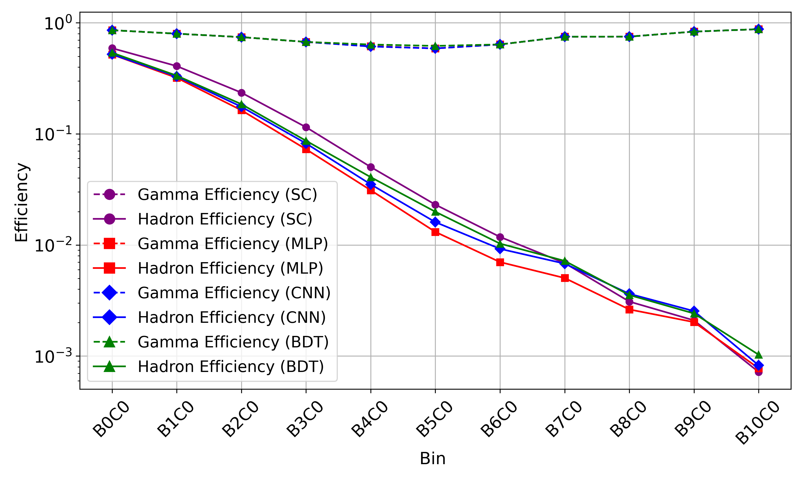
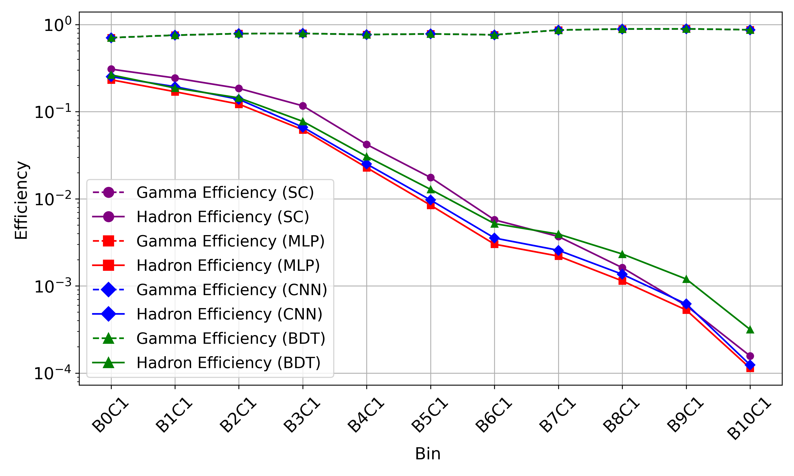
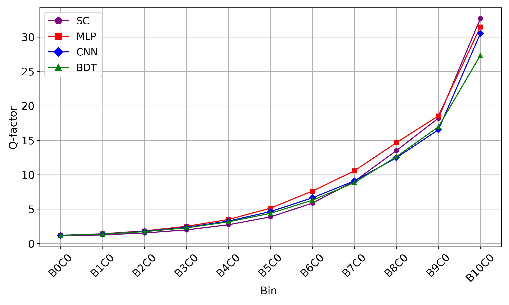
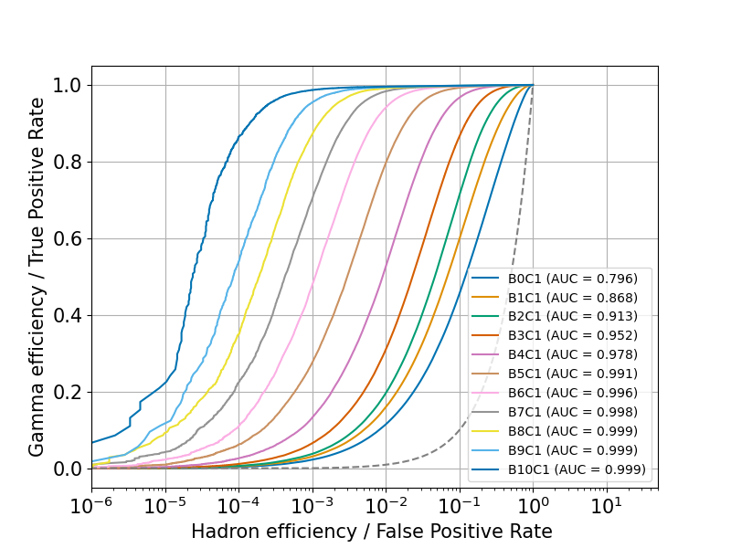

$\newcommand{\ensuremath}{}$
$\newcommand{\xspace}{}$
$\newcommand{\object}[1]{\texttt{#1}}$
$\newcommand{\farcs}{{.}''}$
$\newcommand{\farcm}{{.}'}$
$\newcommand{\arcsec}{''}$
$\newcommand{\arcmin}{'}$
$\newcommand{\ion}[2]{#1#2}$
$\newcommand{\textsc}[1]{\textrm{#1}}$
$\newcommand{\hl}[1]{\textrm{#1}}$
$\newcommand{\footnote}[1]{}$
$\newcommand{\vdag}{(v)^\dagger}$
$\newcommand$
$\newcommand$

# HAWC Performance Enhanced by Machine Learning in Gamma-Hadron Separation

<mark>Appeared on: 2025-06-24</mark> - 

R. Alfaro, et al. -- incl., <mark>J.A.</mark>

**Abstract:** Improving gamma-hadron separation is one of the most effective ways to enhance the performance of ground-based gamma-ray observatories. With over a decade of continuous operation, the High-Altitude Water Cherenkov (HAWC) Observatory has contributed significantly to high-energy astrophysics. To further leverage its rich dataset, we introduce a machine learning approach for gamma-hadron separation. A Multilayer Perceptron shows the best performance, surpassing traditional and other Machine Learning based methods. This approach shows a notable improvement in the detector's sensitivity, supported by results from both simulated and real HAWC data. In particular, it achieves a 19 \% increase in significance for the Crab Nebula, commonly used as a benchmark. These improvements highlight the potential of machine learning to significantly enhance the performance of HAWC and provide a valuable reference for ground-based observatories, such as Large High Altitude Air Shower Observatory (LHAASO) and the upcoming Southern Wide-field Gamma-ray Observatory (SWGO).

**Figure 1. -** Gamma-ray efficiencies (dashed lines) and hadron efficiencies (solid lines) as a function of fHit bins for different classification methods. (a): Results for on-array events. (b): Results for off-array events. Classification methods compared include SC, MLP, CNN, and BDT. (*fig:eff*)

**Figure 2. -** Q-factor as a function of fHit bins for different classification methods. (a): Results for on-array events. (b): Results for off-array events. Classification methods compared include SC, MLP, CNN, and BDT. Q-factors improve with increasing fHit bins, with notable differences across methods, especially in high-fHit bins. (*fig:qfactor*)

**Figure 3. -** Receiver Operating Characteristic (ROC) curves and Area Under the Curve (AUC) values for MLP model performance across different fHit bins. Left panel (a): Results for on-array events. Right panel (b): Results for off-array events. Each curve corresponds to a specific fHit bin, labeled from B0 to B10. The MLP model exhibits progressively better classification performance with increasing fHit, as indicated by higher AUC values. (*fig:ROC_curve*)

