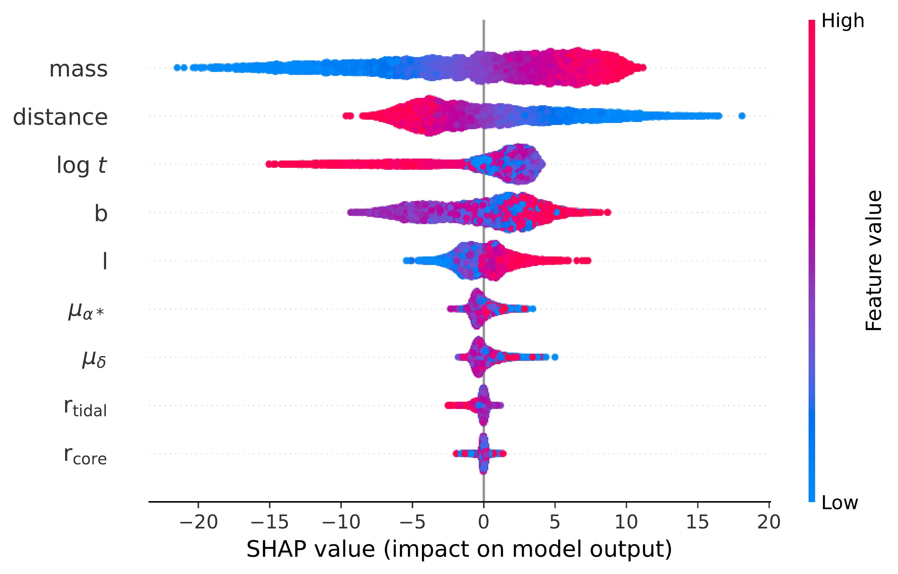
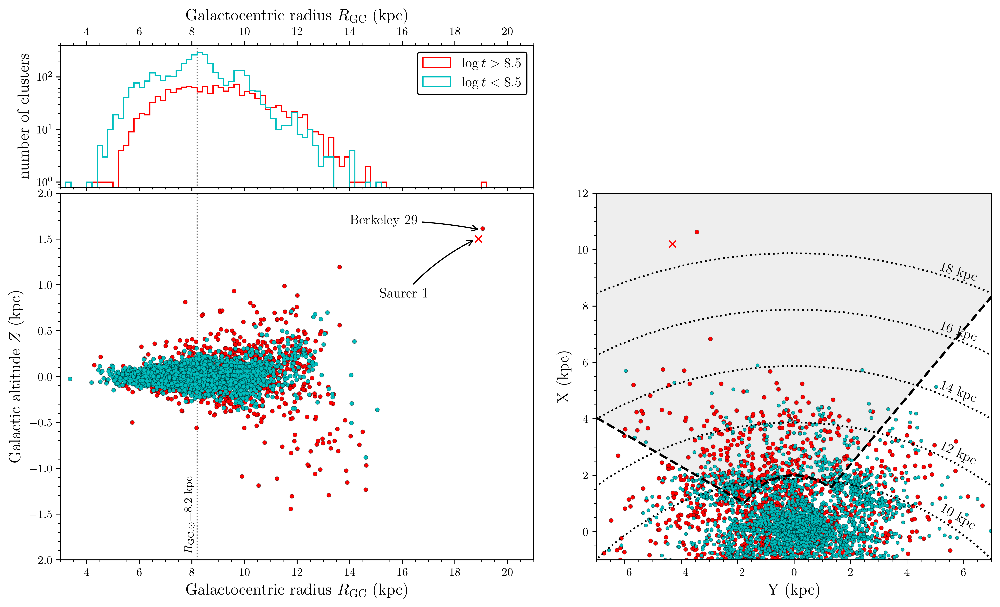

$\newcommand{\ensuremath}{}$
$\newcommand{\xspace}{}$
$\newcommand{\object}[1]{\texttt{#1}}$
$\newcommand{\farcs}{{.}''}$
$\newcommand{\farcm}{{.}'}$
$\newcommand{\arcsec}{''}$
$\newcommand{\arcmin}{'}$
$\newcommand{\ion}[2]{#1#2}$
$\newcommand{\textsc}[1]{\textrm{#1}}$
$\newcommand{\hl}[1]{\textrm{#1}}$
$\newcommand{\footnote}[1]{}$

# The completeness of the open cluster census towards the Galactic anticentre

<mark>Appeared on: 2025-06-24</mark> -  _18 pages, 13 figures. Accepted in A&A_

E. L. Hunt, et al. -- incl., <mark>M. Fouesneau</mark>

**Abstract:** Open clusters have long been used as tracers of Galactic structure. However, without a selection function to describe the completeness of the cluster census, it is difficult to quantitatively interpret their distribution. We create a method to empirically determine the selection function of a Galactic cluster catalogue. We test it by investigating the completeness of the cluster census in the outer Milky Way, where old and young clusters exhibit different spatial distributions. We develop a method to generate realistic mock clusters as a function of their parameters, in addition to accounting for $*Gaia*$ 's selection function and astrometric errors. We then inject mock clusters into _Gaia_ DR3 data, and attempt to recover them in a blind search using HDBSCAN. We find that the main parameters influencing cluster detectability are mass, extinction, and distance. Age also plays an important role, making older clusters harder to detect due to their fainter luminosity function. High proper motions also improve detectability. After correcting for these selection effects, we find that old clusters are $2.97\pm0.11$ times more common at a Galactocentric radius of 13 kpc than in the solar neighbourhood -- despite positive detection biases in their favour, such as hotter orbits or a higher scale height. The larger fraction of older clusters in the outer Galaxy cannot be explained by an observational bias, and must be a physical property of the Milky Way: young outer-disc clusters are not forming in the outer Galaxy, or at least not with sufficient masses to be identified as clusters in $*Gaia*$ DR3. We predict that in this region, more old clusters than young ones remain to be discovered. The current presence of old, massive outer-disc clusters could be explained by radial heating and migration, or alternatively by a lower cluster destruction rate in the anticentre.

**Figure 12. -** Fraction of simulated clusters recovered as a function of $R_\text{GC}$ and $Z$ divided into multiple different mass and ages ranges, and compared against the distribution of OCs in HR24 within those ranges. Each row shows clusters in a different mass range, indicated by the label on each subplot. The subplots in the left column show young clusters with $\log t < 8.5$, while subplots in the right column show old clusters with $\log t > 8.5$. Although proper motions only have a small impact on cluster detectability, we nevertheless only show the detection results of simulated clusters with proper motions $|\mu_{\alpha^*}| < 2.5$ and $|\mu_\delta| < 2.5$, providing a slightly more conservative estimate on cluster detectability at these locations. (*fig:r_z_overall_detections*)

**Figure 7. -**  SHAP feature importance values for the CST predictor. *Top:* Beeswarm plot where each cluster in the validation dataset is shown as a dot. Each row corresponds to the impact of a different input parameter. The colour coding corresponds to whether it was a high or low value of the parameter. The $x$ axis shows the final impact on the output of the model, which is how much the CST is changed for that given cluster and that given parameter value. For example: for cluster mass, low mass values (blue) correspond to a much lower SHAP/CST, whereas high mass values (red) correspond to a much higher SHAP/CST. On the other hand, most age values have minimal impact on CST, although high ages significantly reduce it. *Bottom:* SHAP value at a given \texttt{pmdec} as a function of \texttt{pmdec} and shown for all clusters in the validation dataset. Colour coding shows the Galactic longitude, $l$. (*fig:cst_shap*)

**Figure 8. -**  Spatial distribution of high-certainty clusters (\texttt{CST}$>$4) from \citet{2023A&A...673A.114H}. Ages are taken from \citet{2024AJ....167...12C} as they are more accurate for old clusters (see Sect. \ref{sec:catalogues} for discussion).
    *Top left*: Histogram of cluster galactocentric radii divided into young ($\log t < 8.5$, blue) and old ($\log t > 8.5$, red) clusters and with a 200 pc bin width.
    *Bottom left*: Distribution of the same young and old clusters but in terms of altitude $Z$ and Galactocentric radius $R_{\mathrm{GC}}$, assuming $R_{\mathrm{GC},\odot}$=8.2 kpc.
    *Bottom right*: Projection of these clusters in heliocentric Galactic co-ordinates, with the Sun located at ($X$,$Y$)=(0,0). The dotted lines indicate Galactocentric radii from 10 to 18 kpc. The shaded area is the region investigated in this study ($140^{\circ} \leq \ell \leq 240^{\circ}$ starting 2 kpc from the Sun) . In both lower panels, the cross indicates the cluster Saurer 1, visible in _Gaia_ data but not recovered in the blind search of \citet{2023A&A...673A.114H}. (*fig:XY_RgcZ*)

