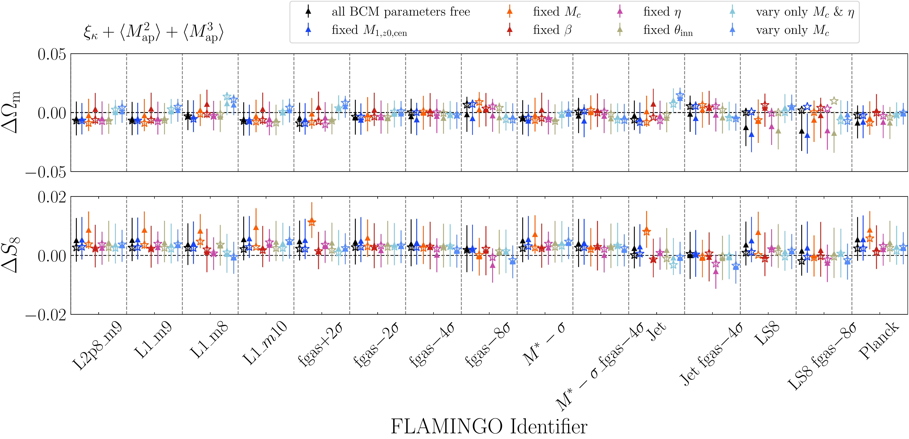

$\newcommand{\ensuremath}{}$
$\newcommand{\xspace}{}$
$\newcommand{\object}[1]{\texttt{#1}}$
$\newcommand{\farcs}{{.}''}$
$\newcommand{\farcm}{{.}'}$
$\newcommand{\arcsec}{''}$
$\newcommand{\arcmin}{'}$
$\newcommand{\ion}[2]{#1#2}$
$\newcommand{\textsc}[1]{\textrm{#1}}$
$\newcommand{\hl}[1]{\textrm{#1}}$
$\newcommand{\footnote}[1]{}$
$\newcommand{\Msun}{ h^{-1}{\rm M_{ \odot}}}$
$\newcommand{\hkpc}{ h^{-1}{\rm kpc}}$
$\newcommand{\ihMpc}{ h {\rm Mpc}^{-1}}$
$\newcommand{\raul}[1]{\textcolor{red}{\textbf{Raul: #1}}}$
$\newcommand{\gio}[1]{\textcolor{red}{\textbf{GA: #1}}}$
$\newcommand{\anik}[1]{\textcolor{orange}{\textbf{#1}}}$
$\newcommand{\Mperp}{\mathcal{M}_{\perp}}$
$\newcommand{\MapMapMap}{{\expval{\Map^3}}}$
$\newcommand{\MapMperpMperp}{{\expval{\Map\Mperp^2}}}$
$\newcommand{\Mapperp}{\mathcal{M}_{\mathrm{ap}/\perp}}$
$\newcommand{\diracd}{\delta_\mathrm{D}}$
$\newcommand{\LCDM}{\LambdaCDM}$
$\newcommand{\bkappa}{\ensuremath{B_\kappa}}$
$\newcommand{\pkappa}{\ensuremath{P_\kappa}}$
$\newcommand{\MapEst}{\widehat{\mathcal{M}}_\mathrm{ap}}$
$\newcommand{\MperpEst}{\widehat{\mathcal{M}}_\perp}$
$\newcommand{\dd}{\mathrm{d}}$
$\newcommand{\vtheta}{\pmb{\theta_\mathrm{ap}}}$
$\newcommand{\vell}{\pmb{\ell}}$
$\newcommand{\Npix}{N_\mathrm{pix}}$
$\newcommand{\Ngal}{N_\mathrm{eff}}$
$\newcommand{\expval}[1]{\langle #1 \rangle}$
$\newcommand{\code}{\tt }$
$\newcommand{\mycomment}[1]$
$\newcommand{\corr}[1]{\textcolor{red}{\textbf{#1}}}$
$\newcommand{\laila}[1]{{\color{teal}#1}}$
$\newcommand{\orcid}[1]$
$\newcommand{\arraystretch}{1.2}$
$\newcommand{\arraystretch}{1.2}$
$\newcommand{\arraystretch}{1.3}$
$\newcommand{\arraystretch}{1.2}$
$\newcommand{\arraystretch}{1.3}$
$\newcommand{\arraystretch}{1.2}$
$\newcommand\say{#1}$

# $\Euclid$\/: An emulator for baryonic effects on the matter bispectrum$\thanks{This paper is published on behalf of the Euclid Consortium.}$

<mark>Appeared on: 2025-06-25</mark> -  _24 pages, 18 figures, submitted to A&A_

P. A. Burger, et al. -- incl., <mark>K. Jahnke</mark>

**Abstract:** The $\Euclid$ mission and other next-generation large-scale structure surveys will enable high-precision measurements of the cosmic matter distribution. Understanding the impact of baryonic processes such as star formation and active galactic nuclei (AGN) feedback on matter clustering is crucial to ensure precise and unbiased cosmological inference. Most theoretical models of baryonic effects to date focus on two-point statistics, neglecting higher-order contributions. This work develops a fast and accurate emulator for baryonic effects on the matter bispectrum, a key non-Gaussian statistic in the nonlinear regime. We employ high-resolution $N$ -body simulations from the BACCO suite and apply a combination of cutting-edge techniques such as cosmology scaling and baryonification to efficiently span a large cosmological and astrophysical parameter space. A deep neural network is trained to emulate baryonic effects on the matter bispectrum measured in simulations, capturing modifications across various scales and redshifts relevant to $\Euclid$ . We validate the emulator accuracy and robustness using an analysis of $\Euclid$ mock data, employing predictions from the state-of-the-art FLAMINGO hydrodynamical simulations. The emulator reproduces baryonic suppression in the bispectrum to better than 2 $\%$ for the $68\%$ percentile across most triangle configurations for $k \in [0.01, 20] \ihMpc$ and ensures consistency between cosmological posteriors inferred from second- and third-order weak lensing statistics. These results demonstrate that our emulator meets the high-precision requirements of the $\Euclid$ mission for at least the first data release and provides forecasts of the cosmological and astrophysical information contained in the small-scale matter bispectrum. This underscores the potential of emulation techniques to bridge the gap between complex baryonic physics and observational data, maximising the scientific output of $\Euclid$ . Our emulators will becomepublicly available in $\url{https://baccoemu.readthedocs.io/en/latest/}$ .

**Figure 8. -** Estimated mean and $68\%$ credible intervals for all FLAMINGO models described in Sect. \ref{sec:Flamingo_sim}. Since the LS8 and \Planck cosmology is different we plot $\Delta \Omega_\mathrm{m} = \Omega^\mathrm{best}_\mathrm{m} - \Omega^\mathrm{true}_\mathrm{m}$ and in analogy $\Delta S_8$. The different colours show cases where parameters are fixed. The stars indicate the best-fitting parameters. The figure is for $\xi_\kappa + \langle \Map^2 \rangle + \langle \Map^3 \rangle$. The corresponding figure for $\xi_\kappa + \langle \Map^2 \rangle$ is shown in Fig. \ref{fig:Flamingo_variation_cosmology_2nd}. (*fig:Flamingo_variation_cosmology*)

**Figure 12. -** In this figure, we show the power spectrum's dependence on baryonic feedback effects in the three upper rows. In the bottom three rows, we show the dependence of the bispectrum for $k_1=k_2=k_3$. (*fig:bispec_dependence*)

**Figure 18. -** Dependence of the $\expval{\Map^n}$ and $\xi_\kappa$ to changes of baryonic and cosmological parameters. We scaled the model vectors using the same model just for a GrO case, disentangling the effect of the baryons. The $\theta_\mathrm{ap} = \{\theta_\mathrm{ap,1},\theta_\mathrm{ap,2},\theta_\mathrm{ap,3}\}$ values for the lowest panel are increasing from left to right as in Fig. \ref{fig:Map3_Flamingo}, increasing first $\theta_\mathrm{ap,3}$, then $\theta_\mathrm{ap,2}$ and lastly $\theta_\mathrm{ap,1}$.  (*fig:Map23_dependence_GrO*)

