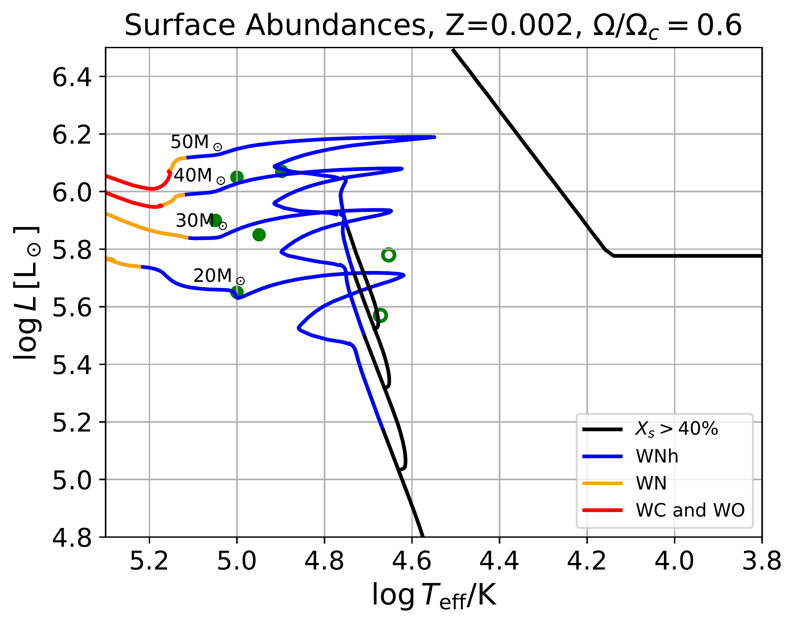
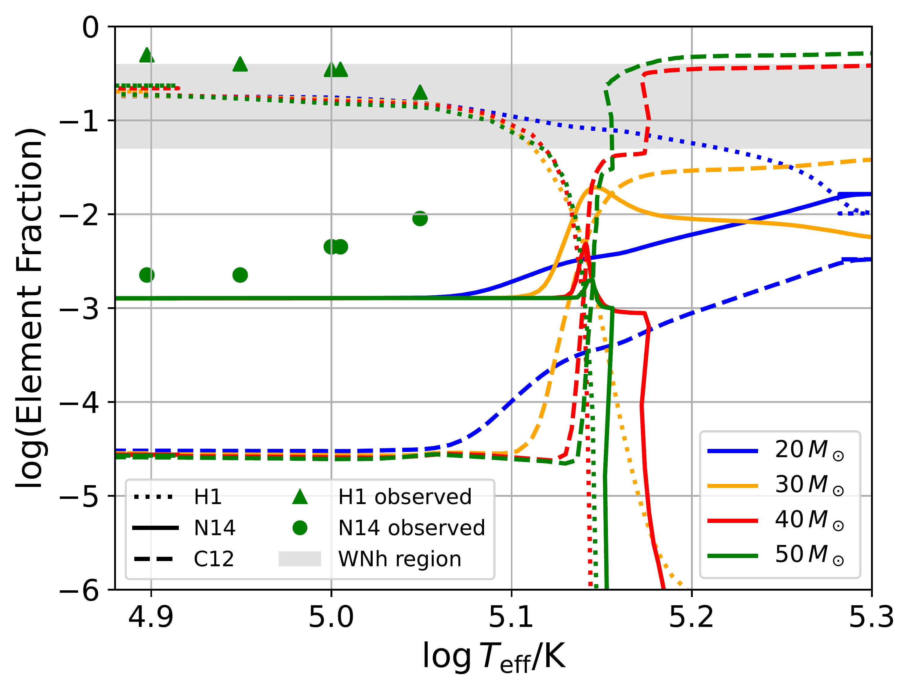

$\newcommand{\ensuremath}{}$
$\newcommand{\xspace}{}$
$\newcommand{\object}[1]{\texttt{#1}}$
$\newcommand{\farcs}{{.}''}$
$\newcommand{\farcm}{{.}'}$
$\newcommand{\arcsec}{''}$
$\newcommand{\arcmin}{'}$
$\newcommand{\ion}[2]{#1#2}$
$\newcommand{\textsc}[1]{\textrm{#1}}$
$\newcommand{\hl}[1]{\textrm{#1}}$
$\newcommand{\footnote}[1]{}$
$\newcommand{\orcidicon}[1]{\href{https://orcid.org/#1}{\includegraphics[width=11pt]{Plot/ORCIDiD_icon128x128.png}}}$
$\newcommand{\orcid}[1]{\href{https://orcid.org/#1}{\protect\orcidicon{#1}}}$
$\newcommand{\msun}{{\rm M}_\odot}$
$\newcommand{\as}[1]{\textbf{\textcolor{orange}{Andreas: {#1}}}}$
$\newcommand{\astext}[1]{{\textcolor{orange}{#1}}}$
$\newcommand{\ST}[1]{\textcolor{steelblue!100}{#1_{\mathrm{ST}}}}$
$\newcommand{\micmap}[1]{\textcolor{purple}{#1}}$
$\newcommand{\lb}[2]{\textcolor{red}{#1}}$

# Metal-poor single Wolf-Rayet stars:\ the interplay of optically thick winds and rotation

<mark>Appeared on: 2025-07-02</mark> -  _18 pages, 17 Figures. Submitted to A&A. Comments from the community are welcome_

L. Boco, et al. -- incl., <mark>S. Torniamenti</mark>

**Abstract:** The Small Magellanic Cloud (SMC) hosts 12 known Wolf-Rayet stars (WRs), seven of which apparently single. Their formation is a challenge for current stellar evolution models, because line-driven winds are generally assumed to be quenched at a metallicity $Z\leq 0.004$ . Here, we present a set of mesa models of single stars with zero-age main sequence masses $20-80$ M $_\odot$ , considering different initial rotation speeds ( $\Omega=0-0.7  \Omega_c$ ), metallicities ( $Z=0.002-0.0045$ ), and wind mass-loss models (optically thin and thick winds). We show that if we account for optically thick winds, as described by [Sabhahit, et. al (2023)]() , fast rotating ( $\Omega\sim 0.6  \Omega_c$ ) single metal-poor O-type stars (with $M\gtrsim 20$ M $_\odot$ ) shed their envelope and become WR stars even at the low metallicity of the SMC. The luminosity, effective temperature, evolutionary timescale, surface abundance, and rotational velocity of our simulated WR stars are compatible to the WRs observed in the SMC. We speculate that this scenario can also alleviate the excess of giant stars across the Humphreys-Davidson limit. Our results have key implications for black hole masses, (pair instability) supernova explosions, and other observable signatures.

**Figure 15. -** Stellar tracks on the HR diagram for initial masses $M=25, 30,  40,  60,  80$ M$_\odot$ at metallicity $Z=0.0025$. In the left-hand panels, \citetalias{Vink2001} model with only optically thin winds is implemented. In the right-hand panels, the \citetalias{Sabhahit2023} model is enforced, with the possibility to activate optically thick winds. The upper panels show the case with no rotation, while the lower panels the $\Omega/\Omega_c=0.6$ case. Different line styles represent different wind regimes: dotted for optically thin winds, solid for optically thick winds, dashed for WR-type winds. Colors represent different burning stages, defined as the element whose burning generates most of the energy of the star. Blue is for H-burning through CNO, orange for He-burning through triple $\alpha$, red for carbon burning, and green for oxygen burning. Green circles are observations of single WRs, filled for the hottest, open for the coldest. The lower-right plot shows that the combination of optically thick winds and high initial rotation is able to self-strip stars even at SMC metallicity. The stars in the lower-right plot (\citetalias{Sabhahit2023}, $\Omega=\Omega_c=0.6$) avoid the HD limit and transition from main-sequence stars to WRs. (*fig:new_winds*)

**Figure 5. -** The upper panel shows the classification of the star along the HR diagram: O-type (black), WNh (blue), WN (orange), WC and WO (red). The lower panel shows the
   surface abundances as a function of the effective temperature $T_{\rm eff}$. Line styles are for different elements: hydrogen (dotted line), $^{14}$N (solid line), $^{12}$C (dashed line). Different colors are for different initial masses: 20 (blue), 30 (orange), 40 (red), and 50 M$_\odot$(green). Green triangles (circles) represent hydrogen (nitrogen) abundances for the 5 observed hottest WRs  ([Hainich, Pasemann and Todt 2015]()) . The gray horizontal band covers the $\sim 5-40\%$ range; if hydrogen abundance is inside this region the star is considered a WNh. (*fig:abundances*)

**Figure 9. -** Relation between $M_{\rm ZAMS}$ and final mass of the star ($M_{\rm fin}$, thin solid line), He core mass ($M_{\rm He}$, thick dotted line), CO core mass ($M_{\rm CO}$, thick dot-dashed line) and black hole mass ($M_{\rm BH}$, thick solid line), for optically thin winds (\citetalias{Vink2001}, magenta) and for the \citetalias{Sabhahit2023} model (\citetalias{Sabhahit2023}, black). Upper panel: $\Omega/\Omega_c=0$; lower panel: $\Omega/\Omega_c=0.6$. Gray shaded area: range of $M_{\rm He}$ in which we expect a pulsational pair instability supernova. (*fig:BH_masses*)

