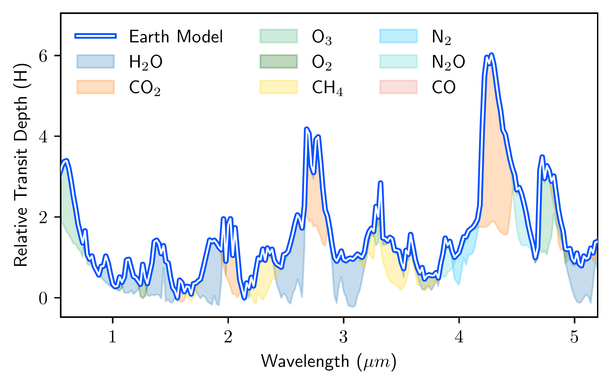
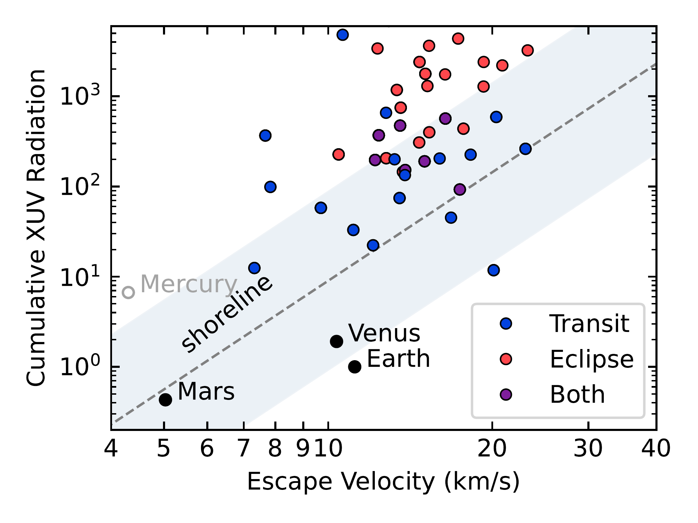

$\newcommand{\ensuremath}{}$
$\newcommand{\xspace}{}$
$\newcommand{\object}[1]{\texttt{#1}}$
$\newcommand{\farcs}{{.}''}$
$\newcommand{\farcm}{{.}'}$
$\newcommand{\arcsec}{''}$
$\newcommand{\arcmin}{'}$
$\newcommand{\ion}[2]{#1#2}$
$\newcommand{\textsc}[1]{\textrm{#1}}$
$\newcommand{\hl}[1]{\textrm{#1}}$
$\newcommand{\footnote}[1]{}$
$\newcommand$
$\newcommand$
$\newcommand$

# A first look at rocky exoplanets with JWST

<mark>Appeared on: 2025-07-02</mark> -  _Accepted review for PNAS Special Feature "Exoplanets in the JWST era"_

<mark>L. Kreidberg</mark>, K. B. Stevenson

**Abstract:** Rocky exoplanet characterization has been a top priority for early James Webb Space Telescope (JWST) science operations.  Several milestones have been achieved, including the most precise rocky planet transmission spectra measured to date, and the first detection of thermal emission for rocky worlds below 800 Kelvin. Despite these advances, no atmospheres have been definitively detected. Several transmission spectra show tentative evidence for molecular absorption features, but these hints are marginally significant and the spectra may be affected by stellar contamination. Features from many plausible atmospheres, including those dominated by oxygen, nitrogen, and carbon dioxide, are below the current noise level.  Meanwhile, the emerging picture from thermal emission spectra is that the planets have hot daysides, consistent with either a bare rock composition or low surface pressure atmospheres ( $<10$ bar). Higher surface pressures and high carbon dioxide abundances are generally ruled out, assuming cloud-free atmosphere models. The absence of strong $\ce{CO2}$ features hints at a limited initial volatile inventory or rapid atmospheric escape during the planets' early lifetimes. Taken together, these results motivate a push towards higher precision data, as well as observations of cooler planets that may be more likely to retain atmospheres.  As a goal for future transmission spectroscopy, we suggest a "five scale height challenge," to achieve the precision necessary to detect $\ce{CO2}$ features in nitrogen-rich atmospheres.  Detecting rocky planet atmospheres remains challenging, but with JWST's excellent performance and a continuing investment of telescope time, we are optimistic these uncharted atmospheres will be detected in coming years.

**Figure 2. -** Best-fit model to an empirical transmission spectrum of the cloudless Earth in units of scale height, $H$(adapted from LY2023b).  Different colors indicate the contributions from various molecules.  Despite its relatively low abundance, \ce{CO2} has the most prominent spectral features (at 2.7 and 4.3 {\microns}), making it an ideal molecule to search for in exoplanet atmospheres. The strength of different absorption peaks is sensitive to the underlying atmospheric composition and detailed atmospheric modeling can constrain the abundances of individual absorbing species (which may differ from those of the Earth). This figure neglects the effects of refraction, which effectively blocks transmission below roughly 1.5 scale heights for Earth-Sun analog systems (planets orbiting M-dwarfs are less strongly affected)  (betremieux14) .
 (*fig:earth*)

**Figure 1. -** Rocky planets with approved JWST transit and eclipse observations in Cycles 1 -- 4, relative to their escape velocity and lifetime X-ray and UV (XUV) irradiation \citep[adapated from][]{zahnle17}. Cumulative XUV radiation is normalized relative to that of the Earth.  The XUV flux is calculated for a constant system age; a reasonable assumption given that the majority of XUV flux is emitted in the first Gyr of the stars' lifetimes.  The cosmic shoreline is denoted with a gray dashed line, which divides Solar System bodies with substantial atmospheres (below the line) from those without (above). To illustrate the large uncertainties on the possible location (and even existence) of a shoreline around other stars, we shaded the region within an order of magnitude of the relation from zahnle17.  Most planets observed by JWST are situated above the gray dashed line and, thus, are less likely to have atmospheres.
 (*fig:shoreline*)

**Figure 3. -** Published transmission spectra of rocky exoplanets.  The data have been binned to a uniform resolution and converted to scale heights, $H$, assuming a pure nitrogen atmosphere ($\mu=28$). For clarity, we apply a $40H$ vertical offset between adjacent planets.  The spectra for TRAPPIST-1b and LHS 1140b have been corrected for stellar contamination. The symbol size indicates planet radius and the color indicates planet equilibrium temperature.  Open symbols depict NIRISS data and closed symbols depict NIRSpec or NIRCam data.  The gray regions, which are $5H$ in height, roughly indicate the maximum size of molecular absorption features for a nitrogen-rich atmosphere.  At the current level of precision, none of the spectra are sensitive to features in nitrogen-rich, let alone carbon-dioxide-rich, atmospheres. The blue Earth model is the same as that shown in \autoref{fig:earth}.
 (*fig:transits*)

