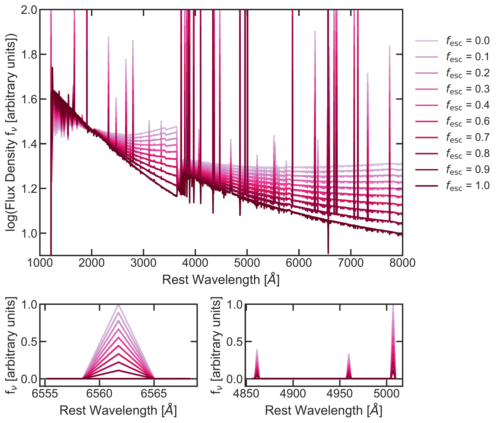

$\newcommand{\ensuremath}{}$
$\newcommand{\xspace}{}$
$\newcommand{\object}[1]{\texttt{#1}}$
$\newcommand{\farcs}{{.}''}$
$\newcommand{\farcm}{{.}'}$
$\newcommand{\arcsec}{''}$
$\newcommand{\arcmin}{'}$
$\newcommand{\ion}[2]{#1#2}$
$\newcommand{\textsc}[1]{\textrm{#1}}$
$\newcommand{\hl}[1]{\textrm{#1}}$
$\newcommand{\footnote}[1]{}$
$\newcommand{\EG}[1]{\textcolor{Purple}{#1}}$
$\newcommand{\fesc}{f_{\rm{esc}}\xspace}$
$\newcommand{\uvbeta}{\beta_{\rm UV}\xspace}$
$\newcommand{\arraystretch}{1.2}$
$\newcommand{\arraystretch}{1.5}$
$\newcommand{\arraystretch}{1.5}$

# Breaking Through the Cosmic Fog: JWST/NIRSpec Constraints on Ionizing Photon Escape in Reionization-Era Galaxies

<mark>Appeared on: 2025-07-03</mark> -  _Submitted to A&A_

E. Giovinazzo, et al. -- incl., <mark>A. d. Graaff</mark>

**Abstract:** ${The escape fraction of Lyman continuum photons ($f_{\rm esc}(\rm LyC)$) is the last key unknown in our understanding of cosmic reionization. Directly estimating the escape fraction (\fesc) of ionizing photons in the epoch of reionization (EoR) is impossible, due to the opacity of the intergalactic medium (IGM). However, a high \fesc leaves clear imprints in the spectrum of a galaxy, due to reduced nebular line and continuum emission, which also leads to bluer UV continuum slopes (\uvbeta). Here, we exploit the large archive of deep JWST/NIRSpec spectra from the DAWN JWST Archive to analyze over 1'400 galaxies at $5<z_\mathrm{spec}<10$ and constrain their \fesc based on SED fitting enhanced with a picket fence model.}$ ${We identify 71 high-confidence sources with significant \fesc based on Bayes factor analysis strongly favouring \fesc> 0 over \fesc= 0 solutions. We compare the characteristics of this high-escape subset against both the parent sample and established diagnostics including \uvbeta slope, O32, and SFR surface density ($\Sigma_{\rm SFR}$).}$ ${For the overall sample, we find that most sources have a low escape fraction (<1$\%$), however, a small subset of sources seems to emit a large number of their ionizing photons into the IGM, such that the average \fesc is found to be $\sim$10\%, as needed for galaxies to drive reionization.}$ ${Although uncertainties remain regarding recent burstiness and the intrinsic stellar ionizing photon output at low metallicities, our results demonstrate the unique capability of JWST/NIRSpec to identify individual LyC leakers, measure average \fesc and thus constrain the drivers of cosmic reionization.}$

**Figure 7. -** **Top:**$\fesc$ vs $\rm M_{\rm UV}$. The parent sample is shown with the pink dots, the high confidence sample is the dark diamonds and the average $\fesc$ in bins of $\rm M_{\rm UV}$ is shown as the black squares. The mean $\fesc$ does not show a trend with $\rm M_{\rm UV}$. The average $\fesc$ of our sample is consistently measured between 10-15\% in all bins.
    **Bottom:** The fraction of sources with $f_{\rm esc}$>0.1 in each UV magnitude bin. This fraction also shows no trend with $\rm M_{\rm UV}$. (*fig:fesc_MUV*)

**Figure 3. -** Example galaxy with a Bayes factor $>$ 100. **Top: ** Here we show the observed spectrum (blue line) and the two models, one with high $\fesc$(orange solid line) and one with $\fesc$ = 0 (magenta dashed line). The grey shaded region represents the masked region. A clear difference between the two models can be seen in the $\uvbeta$ part of the spectrum, where the high $\fesc$ solution fits the data much better than the other solution.
    **Middle: ** Difference between the two models highlighting the difference in the $\uvbeta$ slope and to some extent in the emission line strengths.
    **Bottom: ** Comparison of the SFH for the two models. The models are extremely different, as reproducing the weak lines and steep $\uvbeta$ slope without $\fesc$ is only possible with a recent quenching of star formation. This indicates a degeneracy between SFH and $\fesc$, which is discussed more in Section \ref{ch:discussion}.  (*fig:rubies_spec*)

**Figure 2. -** **Top**: Spectrum of a model galaxy with various $\fesc$. The model galaxy is at  $z=6$, has a mass of $\rm M_{*} = 10^9 M_{\odot}$, metallicity $Z= 0.05 Z_{\odot}$, ionization parameter $\rm logU = -2$, constant star formation  switched on at 5 Myr and dust modelled with the Calzetti  ([Calzetti, Armus and Bohlin 2000]())  dust curve with $\rm A_{\rm v} = 0.2$.
    As $\fesc$ increases the $\uvbeta$ slope becomes steeper due to reduced nebular continuum emission, and the emission lines become weaker. The continuum emission is also affected, as its nebular component scales with $\fesc$. The full spectrum thus contains information on the escape fractions, which we exploit to constrain the $\fesc$ of galaxies with NIRSpec spectra.
    **Bottom left**: Zoom in on H$\alpha$. **Bottom right**: Zoom in on H$\beta$+[$\ion${O}{iii}] (*fig:model_galaxy*)

