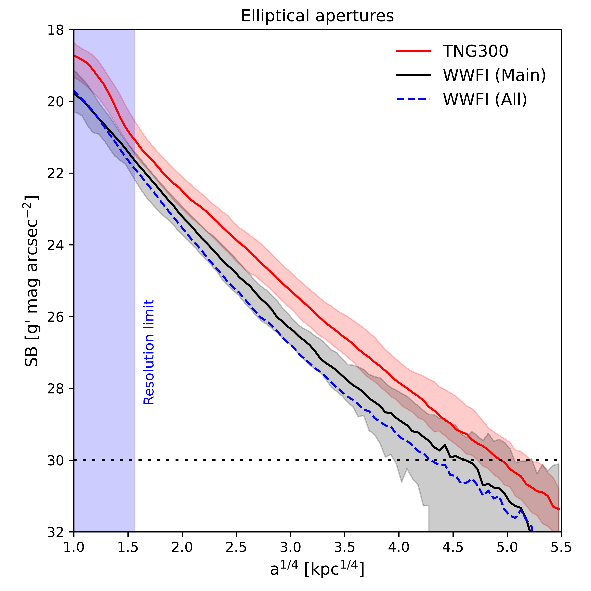
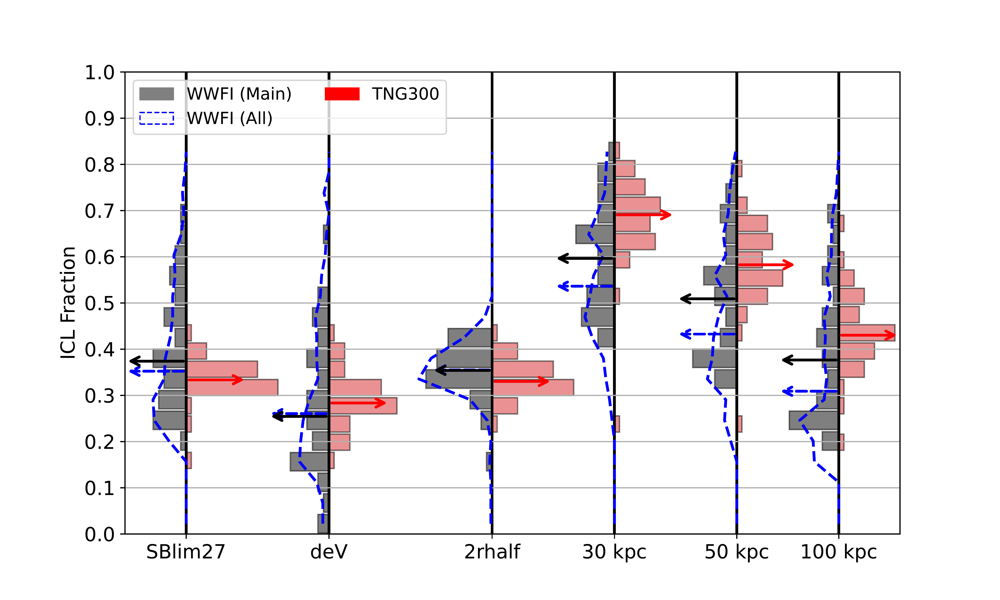

$\newcommand{\ensuremath}{}$
$\newcommand{\xspace}{}$
$\newcommand{\object}[1]{\texttt{#1}}$
$\newcommand{\farcs}{{.}''}$
$\newcommand{\farcm}{{.}'}$
$\newcommand{\arcsec}{''}$
$\newcommand{\arcmin}{'}$
$\newcommand{\ion}[2]{#1#2}$
$\newcommand{\textsc}[1]{\textrm{#1}}$
$\newcommand{\hl}[1]{\textrm{#1}}$
$\newcommand{\footnote}[1]{}$
$\newcommand{\Msun}{{\rm M}_{\odot}}$
$\newcommand{\Mtwo}{M_{\rm 200}}$
$\newcommand{\Mfive}{M_{\rm 500}}$
$\newcommand{\Rtwo}{R_{\rm 200}}$
$\newcommand{\Rfive}{R_{\rm 500}}$
$\newcommand{\facc}{f_{\rm acc}}$
$\newcommand{\fex}{f_{\rm ex}}$
$\newcommand{\krot}{\kappa_{\rm rot}}$
$\newcommand{\thebibliography}{\DeclareRobustCommand{\VAN}[3]{##3}\VANthebibliography}$

# Photometric analysis of the intracluster light in the TNG300 simulation and wide-field observations

<mark>Appeared on: 2025-07-07</mark> -  _Accepted for publication in MNRAS (submitted April 8, 2025)_

D. Montenegro-Taborda, et al. -- incl., <mark>A. Pillepich</mark>

**Abstract:** We present a robust, apples-to-apples comparison between the photometric properties of the intracluster light (ICL) in the TNG300 magnetohydrodynamic cosmological simulation and those in Wendelstein Wide Field Imager (WWFI) observations. This is accomplished by generating synthetic $g'$ -band images of 40 massive ( $\log\left(M_{\rm 200, crit}/{\rm M}_{\odot}\right) > 14.5$ ) TNG300 clusters at $z \approx 0.06$ , closely mimicking WWFI observations, and then performing identical photometric calculations on the synthetic and real images. Importantly, we apply the same observationally motivated satellite-masking procedure to both data-sets, which effectively removes any possible biases introduced by the halo finder. We first analyze the light distribution of the `smooth' stellar component of each cluster, composed of the brightest cluster galaxy (BCG) plus the ICL, and find that it tends to be about twice as extended in TNG300 than in observations, while also being approximately 1 $g'$ mag arcsec $^{-2}$ brighter. We then quantify $f_{\rm ICL}$ , the ICL fraction relative to the BCG+ICL, by considering several ICL definitions: (i) the light dimmer than a surface brightness cut at 27 $g'$ mag arcsec $^{-2}$ , (ii) the excess light over a de Vaucouleurs profile, (iii) the light beyond twice the half-light radius ( $2 r_{\rm half}$ ), and (iv) the light beyond a fixed circular aperture of 30, 50, or 100 kpc. For most definitions, the median $f_{\rm ICL}$ is consistent between simulation and observations. However, the observations exhibit larger scatter in $f_{\rm ICL}$ , which we attribute primarily to observational uncertainties in the total BCG+ICL luminosity rather than `true' cluster-to-cluster variation in the real Universe. We also find that most methods yield median $f_{\rm ICL}$ values near 0.3, which is consistent with a BCG/ICL transition radius around $2 r_{\rm half}$ .

**Figure 7. -** Median surface brightness (SB) profiles of the simulated (red) and observed (black and blue) BCG+ICL systems, shown both for circular (left) and elliptical (right) apertures. In the case of the observations, the main (consisting of the 38 observed clusters with mass estimates) and full (including all 170 observed clusters) samples are represented by the solid black and dashed blue lines, respectively. The red and black shaded regions represent the 16th to 84th percentile ranges of the TNG300 and WWFI (main sample) profiles, respectively.  The blue shaded region to the left indicates the resolution limit of the simulation, here defined as $4 \epsilon_{\ast} \approx 5.9$ kpc. All SB values are in the observer's frame. (*fig:profiles_comparison*)

**Figure 11. -** The ICL fraction that results from defining the ICL as the light with SB dimmer than 27 $g'$ mag arcsec$^{-2}$(left) and as the excess of light with respect to an outwardly extrapolated 2D de Vaucouleurs profile fitted to the inner region brighter than 27 $g'$ mag arcsec$^{-2}$(right), plotted against cluster mass. Red and black dots represent the simulation and observations, respectively, while the solid lines and shaded regions indicate the corresponding medians and 16th--84th percentile ranges. As before, the main measurements (dots, solid lines, and shaded regions) represent the corrected, `SB-limited' measurements (see Section \ref{subsec:undetected_light}) obtained for the `sigma-clipped' images (see Section \ref{subsec:background_subtraction}), while the dashed red line shows the median $f_{\rm ICL}$ obtained by performing `full' measurements on the `raw' synthetic images. Only observed clusters with gravitational mass estimates (38 out of 170) are shown. (*fig:f_icl_sblim_27_and_dev*)

**Figure 14. -** ICL fraction distributions for the various methods presented in Sections \ref{subsec:f_icl_sb27}--\ref{subsec:f_icl_fixed_kpc}. The black and red bars correspond to the observational (main WWFI sample, composed of 38 clusters) and simulated (TNG300, 40 clusters) cluster populations, respectively. The dashed blue lines show the distributions for the full WWFI sample, i.e. including all 170 observed clusters. The arrows indicate the medians of the distributions. (*fig:f_icl_barchart*)

